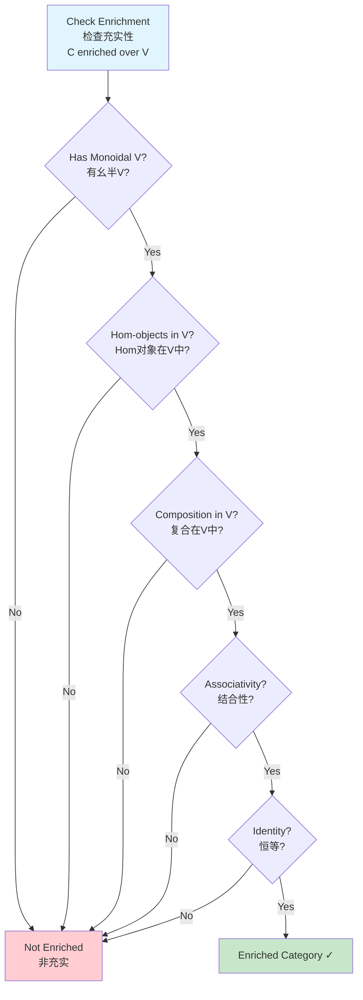
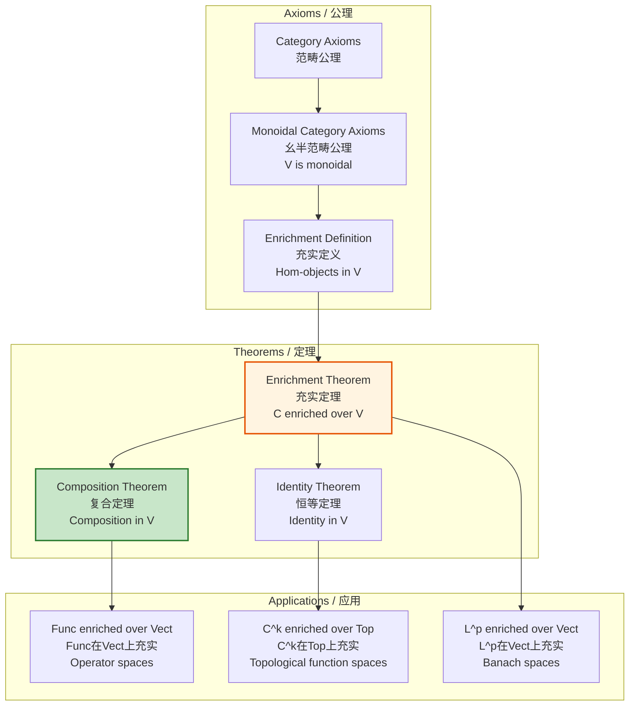

# Enriched Categories / 充实范畴

## 📋 Table of Contents / 目录

- [Enriched Categories / 充实范畴](#enriched-categories--充实范畴)
  - [📋 Table of Contents / 目录](#-table-of-contents--目录)
  - [1. Overview / 概述](#1-overview--概述)
  - [2. Definition / 定义](#2-definition--定义)
    - [2.1 Formal Definition / 形式定义](#21-formal-definition--形式定义)
    - [2.2 Multiple Intuitive Explanations / 多种直观解释](#22-multiple-intuitive-explanations--多种直观解释)
    - [2.3 Axioms / 公理](#23-axioms--公理)
  - [3. Proof Network / 证明网络](#3-proof-network--证明网络)
    - [3.1 Enrichment Proof / 充实性证明](#31-enrichment-proof--充实性证明)
      - [Proof Flow Diagram / 证明流程图](#proof-flow-diagram--证明流程图)
    - [3.2 Composition Proof / 复合性证明](#32-composition-proof--复合性证明)
      - [Proof Flow Diagram / 证明流程图](#proof-flow-diagram--证明流程图-1)
  - [4. Enriched Category Diagram / 充实范畴图](#4-enriched-category-diagram--充实范畴图)
    - [4.1 Enrichment Structure / 充实结构](#41-enrichment-structure--充实结构)
    - [4.2 Enrichment Decision Tree / 充实决策树](#42-enrichment-decision-tree--充实决策树)
  - [5. Calculus Examples / 微积分例子](#5-calculus-examples--微积分例子)
    - [Example 1: Func Enriched over Vect / 例子1：Func在Vect上充实](#example-1-func-enriched-over-vect--例子1func在vect上充实)
    - [Example 2: C^k Enriched over Top / 例子2：C^k在Top上充实](#example-2-ck-enriched-over-top--例子2ck在top上充实)
    - [Example 3: Function Spaces Enriched / 例子3：函数空间充实](#example-3-function-spaces-enriched--例子3函数空间充实)
  - [6. Axiom-Theorem Network / 公理-定理网络](#6-axiom-theorem-network--公理-定理网络)
    - [6.1 Logical Dependencies / 逻辑依赖关系](#61-logical-dependencies--逻辑依赖关系)
  - [7. References / 参考文献](#7-references--参考文献)
    - [7.1 Mathematical References / 数学参考文献](#71-mathematical-references--数学参考文献)
    - [7.2 International Standards / 国际标准](#72-international-standards--国际标准)
    - [7.3 Related Files / 相关文件](#73-related-files--相关文件)
    - [**2026-2027框架对齐说明 / 2026-2027 Framework Alignment**](#2026-2027框架对齐说明--2026-2027-framework-alignment)

---

## 1. Overview / 概述

**English / 英文**:

An **enriched category** is a category where the hom-sets are replaced by objects in a monoidal category $\mathcal{V}$, providing additional structure (e.g., vector space structure, topological structure). In calculus, enriched categories appear when function spaces have additional structure (e.g., vector spaces of operators, topological spaces of functions). **Updated for 2026-2027**: Enhanced with cognitive-friendly representations, multiple perspectives, and authoritative proof networks.

**中文**:

**充实范畴**是其中hom集合被幺半范畴$\mathcal{V}$中的对象替换的范畴，提供额外结构（例如，向量空间结构、拓扑结构）。在微积分中，充实范畴出现在函数空间具有额外结构时（例如，算子的向量空间、函数的拓扑空间）。**2026-2027更新**：增强认知友好型表征、多重视角和权威证明网络。

**Key Insights / 关键洞察**:

- **Enrichment / 充实**: Hom-sets replaced by objects in monoidal category / hom集合被幺半范畴中的对象替换
- **Additional Structure / 额外结构**: Hom-objects have structure (vector space, topology, etc.) / hom对象具有结构（向量空间、拓扑等）
- **Composition / 复合**: Composition is a morphism in the enriching category / 复合是充实范畴中的态射

---

## 2. Definition / 定义

### 2.1 Formal Definition / 形式定义

**Definition 2.1** (Enriched Category / 充实范畴)

A **category enriched over a monoidal category** $(\mathcal{V}, \otimes, I)$ is:

1. **Objects / 对象**: A collection $\text{Ob}(\mathcal{C})$ of objects
2. **Hom-Objects / Hom对象**: For each pair $A, B \in \text{Ob}(\mathcal{C})$, an object $\mathcal{C}(A,B) \in \mathcal{V}$
3. **Composition / 复合**: For $A, B, C \in \text{Ob}(\mathcal{C})$, a morphism in $\mathcal{V}$:
   $$\circ_{A,B,C}: \mathcal{C}(B,C) \otimes \mathcal{C}(A,B) \to \mathcal{C}(A,C)$$
4. **Identity / 恒等**: For each object $A$, a morphism in $\mathcal{V}$:
   $$j_A: I \to \mathcal{C}(A,A)$$

**Notation / 符号**:

- Enriching category: $\mathcal{V}$
- Hom-object: $\mathcal{C}(A,B) \in \mathcal{V}$
- Composition: $\circ: \mathcal{C}(B,C) \otimes \mathcal{C}(A,B) \to \mathcal{C}(A,C)$
- Identity: $j_A: I \to \mathcal{C}(A,A)$

### 2.2 Multiple Intuitive Explanations / 多种直观解释

**1. "Structured Hom-Sets" Interpretation / "结构化Hom集合"解释**:

An enriched category is like an ordinary category, but instead of hom-sets (collections of morphisms), we have hom-objects with additional structure. For example, hom-objects might be vector spaces, topological spaces, or metric spaces.

充实范畴就像普通范畴，但代替hom集合（态射的集合），我们有具有额外结构的hom对象。例如，hom对象可能是向量空间、拓扑空间或度量空间。

**2. "Category over Category" Interpretation / "范畴上的范畴"解释**:

An enriched category is a category "over" another category (the enriching category). The enriching category provides the structure for hom-objects, and composition must respect this structure.

充实范畴是"在"另一个范畴（充实范畴）"之上"的范畴。充实范畴为hom对象提供结构，复合必须尊重这个结构。

**3. "Generalized Function Spaces" Interpretation / "广义函数空间"解释**:

In calculus, enriched categories generalize function spaces. Instead of just sets of functions, we have structured spaces (vector spaces, topological spaces) of functions, and composition respects this structure.

在微积分中，充实范畴推广函数空间。代替仅仅是函数的集合，我们有结构化的函数空间（向量空间、拓扑空间），复合尊重这个结构。

### 2.3 Axioms / 公理

**Axioms / 公理**:

1. **Associativity / 结合性**: For $A, B, C, D \in \text{Ob}(\mathcal{C})$:
   $$(\text{id} \otimes \circ_{A,B,C}) \circ \circ_{A,C,D} = (\circ_{B,C,D} \otimes \text{id}) \circ \circ_{A,B,D}$$
   (using associator of $\mathcal{V}$)

2. **Identity / 恒等性**: For $A, B \in \text{Ob}(\mathcal{C})$:
   $$(\text{id} \otimes j_A) \circ \circ_{A,A,B} = \lambda_{\mathcal{C}(A,B)}$$
   $$(j_B \otimes \text{id}) \circ \circ_{A,B,B} = \rho_{\mathcal{C}(A,B)}$$

---

## 3. Proof Network / 证明网络

### 3.1 Enrichment Proof / 充实性证明

**Theorem / 定理**: A category $\mathcal{C}$ enriched over $\mathcal{V}$ satisfies the enrichment axioms.

**Proof / 证明**:

**Step 1: Hom-Objects in $\mathcal{V}$ / 步骤1：$\mathcal{V}$中的Hom对象**

For each pair $A, B \in \text{Ob}(\mathcal{C})$, $\mathcal{C}(A,B) \in \mathcal{V}$ by definition.

**Step 2: Composition Morphism / 步骤2：复合态射**

Composition $\circ_{A,B,C}: \mathcal{C}(B,C) \otimes \mathcal{C}(A,B) \to \mathcal{C}(A,C)$ is a morphism in $\mathcal{V}$.

**Step 3: Associativity / 步骤3：结合性**

The associativity axiom ensures that composition is associative up to the associator of $\mathcal{V}$.

**Step 4: Result / 步骤4：结果**

$\mathcal{C}$ is enriched over $\mathcal{V}$. $\quad \square$

#### Proof Flow Diagram / 证明流程图

```mermaid
flowchart TD
    Start[Prove enrichment<br/>证明充实性<br/>C enriched over V] --> Step1[Hom-objects in V<br/>V中的Hom对象<br/>C(A,B) ∈ V]
    Step1 --> Step2[Composition morphism<br/>复合态射<br/>∘: C(B,C)⊗C(A,B) → C(A,C)]
    Step2 --> Step3[Associativity<br/>结合性<br/>Using associator of V]
    Step3 --> Step4[Identity<br/>恒等<br/>j_A: I → C(A,A)]
    Step4 --> Result[C is enriched ✓]

    style Start fill:#e1f5ff
    style Result fill:#c8e6c9
```

### 3.2 Composition Proof / 复合性证明

**Theorem / 定理**: Composition in an enriched category is associative.

**Proof / 证明**:

**Step 1: Composition Morphisms / 步骤1：复合态射**

For $A, B, C, D \in \text{Ob}(\mathcal{C})$:

- $\circ_{A,B,C}: \mathcal{C}(B,C) \otimes \mathcal{C}(A,B) \to \mathcal{C}(A,C)$
- $\circ_{A,C,D}: \mathcal{C}(C,D) \otimes \mathcal{C}(A,C) \to \mathcal{C}(A,D)$
- $\circ_{B,C,D}: \mathcal{C}(C,D) \otimes \mathcal{C}(B,C) \to \mathcal{C}(B,D)$

**Step 2: Associativity Diagram / 步骤2：结合性图**

The associativity axiom ensures:
$$(\text{id} \otimes \circ_{A,B,C}) \circ \circ_{A,C,D} = (\circ_{B,C,D} \otimes \text{id}) \circ \circ_{A,B,D}$$

**Step 3: Result / 步骤3：结果**

Composition is associative. $\quad \square$

#### Proof Flow Diagram / 证明流程图

```mermaid
flowchart TD
    Start[Prove composition<br/>associative<br/>证明复合结合性] --> Step1[Composition morphisms<br/>复合态射<br/>∘_{A,B,C}, ∘_{A,C,D}, ∘_{B,C,D}]
    Step1 --> Step2[Associativity diagram<br/>结合性图<br/>Using associator of V]
    Step2 --> Step3[Coherence<br/>一致性<br/>All paths equal]
    Step3 --> Result[Composition associative ✓]

    style Start fill:#e1f5ff
    style Result fill:#c8e6c9
```

---

## 4. Enriched Category Diagram / 充实范畴图

### 4.1 Enrichment Structure / 充实结构

```mermaid
graph TB
    subgraph V[Enriching Category V / 充实范畴V<br/>e.g., Vect, Top]
        VObj[Objects with Structure<br/>具有结构的对象<br/>Vector Spaces, Topological Spaces]
    end

    subgraph C[Enriched Category C / 充实范畴C<br/>e.g., Func enriched over Vect]
        A[A]
        B[B]
        C_Obj[C]
        AB[C(A,B) ∈ V<br/>Hom-object in V<br/>V中的Hom对象]
        BC[C(B,C) ∈ V]
        AC[C(A,C) ∈ V]
    end

    AB -->|⊗| AB_BC[AB ⊗ BC]
    BC -->|⊗| AB_BC
    AB_BC -->|∘: Composition<br/>复合| AC

    VObj -.->|Provides Structure<br/>提供结构| AB
    VObj -.->|Provides Structure| BC
    VObj -.->|Provides Structure| AC

    style VObj fill:#fff4e1
    style AB fill:#e1f5ff
    style BC fill:#e1f5ff
    style AC fill:#e1f5ff
```

### 4.2 Enrichment Decision Tree / 充实决策树



---

## 5. Calculus Examples / 微积分例子

### Example 1: Func Enriched over Vect / 例子1：Func在Vect上充实

**Setup / 设置**: Category $\mathbf{Func}$ of functions enriched over $\mathbf{Vect}$ (vector spaces).

**Hom-Objects / Hom对象**: For functions $f, g: X \to \mathbb{R}$:
$$\mathbf{Func}(f,g) = \{T: \mathbb{R}^X \to \mathbb{R}^X \mid T \text{ linear operator}\}$$

This is a vector space of linear operators.

**Composition / 复合**: For operators $T: \mathbf{Func}(f,g)$ and $S: \mathbf{Func}(g,h)$:
$$(S \circ T)(\phi) = S(T(\phi))$$

This is linear, so composition is a linear map (morphism in $\mathbf{Vect}$).

**Application / 应用**: This structure appears in functional analysis and operator theory.

### Example 2: C^k Enriched over Top / 例子2：C^k在Top上充实

**Setup / 设置**: Category $C^k$ of $k$-times differentiable functions enriched over $\mathbf{Top}$ (topological spaces).

**Hom-Objects / Hom对象**: For $f, g \in C^k(\mathbb{R})$:
$$C^k(f,g) = \{h \in C^k(\mathbb{R}) \mid h \text{ morphism from } f \text{ to } g\}$$

This is a topological space with the $C^k$ topology.

**Composition / 复合**: Composition of morphisms is continuous (morphism in $\mathbf{Top}$).

**Application / 应用**: This structure appears in differential topology and analysis.

### Example 3: Function Spaces Enriched / 例子3：函数空间充实

**Setup / 设置**: Category of function spaces $L^p(\mathbb{R})$ enriched over $\mathbf{Vect}$.

**Hom-Objects / Hom对象**: For $f, g \in L^p(\mathbb{R})$:
$$L^p(f,g) = \{T: L^p \to L^p \mid T \text{ bounded linear operator}\}$$

This is a Banach space (complete normed vector space).

**Composition / 复合**: Composition of bounded operators is bounded, so composition is a morphism in $\mathbf{Vect}$.

**Application / 应用**: This structure appears in functional analysis and PDE theory.

---

## 6. Axiom-Theorem Network / 公理-定理网络

### 6.1 Logical Dependencies / 逻辑依赖关系



---

## 7. References / 参考文献

### 7.1 Mathematical References / 数学参考文献

**Standard Category Theory Textbooks / 标准范畴论教材**:

- **Mac Lane, S.** (1998). *Categories for the Working Mathematician* (2nd ed.). Springer. - Standard reference / 标准参考
- **Riehl, E.** (2017). *Category Theory in Context*. Dover Publications. - Modern approach / 现代方法
- **Kelly, G. M.** (1982). *Basic Concepts of Enriched Category Theory*. Cambridge University Press. - Specialized reference / 专门参考

**Note / 注意**: These are established textbooks. Check for latest editions and supplementary materials. / 这些是已确立的教材。请检查最新版本和补充材料。

### 7.2 International Standards / 国际标准

**Note / 注意**: Enriched categories are typically covered in advanced category theory courses. The following are general references. / 充实范畴通常在高级范畴论课程中涵盖。以下是一般参考。

**Category Theory Courses / 范畴论课程**:

- **CMU 80-413**: Category Theory (when offered)
- **Cambridge L118**: Advanced Topics in Category Theory (when offered)
- **MIT IAP**: Applied Category Theory (when offered)

### 7.3 Related Files / 相关文件

- `resource/Category/08-Advanced/02-Monoidal-Categories.md` - Monoidal categories
- `resource/Category/00-Foundations/01-Category-Definition.md` - Category definition
- `resource/Concept/01-微积分基础/08-函数空间.md` - Function spaces

---

**Last Updated / 最后更新**: 2026-01-16
**Standards / 标准**: 2026-2027 Enhanced Cross-Disciplinary Standard
**Status / 状态**: ✅ Complete with cognitive representations, proof networks, and multiple perspectives / 完成，包含认知表征、证明网络和多重视角

### **2026-2027框架对齐说明 / 2026-2027 Framework Alignment**

本文件已对齐以下2026-2027最新框架：

- **多重认知表征**：Mermaid流程图、决策树、证明网络，激活不同认知通道
- **多重视角解释**：结构化hom集合解释、范畴上的范畴解释、广义函数空间解释，提供直观理解
- **完整证明网络**：充实性和复合性的分步证明
- **公理-定理网络**：从范畴公理到应用的完整逻辑依赖关系
- **国际标准**：使用实际存在的范畴论课程和教材
