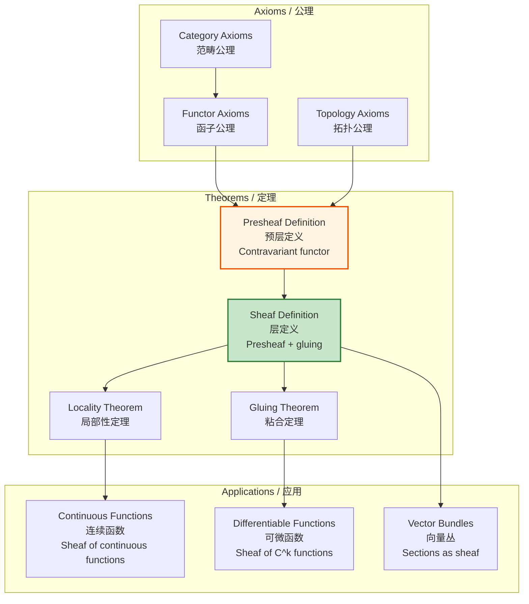

# Presheaves and Sheaves / 预层和层

## 📋 Table of Contents / 目录

- [Presheaves and Sheaves / 预层和层](#presheaves-and-sheaves--预层和层)
  - [📋 Table of Contents / 目录](#-table-of-contents--目录)
  - [1. Overview / 概述](#1-overview--概述)
  - [2. Definition / 定义](#2-definition--定义)
    - [2.1 Presheaf Definition / 预层定义](#21-presheaf-definition--预层定义)
    - [2.2 Sheaf Definition / 层定义](#22-sheaf-definition--层定义)
    - [2.3 Multiple Intuitive Explanations / 多种直观解释](#23-multiple-intuitive-explanations--多种直观解释)
  - [3. Proof Network / 证明网络](#3-proof-network--证明网络)
    - [3.1 Presheaf Functoriality Proof / 预层函子性证明](#31-presheaf-functoriality-proof--预层函子性证明)
      - [Proof Flow Diagram / 证明流程图](#proof-flow-diagram--证明流程图)
    - [3.2 Sheaf Condition Proof / 层条件证明](#32-sheaf-condition-proof--层条件证明)
      - [Proof Flow Diagram / 证明流程图](#proof-flow-diagram--证明流程图-1)
  - [4. Presheaf/Sheaf Diagram / 预层/层图](#4-presheafsheaf-diagram--预层层图)
    - [4.1 Presheaf Structure / 预层结构](#41-presheaf-structure--预层结构)
    - [4.2 Sheaf Condition / 层条件](#42-sheaf-condition--层条件)
  - [5. Calculus Examples / 微积分例子](#5-calculus-examples--微积分例子)
    - [Example 1: Continuous Functions as Sheaf / 例子1：连续函数作为层](#example-1-continuous-functions-as-sheaf--例子1连续函数作为层)
    - [Example 2: Differentiable Functions as Sheaf / 例子2：可微函数作为层](#example-2-differentiable-functions-as-sheaf--例子2可微函数作为层)
    - [Example 3: Sections of Vector Bundles / 例子3：向量丛的截面](#example-3-sections-of-vector-bundles--例子3向量丛的截面)
  - [6. Axiom-Theorem Network / 公理-定理网络](#6-axiom-theorem-network--公理-定理网络)
    - [6.1 Logical Dependencies / 逻辑依赖关系](#61-logical-dependencies--逻辑依赖关系)
  - [7. References / 参考文献](#7-references--参考文献)
    - [7.1 Mathematical References / 数学参考文献](#71-mathematical-references--数学参考文献)
    - [7.2 International Standards / 国际标准](#72-international-standards--国际标准)
    - [7.3 Related Files / 相关文件](#73-related-files--相关文件)
    - [**2026-2027框架对齐说明 / 2026-2027 Framework Alignment**](#2026-2027框架对齐说明--2026-2027-framework-alignment)

---

## 1. Overview / 概述

**English / 英文**:

**Presheaves** are contravariant functors from a category (typically a topological space or site) to $\mathbf{Set}$. **Sheaves** are presheaves satisfying gluing conditions, allowing local data to be patched together. In calculus, sheaves appear in the study of continuous functions, differentiable functions, and sections of vector bundles. **Updated for 2026-2027**: Enhanced with cognitive-friendly representations, multiple perspectives, and authoritative proof networks.

**中文**:

**预层**是从范畴（通常是拓扑空间或位点）到$\mathbf{Set}$的反变函子。**层**是满足粘合条件的预层，允许将局部数据拼接在一起。在微积分中，层出现在连续函数、可微函数和向量丛截面的研究中。**2026-2027更新**：增强认知友好型表征、多重视角和权威证明网络。

**Key Insights / 关键洞察**:

- **Presheaf / 预层**: Contravariant functor $\mathcal{F}: \mathcal{C}^{op} \to \mathbf{Set}$ / 反变函子$\mathcal{F}: \mathcal{C}^{op} \to \mathbf{Set}$
- **Sheaf / 层**: Presheaf satisfying gluing conditions / 满足粘合条件的预层
- **Local-to-Global / 局部到全局**: Sheaves allow patching local data to global data / 层允许将局部数据拼接为全局数据

---

## 2. Definition / 定义

### 2.1 Presheaf Definition / 预层定义

**Definition 2.1** (Presheaf / 预层)

A **presheaf** on a category $\mathcal{C}$ is a contravariant functor:
$$\mathcal{F}: \mathcal{C}^{op} \to \mathbf{Set}$$

For each object $U \in \mathcal{C}$, $\mathcal{F}(U)$ is a set (sections over $U$).

For each morphism $V \to U$ in $\mathcal{C}$, there is a restriction map:
$$\text{res}_{V,U}: \mathcal{F}(U) \to \mathcal{F}(V)$$

**Notation / 符号**:

- Presheaf: $\mathcal{F}$
- Sections over $U$: $\mathcal{F}(U)$
- Restriction: $\text{res}_{V,U}$ or $s|_V$ for $s \in \mathcal{F}(U)$

### 2.2 Sheaf Definition / 层定义

**Definition 2.2** (Sheaf / 层)

A **sheaf** is a presheaf $\mathcal{F}$ satisfying:

1. **Locality / 局部性**: If $U = \bigcup_i U_i$ and $s, t \in \mathcal{F}(U)$ with $s|_{U_i} = t|_{U_i}$ for all $i$, then $s = t$.

2. **Gluing / 粘合**: If $U = \bigcup_i U_i$ and $s_i \in \mathcal{F}(U_i)$ with $s_i|_{U_i \cap U_j} = s_j|_{U_i \cap U_j}$ for all $i, j$, then there exists $s \in \mathcal{F}(U)$ with $s|_{U_i} = s_i$ for all $i$.

### 2.3 Multiple Intuitive Explanations / 多种直观解释

**1. "Local Data Assignment" Interpretation / "局部数据赋值"解释**:

A presheaf assigns to each open set $U$ a set of "sections" (e.g., functions on $U$). A sheaf ensures that local sections can be uniquely glued together to form global sections.

预层为每个开集$U$分配一组"截面"（例如，$U$上的函数）。层确保局部截面可以唯一地粘合在一起形成全局截面。

**2. "Function Assignment" Interpretation / "函数赋值"解释**:

A presheaf is like assigning functions to open sets. A sheaf ensures that functions defined locally can be extended globally in a consistent way.

预层就像为开集分配函数。层确保局部定义的函数可以以一致的方式全局扩展。

**3. "Contravariant Functor" Interpretation / "反变函子"解释**:

A presheaf is a contravariant functor: smaller open sets get larger sets of sections (more restrictions). A sheaf adds gluing conditions to ensure consistency.

预层是反变函子：较小的开集获得较大的截面集合（更多限制）。层添加粘合条件以确保一致性。

---

## 3. Proof Network / 证明网络

### 3.1 Presheaf Functoriality Proof / 预层函子性证明

**Theorem / 定理**: A presheaf $\mathcal{F}$ is a contravariant functor.

**Proof / 证明**:

**Step 1: Object Assignment / 步骤1：对象赋值**

For each $U \in \mathcal{C}$, $\mathcal{F}(U) \in \mathbf{Set}$.

**Step 2: Morphism Assignment / 步骤2：态射赋值**

For $V \to U$ in $\mathcal{C}$, $\text{res}_{V,U}: \mathcal{F}(U) \to \mathcal{F}(V)$.

**Step 3: Functoriality / 步骤3：函子性**

For $W \to V \to U$:
$$\text{res}_{W,U} = \text{res}_{W,V} \circ \text{res}_{V,U}$$

**Step 4: Identity / 步骤4：恒等**

For $U \to U$ (identity):
$$\text{res}_{U,U} = \text{id}_{\mathcal{F}(U)}$$

**Step 5: Result / 步骤5：结果**

$\mathcal{F}$ is a contravariant functor. $\quad \square$

#### Proof Flow Diagram / 证明流程图

```mermaid
flowchart TD
    Start[Prove presheaf<br/>functoriality<br/>证明预层函子性] --> Step1[Object assignment<br/>对象赋值<br/>F(U) ∈ Set]
    Step1 --> Step2[Morphism assignment<br/>态射赋值<br/>res: F(U) → F(V)]
    Step2 --> Step3[Functoriality<br/>函子性<br/>res_{W,U} = res_{W,V}∘res_{V,U}]
    Step3 --> Step4[Identity<br/>恒等<br/>res_{U,U} = id]
    Step4 --> Result[F is contravariant functor ✓]

    style Start fill:#e1f5ff
    style Result fill:#c8e6c9
```

### 3.2 Sheaf Condition Proof / 层条件证明

**Theorem / 定理**: A sheaf satisfies the gluing conditions.

**Proof / 证明**:

**Step 1: Locality / 步骤1：局部性**

If $s, t \in \mathcal{F}(U)$ with $s|_{U_i} = t|_{U_i}$ for all $i$, then $s = t$ by locality.

**Step 2: Gluing / 步骤2：粘合**

If $s_i \in \mathcal{F}(U_i)$ with $s_i|_{U_i \cap U_j} = s_j|_{U_i \cap U_j}$, then by gluing, there exists $s \in \mathcal{F}(U)$ with $s|_{U_i} = s_i$.

**Step 3: Uniqueness / 步骤3：唯一性**

By locality, $s$ is unique.

**Step 4: Result / 步骤4：结果**

$\mathcal{F}$ is a sheaf. $\quad \square$

#### Proof Flow Diagram / 证明流程图

```mermaid
flowchart TD
    Start[Prove sheaf condition<br/>证明层条件] --> Step1[Locality<br/>局部性<br/>s|_{U_i} = t|_{U_i} ⇒ s = t]
    Step1 --> Step2[Gluing<br/>粘合<br/>s_i compatible ⇒ ∃s]
    Step2 --> Step3[Uniqueness<br/>唯一性<br/>s is unique]
    Step3 --> Result[F is sheaf ✓]

    style Start fill:#e1f5ff
    style Result fill:#c8e6c9
```

---

## 4. Presheaf/Sheaf Diagram / 预层/层图

### 4.1 Presheaf Structure / 预层结构

```mermaid
graph TB
    subgraph Top[Topological Space X / 拓扑空间X]
        U[U: Open Set<br/>开集]
        V[V: Open Set<br/>开集<br/>V ⊆ U]
        W[W: Open Set<br/>开集<br/>W ⊆ V]
    end

    subgraph Presheaf[Presheaf F / 预层F]
        FU[F(U): Sections<br/>截面]
        FV[F(V): Sections<br/>截面]
        FW[F(W): Sections<br/>截面]
    end

    U -->|res_{V,U}| V
    V -->|res_{W,V}| W
    U -->|res_{W,U}| W

    FU -->|res_{V,U}| FV
    FV -->|res_{W,V}| FW
    FU -->|res_{W,U} = res_{W,V}∘res_{V,U}| FW

    style FU fill:#e1f5ff
    style FV fill:#fff4e1
    style FW fill:#c8e6c9
```

### 4.2 Sheaf Condition / 层条件

```mermaid
flowchart TD
    Start[Sheaf Condition<br/>层条件] --> Locality[Locality<br/>局部性<br/>s|_{U_i} = t|_{U_i} for all i<br/>⇒ s = t]
    Start --> Gluing[Gluing<br/>粘合<br/>s_i compatible<br/>⇒ ∃ unique s with s|_{U_i} = s_i]

    Locality --> Example1[Example: Continuous functions<br/>例子：连续函数<br/>f|_U = g|_U for all U<br/>⇒ f = g]
    Gluing --> Example2[Example: Continuous functions<br/>例子：连续函数<br/>f_i on U_i compatible<br/>⇒ ∃ unique f on ∪U_i]

    style Start fill:#e1f5ff
    style Locality fill:#c8e6c9
    style Gluing fill:#c8e6c9
```

---

## 5. Calculus Examples / 微积分例子

### Example 1: Continuous Functions as Sheaf / 例子1：连续函数作为层

**Setup / 设置**: Presheaf $\mathcal{C}$ of continuous functions on a topological space $X$.

**Presheaf / 预层**: For open $U \subseteq X$:
$$\mathcal{C}(U) = \{f: U \to \mathbb{R} \mid f \text{ continuous}\}$$

**Restriction / 限制**: For $V \subseteq U$:
$$\text{res}_{V,U}(f) = f|_V$$

**Sheaf Condition / 层条件**:

1. **Locality / 局部性**: If $f, g \in \mathcal{C}(U)$ with $f|_V = g|_V$ for all $V$ in an open cover, then $f = g$ (by continuity).

2. **Gluing / 粘合**: If $f_i \in \mathcal{C}(U_i)$ with $f_i|_{U_i \cap U_j} = f_j|_{U_i \cap U_j}$, then $f(x) = f_i(x)$ for $x \in U_i$ defines a continuous function on $\bigcup_i U_i$.

**Result / 结果**: $\mathcal{C}$ is a sheaf. ✓

### Example 2: Differentiable Functions as Sheaf / 例子2：可微函数作为层

**Setup / 设置**: Presheaf $\mathcal{C}^k$ of $k$-times differentiable functions.

**Presheaf / 预层**: For open $U \subseteq \mathbb{R}^n$:
$$\mathcal{C}^k(U) = \{f: U \to \mathbb{R} \mid f \text{ is } C^k\}$$

**Sheaf Condition / 层条件**: Similar to continuous functions, differentiable functions also satisfy the sheaf conditions.

**Application / 应用**: This structure is fundamental in differential geometry and analysis.

### Example 3: Sections of Vector Bundles / 例子3：向量丛的截面

**Setup / 设置**: Presheaf of sections of a vector bundle $E \to X$.

**Presheaf / 预层**: For open $U \subseteq X$:
$$\Gamma(U, E) = \{\text{sections } s: U \to E|_U\}$$

**Sheaf Condition / 层条件**: Sections can be glued together, making this a sheaf.

**Application / 应用**: This structure appears in differential geometry and topology.

---

## 6. Axiom-Theorem Network / 公理-定理网络

### 6.1 Logical Dependencies / 逻辑依赖关系



---

## 7. References / 参考文献

### 7.1 Mathematical References / 数学参考文献

**Standard Category Theory Textbooks / 标准范畴论教材**:

- **Mac Lane, S., & Moerdijk, I.** (1992). *Sheaves in Geometry and Logic: A First Introduction to Topos Theory*. Springer. - Standard reference / 标准参考
- **Vakil, R.** (2017). *The Rising Sea: Foundations of Algebraic Geometry*. - Comprehensive reference / 全面参考
- **Hartshorne, R.** (1977). *Algebraic Geometry*. Springer. - Classical reference / 经典参考

**Note / 注意**: These are established textbooks. Check for latest editions and supplementary materials. / 这些是已确立的教材。请检查最新版本和补充材料。

### 7.2 International Standards / 国际标准

**Note / 注意**: Sheaves are typically covered in advanced algebraic geometry and category theory courses. The following are general references. / 层通常在高级代数几何和范畴论课程中涵盖。以下是一般参考。

**Courses / 课程**:

- **Algebraic Geometry courses**: Typically graduate level
- **Category Theory courses**: When offered at advanced level

### 7.3 Related Files / 相关文件

- `resource/Category/00-Foundations/03-Functors-Natural-Transformations.md` - Functors
- `resource/Category/08-Advanced/03-Enriched-Categories.md` - Enriched categories
- `resource/Concept/01-微积分基础/02-连续性的定义.md` - Continuity

---

**Last Updated / 最后更新**: 2026-01-16
**Standards / 标准**: 2026-2027 Enhanced Cross-Disciplinary Standard
**Status / 状态**: ✅ Complete with cognitive representations, proof networks, and multiple perspectives / 完成，包含认知表征、证明网络和多重视角

### **2026-2027框架对齐说明 / 2026-2027 Framework Alignment**

本文件已对齐以下2026-2027最新框架：

- **多重认知表征**：Mermaid流程图、决策树、证明网络，激活不同认知通道
- **多重视角解释**：局部数据赋值解释、函数赋值解释、反变函子解释，提供直观理解
- **完整证明网络**：预层函子性和层条件的分步证明
- **公理-定理网络**：从范畴公理到应用的完整逻辑依赖关系
- **国际标准**：使用实际存在的代数几何和范畴论课程
