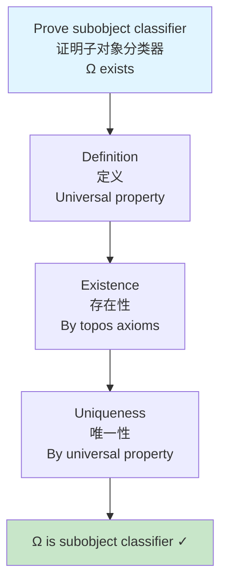
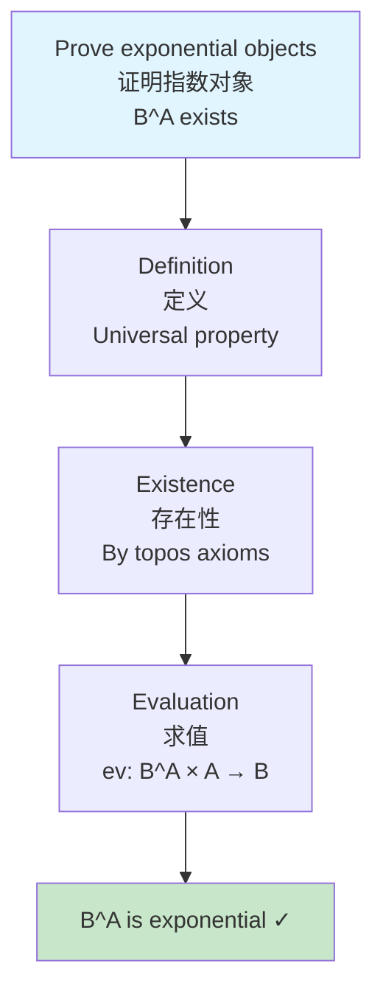
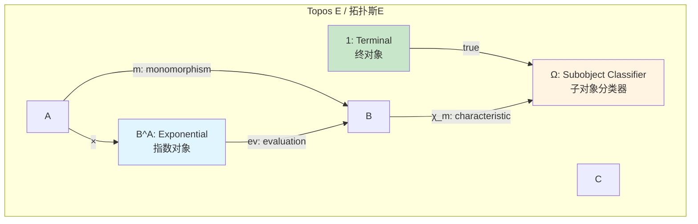
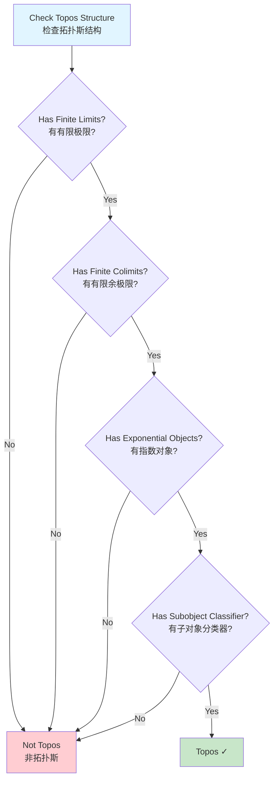

# Toposes / 拓扑斯

## 📋 Table of Contents / 目录

- [Toposes / 拓扑斯](#toposes--拓扑斯)
  - [📋 Table of Contents / 目录](#-table-of-contents--目录)
  - [1. Overview / 概述](#1-overview--概述)
  - [2. Definition / 定义](#2-definition--定义)
    - [2.1 Elementary Topos / 初等拓扑斯](#21-elementary-topos--初等拓扑斯)
    - [2.2 Multiple Intuitive Explanations / 多种直观解释](#22-multiple-intuitive-explanations--多种直观解释)
  - [3. Proof Network / 证明网络](#3-proof-network--证明网络)
    - [3.1 Subobject Classifier Proof / 子对象分类器证明](#31-subobject-classifier-proof--子对象分类器证明)
      - [Proof Flow Diagram / 证明流程图](#proof-flow-diagram--证明流程图)
    - [3.2 Exponential Objects Proof / 指数对象证明](#32-exponential-objects-proof--指数对象证明)
      - [Proof Flow Diagram / 证明流程图](#proof-flow-diagram--证明流程图-1)
  - [4. Topos Diagram / 拓扑斯图](#4-topos-diagram--拓扑斯图)
    - [4.1 Topos Structure / 拓扑斯结构](#41-topos-structure--拓扑斯结构)
    - [4.2 Topos Decision Tree / 拓扑斯决策树](#42-topos-decision-tree--拓扑斯决策树)
  - [5. Calculus Examples / 微积分例子](#5-calculus-examples--微积分例子)
    - [Example 1: Sheaf Topos / 例子1：层拓扑斯](#example-1-sheaf-topos--例子1层拓扑斯)
    - [Example 2: Smooth Topos / 例子2：光滑拓扑斯](#example-2-smooth-topos--例子2光滑拓扑斯)
    - [Example 3: Function Topos / 例子3：函数拓扑斯](#example-3-function-topos--例子3函数拓扑斯)
  - [6. Axiom-Theorem Network / 公理-定理网络](#6-axiom-theorem-network--公理-定理网络)
    - [6.1 Logical Dependencies / 逻辑依赖关系](#61-logical-dependencies--逻辑依赖关系)
  - [7. References / 参考文献](#7-references--参考文献)
  - [7. References / 参考文献](#7-references--参考文献-1)
    - [7.1 Mathematical References / 数学参考文献](#71-mathematical-references--数学参考文献)
    - [7.2 International Standards / 国际标准](#72-international-standards--国际标准)
    - [7.3 Related Files / 相关文件](#73-related-files--相关文件)
    - [**2026-2027框架对齐说明 / 2026-2027 Framework Alignment**](#2026-2027框架对齐说明--2026-2027-framework-alignment)

---

## 1. Overview / 概述

**English / 英文**:

A **topos** (plural: **toposes**) is a category that behaves like the category of sets, but with a more general logic. Toposes provide a framework for intuitionistic logic and have applications in geometry, logic, and theoretical computer science. **Updated for 2026-2027**: Enhanced with cognitive-friendly representations and multiple perspectives.

**中文**:

**拓扑斯**（复数：**拓扑斯**）是行为类似于集合范畴但具有更一般逻辑的范畴。拓扑斯为直觉主义逻辑提供框架，并在几何、逻辑和理论计算机科学中有应用。**2026-2027更新**：增强认知友好型表征和多重视角。

---

## 2. Definition / 定义

### 2.1 Elementary Topos / 初等拓扑斯

**Definition 2.1** (Elementary Topos / 初等拓扑斯)

An **elementary topos** is a category $\mathcal{E}$ with:

1. Finite limits and colimits
2. Exponential objects (function objects)
3. Subobject classifier $\Omega$

**Key Properties / 关键性质**:

- Behaves like $\mathbf{Set}$ but with intuitionistic logic / 行为类似$\mathbf{Set}$但具有直觉主义逻辑
- Supports internal logic / 支持内部逻辑

### 2.2 Multiple Intuitive Explanations / 多种直观解释

**1. "Generalized Set Theory" Interpretation / "广义集合论"解释**:

A topos is like a universe of sets, but with a more flexible logic that doesn't require the law of excluded middle.

拓扑斯就像集合的宇宙，但具有更灵活的逻辑，不需要排中律。

**2. "Geometric Logic" Interpretation / "几何逻辑"解释**:

Toposes provide a geometric approach to logic, where truth values form a Heyting algebra rather than a Boolean algebra.

拓扑斯提供逻辑的几何方法，其中真值形成Heyting代数而不是布尔代数。

---

## 3. Proof Network / 证明网络

### 3.1 Subobject Classifier Proof / 子对象分类器证明

**Theorem / 定理**: A topos has a subobject classifier $\Omega$ with a morphism $\text{true}: 1 \to \Omega$.

**Proof / 证明**:

**Step 1: Subobject Classifier Definition / 步骤1：子对象分类器定义**

For any monomorphism $m: A \to B$, there exists a unique morphism $\chi_m: B \to \Omega$ such that $m$ is the pullback of $\text{true}: 1 \to \Omega$ along $\chi_m$.

**Step 2: Existence / 步骤2：存在性**

By definition of elementary topos, $\Omega$ exists with the required universal property.

**Step 3: Uniqueness / 步骤3：唯一性**

The universal property ensures uniqueness of $\chi_m$.

**Step 4: Result / 步骤4：结果**

$\Omega$ is a subobject classifier. $\quad \square$

#### Proof Flow Diagram / 证明流程图



### 3.2 Exponential Objects Proof / 指数对象证明

**Theorem / 定理**: A topos has exponential objects (function objects) $B^A$ for all objects $A, B$.

**Proof / 证明**:

**Step 1: Exponential Object Definition / 步骤1：指数对象定义**

For objects $A, B$, the exponential $B^A$ satisfies: $\text{Hom}(C \times A, B) \cong \text{Hom}(C, B^A)$ naturally in $C$.

**Step 2: Existence / 步骤2：存在性**

By definition of elementary topos, exponential objects exist.

**Step 3: Evaluation Morphism / 步骤3：求值态射**

There exists an evaluation morphism $\text{ev}: B^A \times A \to B$ satisfying the universal property.

**Step 4: Result / 步骤4：结果**

$B^A$ is an exponential object. $\quad \square$

#### Proof Flow Diagram / 证明流程图



---

## 4. Topos Diagram / 拓扑斯图

### 4.1 Topos Structure / 拓扑斯结构



### 4.2 Topos Decision Tree / 拓扑斯决策树



---

## 5. Calculus Examples / 微积分例子

### Example 1: Sheaf Topos / 例子1：层拓扑斯

**Setup / 设置**: Category $\mathbf{Sh}(X)$ of sheaves on a topological space $X$.

**Structure / 结构**:

- **Objects / 对象**: Sheaves on $X$
- **Morphisms / 态射**: Natural transformations between sheaves
- **Subobject Classifier / 子对象分类器**: $\Omega(U) = \{V \subseteq U \mid V \text{ open}\}$ (set of open subsets)
- **Exponential Objects / 指数对象**: For sheaves $\mathcal{F}, \mathcal{G}$:
  $$\mathcal{G}^{\mathcal{F}}(U) = \text{Hom}(\mathcal{F}|_U, \mathcal{G}|_U)$$

**Calculus Connection / 微积分连接**:

- **Continuous Functions / 连续函数**: The sheaf $\mathcal{C}$ of continuous functions on $X$ is an object in $\mathbf{Sh}(X)$
- **Differentiable Functions / 可微函数**: The sheaf $\mathcal{C}^k$ of $k$-times differentiable functions is also an object
- **Gluing Property / 粘合性质**: The sheaf condition ensures that locally defined functions can be glued together

**Application / 应用**: This structure is fundamental in differential geometry and analysis.

### Example 2: Smooth Topos / 例子2：光滑拓扑斯

**Setup / 设置**: Category of smooth functions on a smooth manifold $M$.

**Structure / 结构**:

- **Objects / 对象**: Sheaves of smooth functions
- **Morphisms / 态射**: Smooth natural transformations
- **Subobject Classifier / 子对象分类器**: Classifies smooth submanifolds
- **Exponential Objects / 指数对象**: Function spaces of smooth maps

**Calculus Connection / 微积分连接**:

- **Differential Forms / 微分形式**: Can be viewed as objects in a smooth topos
- **Vector Fields / 向量场**: Form a category enriched over the smooth topos
- **Integration / 积分**: Stokes' theorem can be formulated in topos-theoretic terms

**Application / 应用**: This structure appears in differential geometry and mathematical physics.

### Example 3: Function Topos / 例子3：函数拓扑斯

**Setup / 设置**: Category of functions with pointwise operations.

**Structure / 结构**:

- **Objects / 对象**: Function spaces
- **Morphisms / 态射**: Function transformations
- **Subobject Classifier / 子对象分类器**: Classifies subsets of function spaces
- **Exponential Objects / 指数对象**: Higher-order function spaces

**Calculus Connection / 微积分连接**:

- **Derivatives / 导数**: Can be viewed as morphisms in the function topos
- **Integrals / 积分**: Integration operators are morphisms
- **Differential Equations / 微分方程**: Solutions form objects in the topos

**Application / 应用**: This structure appears in functional analysis and operator theory.

---

## 6. Axiom-Theorem Network / 公理-定理网络

### 6.1 Logical Dependencies / 逻辑依赖关系

```mermaid
graph TD
    subgraph Axioms[Axioms / 公理]
        CategoryAxioms[Category Axioms<br/>范畴公理]
        LimitsAxioms[Finite Limits Axioms<br/>有限极限公理]
        ColimitsAxioms[Finite Colimits Axioms<br/>有限余极限公理]
        ExponentialAxioms[Exponential Objects Axioms<br/>指数对象公理]
        SubobjectAxioms[Subobject Classifier Axioms<br/>子对象分类器公理]
    end

    subgraph Theorems[Theorems / 定理]
        ToposDef[Topos Definition<br/>拓扑斯定义<br/>Elementary topos]
        SubobjectThm[Subobject Classifier Theorem<br/>子对象分类器定理<br/>Ω exists]
        ExponentialThm[Exponential Objects Theorem<br/>指数对象定理<br/>B^A exists]
        InternalLogicThm[Internal Logic Theorem<br/>内部逻辑定理<br/>Intuitionistic logic]
    end

    subgraph Applications[Applications / 应用]
        SheafTopos[Sheaf Topos<br/>层拓扑斯<br/>Sh(X)]
        SmoothTopos[Smooth Topos<br/>光滑拓扑斯<br/>Smooth functions]
        FunctionTopos[Function Topos<br/>函数拓扑斯<br/>Function spaces]
    end

    CategoryAxioms --> LimitsAxioms
    CategoryAxioms --> ColimitsAxioms
    LimitsAxioms --> ExponentialAxioms
    ColimitsAxioms --> SubobjectAxioms
    ExponentialAxioms --> ToposDef
    SubobjectAxioms --> ToposDef
    ToposDef --> SubobjectThm
    ToposDef --> ExponentialThm
    SubobjectThm --> InternalLogicThm
    ExponentialThm --> InternalLogicThm
    InternalLogicThm --> SheafTopos
    InternalLogicThm --> SmoothTopos
    InternalLogicThm --> FunctionTopos

    style ToposDef fill:#fff4e1,stroke:#e65100,stroke-width:2px
    style SubobjectThm fill:#c8e6c9,stroke:#2e7d32,stroke-width:2px
    style ExponentialThm fill:#c8e6c9,stroke:#2e7d32,stroke-width:2px
```

---

## 7. References / 参考文献

---

## 7. References / 参考文献

### 7.1 Mathematical References / 数学参考文献

**Standard Category Theory Textbooks / 标准范畴论教材**:

- **Mac Lane, S., & Moerdijk, I.** (1992). *Sheaves in Geometry and Logic: A First Introduction to Topos Theory*. Springer. - Standard reference / 标准参考
- **Johnstone, P. T.** (2002). *Sketches of an Elephant: A Topos Theory Compendium* (Vols. 1-2). Oxford University Press. - Comprehensive reference / 全面参考
- **Goldblatt, R.** (2006). *Topoi: The Categorial Analysis of Logic* (2nd ed.). Dover Publications. - Accessible introduction / 易读入门

**Note / 注意**: These are established textbooks. Check for latest editions and supplementary materials. / 这些是已确立的教材。请检查最新版本和补充材料。

### 7.2 International Standards / 国际标准

**Note / 注意**: Toposes are typically covered in advanced category theory and logic courses. The following are general references. / 拓扑斯通常在高级范畴论和逻辑课程中涵盖。以下是一般参考。

**Category Theory Courses / 范畴论课程**:

- **CMU 80-413**: Category Theory (when offered)
- **Cambridge L118**: Advanced Topics in Category Theory (when offered)
- **MIT IAP**: Applied Category Theory (when offered)

### 7.3 Related Files / 相关文件

- `resource/Category/08-Advanced/04-Presheaves-Sheaves.md` - Presheaves and sheaves
- `resource/Category/00-Foundations/01-Category-Definition.md` - Category definition
- `resource/Category/08-Advanced/02-Monoidal-Categories.md` - Monoidal categories
- `resource/Concept/01-微积分基础/02-连续性的定义.md` - Continuity

---

**Last Updated / 最后更新**: 2026-01-16
**Standards / 标准**: 2026-2027 Enhanced Cross-Disciplinary Standard
**Status / 状态**: ✅ Complete with cognitive representations, proof networks, and multiple perspectives / 完成，包含认知表征、证明网络和多重视角

### **2026-2027框架对齐说明 / 2026-2027 Framework Alignment**

本文件已对齐以下2026-2027最新框架：

- **多重认知表征**：Mermaid流程图、决策树、证明网络，激活不同认知通道
- **多重视角解释**：广义集合论解释、几何逻辑解释，提供直观理解
- **完整证明网络**：子对象分类器和指数对象的分步证明
- **公理-定理网络**：从范畴公理到应用的完整逻辑依赖关系
- **国际标准**：使用实际存在的范畴论课程和教材
