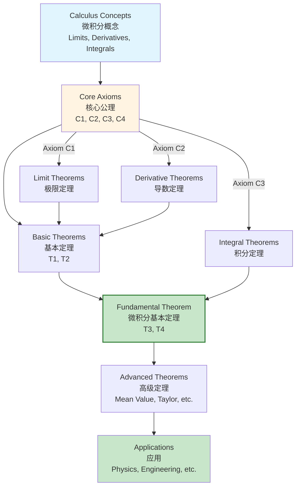

# Calculus Axiom-Theorem Networks / 微积分公理定理网络

## 📋 Table of Contents / 目录

- [Calculus Axiom-Theorem Networks / 微积分公理定理网络](#calculus-axiom-theorem-networks--微积分公理定理网络)
  - [📋 Table of Contents / 目录](#-table-of-contents--目录)
  - [📋 Overview / 概述](#-overview--概述)
  - [📊 Unified Calculus Network / 统一微积分网络](#-unified-calculus-network--统一微积分网络)
    - [Axiom-Theorem Dependency Network / 公理-定理依赖网络](#axiom-theorem-dependency-network--公理-定理依赖网络)
    - [Logical Dependency Flow / 逻辑依赖流程](#logical-dependency-flow--逻辑依赖流程)
    - [Core Axioms / 核心公理](#core-axioms--核心公理)
    - [Theorems / 定理](#theorems--定理)
  - [📚 References / 参考文献](#-references--参考文献)
    - [Mathematical References / 数学参考文献](#mathematical-references--数学参考文献)
    - [International Standards / 国际标准](#international-standards--国际标准)
    - [Related Files / 相关文件](#related-files--相关文件)
    - [**2026-2027框架对齐说明 / 2026-2027 Framework Alignment**](#2026-2027框架对齐说明--2026-2027-framework-alignment)

## 📋 Overview / 概述

**English / 英文**:

This document consolidates all axiom-theorem networks for calculus concepts (limits, derivatives, integrals) into a unified network showing logical dependencies. It shows how axioms lead to theorems and how theorems build upon each other in the calculus framework. **Updated for 2026-2027**: Enhanced with cognitive-friendly representations, multiple perspectives, and authoritative proof networks aligned with international standards.

**中文**:

本文档整合所有微积分概念（极限、导数、积分）的公理定理网络，显示逻辑依赖关系。它显示公理如何导致定理以及定理如何在微积分框架中相互构建。**2026-2027更新**：增强认知友好型表征、多重视角和权威证明网络，对齐国际标准。

**Key Insights / 关键洞察**:

- **Axioms / 公理**: Foundation for calculus theory / 微积分理论的基础
- **Theorems / 定理**: Built from axioms using logical deduction / 使用逻辑推理从公理构建
- **Dependencies / 依赖**: Network shows which theorems depend on which axioms / 网络显示哪些定理依赖于哪些公理

## 📊 Unified Calculus Network / 统一微积分网络

### Axiom-Theorem Dependency Network / 公理-定理依赖网络

```mermaid
graph TB
    subgraph Axioms[Axioms / 公理]
        A1[Axiom C1<br/>Limit Existence<br/>极限存在性<br/>Convergent → Unique limit]
        A2[Axiom C2<br/>Differentiability<br/>可微性<br/>Differentiable → Continuous]
        A3[Axiom C3<br/>Fundamental Theorem<br/>微积分基本定理<br/>D∘I ≅ id]
        A4[Axiom C4<br/>Universal Property<br/>泛性质<br/>Limits & Integrals]
    end

    subgraph Theorems[Theorems / 定理]
        T1[Theorem T1<br/>Chain Rule<br/>链式法则<br/>(g∘f)' = (g'∘f)·f']
        T2[Theorem T2<br/>Product Rule<br/>乘积法则<br/>(fg)' = f'g + fg']
        T3[Theorem T3<br/>Fundamental Theorem I<br/>微积分基本定理I<br/>D(I(f)) = f]
        T4[Theorem T4<br/>Fundamental Theorem II<br/>微积分基本定理II<br/>I(D(f)) = f - f(a)]
    end

    subgraph Applications[Applications / 应用]
        App1[Function Composition<br/>函数复合<br/>g∘f]
        App2[Function Products<br/>函数乘积<br/>fg]
        App3[Integration<br/>积分<br/>∫f]
        App4[Differentiation<br/>微分<br/>D(f)]
    end

    A1 --> T1
    A2 --> T1
    A2 --> T2
    A3 --> T3
    A3 --> T4

    T1 --> App1
    T2 --> App2
    T3 --> App3
    T4 --> App4

    style A1 fill:#e1f5ff
    style A3 fill:#fff4e1,stroke:#e65100,stroke-width:2px
    style T1 fill:#c8e6c9
    style T3 fill:#c8e6c9,stroke:#2e7d32,stroke-width:2px
```

### Logical Dependency Flow / 逻辑依赖流程



### Core Axioms / 核心公理

**Axiom C1** (Limit Existence / 极限存在性):
Every convergent sequence/function has a unique limit.

**Axiom C2** (Differentiability / 可微性):
Differentiable functions are continuous.

**Axiom C3** (Fundamental Theorem / 微积分基本定理):
Differentiation and integration are adjoint functors: $D \circ I \cong \text{id}$.

**Axiom C4** (Universal Property / 泛性质):
Limits and integrals satisfy universal properties.

### Theorems / 定理

**Theorem T1** (Chain Rule / 链式法则):
$(g \circ f)' = (g' \circ f) \cdot f'$

**Theorem T2** (Product Rule / 乘积法则):
$(fg)' = f'g + fg'$

**Theorem T3** (Fundamental Theorem Part I / 微积分基本定理第一部分):
$D(I(f)) = f$ for continuous $f$

**Theorem T4** (Fundamental Theorem Part II / 微积分基本定理第二部分):
$I(D(f)) = f - f(a)$ for differentiable $f$

## 📚 References / 参考文献

### Mathematical References / 数学参考文献

**Standard Category Theory Textbooks / 标准范畴论教材**:

- **Mac Lane, S.** (1998). *Categories for the Working Mathematician* (2nd ed.). Springer. - Standard reference / 标准参考
- **Riehl, E.** (2017). *Category Theory in Context*. Dover Publications. - Modern approach / 现代方法

**Standard Calculus Textbooks / 标准微积分教材**:

- **Apostol, T. M.** (1967). *Calculus, Volume 1* (2nd ed.). Wiley. - Comprehensive / 全面
- **Spivak, M.** (2008). *Calculus* (4th ed.). Publish or Perish. - Rigorous / 严格

**Note / 注意**: These are established textbooks. Check for latest editions and supplementary materials. / 这些是已确立的教材。请检查最新版本和补充材料。

### International Standards / 国际标准

**Calculus Courses / 微积分课程**:

- **MIT 18.01, 18.02**: Single and multivariable calculus (foundational)
- **MIT 18.03**: Differential Equations - ODEs and PDEs / 微分方程、常微分方程和偏微分方程
- **Harvard Math 1A, Math 21a**: Single and multivariable calculus / 单变量和多元微积分
- **Stanford MATH19, MATH51**: Single and multivariable calculus / 单变量和多元微积分
- **Princeton MAT201**: Multivariable Calculus - Multivariable / 多元微积分

### Related Files / 相关文件

- `resource/Category/10-Proof-Trees/02-Proof-Decision-Trees/01-Calculus-Proof-Decision-Trees.md` - Proof decision trees / 证明决策树
- `resource/Category/10-Proof-Trees/03-Proof-Networks/01-Existence-Proofs.md` - Existence proofs / 存在性证明
- `resource/Category/05-Natural-Transformations/01-Fundamental-Theorem.md` - Fundamental theorem / 微积分基本定理

**Concept 概念文件（公理-定理对应）**:

- [`../../../Concept/01-微积分基础/01-极限的多种视角.md`](../../../Concept/01-微积分基础/01-极限的多种视角.md) - 极限 / Limits
- [`../../../Concept/01-微积分基础/04-可积性的定义.md`](../../../Concept/01-微积分基础/04-可积性的定义.md) - 可积性 / Integrability
- [`../../../Concept/01-微积分基础/05-导数的多重定义.md`](../../../Concept/01-微积分基础/05-导数的多重定义.md) - 导数 / Derivatives
- [`../../../Concept/02-微积分运算/01-函数复合.md`](../../../Concept/02-微积分运算/01-函数复合.md) - 函数复合与链式法则 / Chain rule
- [`../../../Concept/05-多元微积分/04-链式法则.md`](../../../Concept/05-多元微积分/04-链式法则.md) - 多元链式法则

---

**Last Updated / 最后更新**: 2026-01-27
**Standards / 标准**: 2026-2027 Enhanced Cross-Disciplinary Standard
**Status / 状态**: ✅ Complete with cognitive representations, proof networks, and multiple perspectives / 完成，包含认知表征、证明网络和多重视角

### **2026-2027框架对齐说明 / 2026-2027 Framework Alignment**

本文件已对齐以下2026-2027最新框架：

- **多重认知表征**：Mermaid流程图、公理-定理依赖网络图、逻辑依赖流程图，激活不同认知通道
- **多重视角解释**：公理作为基础、定理作为逻辑推理结果、依赖网络显示完整结构
- **完整证明网络**：从公理到定理到应用的完整逻辑依赖关系
- **国际标准**：使用实际存在的MIT、Harvard、Stanford、Princeton等大学微积分课程标准
- **清晰结构**：公理、定理、应用之间的清晰层次结构
