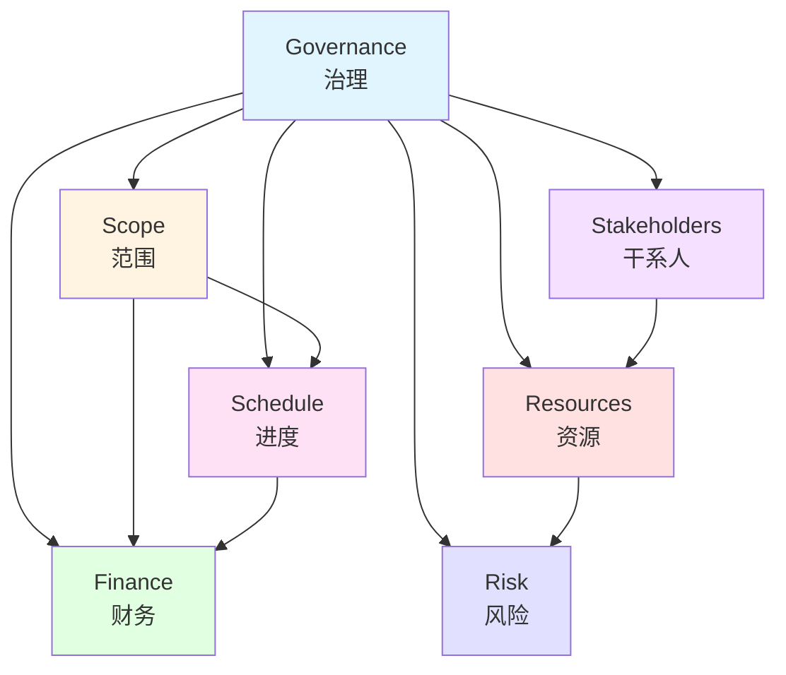

# PMBOK 8th Edition 绩效域 / PMBOK 8th Edition Performance Domains

## 📋 Table of Contents / 目录

- [PMBOK 8th Edition 绩效域 / PMBOK 8th Edition Performance Domains](#pmbok-8th-edition-绩效域--pmbok-8th-edition-performance-domains)
  - [📋 Table of Contents / 目录](#-table-of-contents--目录)
  - [0. 所属层与转换关系 / Layer and Transformation](#0-所属层与转换关系--layer-and-transformation)
  - [1. Overview / 概述](#1-overview--概述)
  - [2. Definition / 定义](#2-definition--定义)
    - [2.1 PMBOK 8th Edition 绩效域概述](#21-pmbok-8th-edition-绩效域概述)
    - [2.2 绩效域1：治理 / Performance Domain 1: Governance](#22-绩效域1治理--performance-domain-1-governance)
    - [2.3 绩效域2：范围 / Performance Domain 2: Scope](#23-绩效域2范围--performance-domain-2-scope)
    - [2.4 绩效域3：进度 / Performance Domain 3: Schedule](#24-绩效域3进度--performance-domain-3-schedule)
    - [2.5 绩效域4：财务 / Performance Domain 4: Finance](#25-绩效域4财务--performance-domain-4-finance)
    - [2.6 绩效域5：干系人 / Performance Domain 5: Stakeholders](#26-绩效域5干系人--performance-domain-5-stakeholders)
    - [2.7 绩效域6：资源 / Performance Domain 6: Resources](#27-绩效域6资源--performance-domain-6-resources)
    - [2.8 绩效域7：风险 / Performance Domain 7: Risk](#28-绩效域7风险--performance-domain-7-risk)
  - [3. Category Theory Perspective / 范畴论视角](#3-category-theory-perspective--范畴论视角)
    - [3.1 绩效域的范畴论建模](#31-绩效域的范畴论建模)
    - [3.2 绩效域之间的自然变换](#32-绩效域之间的自然变换)
  - [4. Properties / 性质](#4-properties--性质)
    - [4.1 绩效域的完整性](#41-绩效域的完整性)
    - [4.2 绩效域的互操作性](#42-绩效域的互操作性)
    - [4.3 绩效域的可测量性](#43-绩效域的可测量性)
  - [5. Relations / 关系](#5-relations--关系)
    - [5.1 绩效域之间的关系](#51-绩效域之间的关系)
    - [5.2 与核心原则的关系](#52-与核心原则的关系)
    - [5.3 与PMBOK 7th Edition的关系](#53-与pmbok-7th-edition的关系)
  - [6. Examples / 例子](#6-examples--例子)
    - [6.1 软件开发项目中的绩效域应用](#61-软件开发项目中的绩效域应用)
    - [6.2 建筑项目中的绩效域应用](#62-建筑项目中的绩效域应用)
    - [6.3 数字化转型项目中的绩效域应用](#63-数字化转型项目中的绩效域应用)
  - [7. Explanations / 解释](#7-explanations--解释)
    - [7.1 数学解释 / Mathematical Explanation](#71-数学解释--mathematical-explanation)
    - [7.2 直观解释 / Intuitive Explanation](#72-直观解释--intuitive-explanation)
    - [7.3 应用解释 / Application Explanation](#73-应用解释--application-explanation)
    - [7.4 认知解释 / Cognitive Explanation](#74-认知解释--cognitive-explanation)
    - [7.5 历史解释 / Historical Explanation](#75-历史解释--historical-explanation)
    - [7.6 哲学解释 / Philosophical Explanation](#76-哲学解释--philosophical-explanation)
    - [7.7 技术解释 / Technical Explanation](#77-技术解释--technical-explanation)
    - [7.8 实践解释 / Practical Explanation](#78-实践解释--practical-explanation)
    - [7.9 对比解释 / Comparative Explanation](#79-对比解释--comparative-explanation)
    - [7.10 系统解释 / System Explanation](#710-系统解释--system-explanation)
  - [8. Argumentation / 论证](#8-argumentation--论证)
    - [8.1 为什么需要绩效域](#81-为什么需要绩效域)
    - [8.2 绩效域的有效性证明](#82-绩效域的有效性证明)
  - [9. Applications / 应用](#9-applications--应用)
    - [9.1 在敏捷项目管理中的应用](#91-在敏捷项目管理中的应用)
    - [9.2 在传统项目管理中的应用](#92-在传统项目管理中的应用)
    - [9.3 在混合项目管理中的应用](#93-在混合项目管理中的应用)
  - [10. References / 参考文献](#10-references--参考文献)
    - [10.1 Standards / 标准](#101-standards--标准)
    - [10.2 Category Theory / 范畴论](#102-category-theory--范畴论)
    - [10.3 Related Files / 相关文件](#103-related-files--相关文件)

---

## 0. 所属层与转换关系 / Layer and Transformation

- **所属层**：**核心模型层**（对应 docs/02-project-management）
- **转换关系**：绩效域作为**项目管理转换**的关键领域，与**生命周期转换** $\delta$、**状态转换** $\rightarrow$ 相关联；与 **02-生命周期概念**、**03-资源管理概念**、**04-风险管理概念** 对应。

---

## 1. Overview / 概述

**English / 英文**:

The PMBOK 8th Edition (published November 2025) introduces seven performance domains that represent key areas of project management practice. These domains are aligned with core project management responsibilities and integrated with six core principles. The seven domains replace the eight domains from PMBOK 7th Edition, providing a more focused and practical framework.

**中文**:

PMBOK 第8版（2025年11月发布）引入了7个绩效域，代表项目管理实践的关键领域。这些域与核心项目管理职责对齐，并与6个核心原则集成。7个域取代了第7版的8个域，提供了更聚焦和实用的框架。

**Key Insights / 关键洞察**:

- **Governance / 治理**: Project oversight and decision-making / 项目监督和决策
- **Scope / 范围**: What will be delivered / 将交付什么
- **Schedule / 进度**: When it will be delivered / 何时交付
- **Finance / 财务**: Financial management and budgeting / 财务管理和预算
- **Stakeholders / 干系人**: People and organizations involved / 涉及的人员和组织
- **Resources / 资源**: People, materials, equipment needed / 需要的人员、材料、设备
- **Risk / 风险**: Uncertainty and its impact / 不确定性及其影响

---

## 2. Definition / 定义

### 2.1 PMBOK 8th Edition 绩效域概述

**Definition 2.1** (PMBOK 8th Edition Performance Domains)

The PMBOK 8th Edition defines seven performance domains:

$$\mathcal{D}_{8} = \{D_1, D_2, D_3, D_4, D_5, D_6, D_7\}$$

where:

- $D_1$: Governance / 治理
- $D_2$: Scope / 范围
- $D_3$: Schedule / 进度
- $D_4$: Finance / 财务
- $D_5$: Stakeholders / 干系人
- $D_6$: Resources / 资源
- $D_7$: Risk / 风险

**Formal Definition / 形式化定义**:

Each performance domain $D_i$ is a category:

$$D_i: \mathbf{Project} \to \mathbf{Outcomes}$$

that maps project activities to desired outcomes.

### 2.2 绩效域1：治理 / Performance Domain 1: Governance

**Definition 2.2** (Governance Domain)

Governance encompasses the framework, functions, and processes that guide project decision-making, oversight, and control.

**Formal Definition / 形式化定义**:

$$\text{Governance}(P) = (\text{Framework}(P), \text{Functions}(P), \text{Processes}(P))$$

where:

- $\text{Framework}(P)$: Governance framework
- $\text{Functions}(P)$: Governance functions (decision-making, oversight, control)
- $\text{Processes}(P)$: Governance processes

**Category Theory Mapping / 范畴论映射**:

Governance corresponds to a functor:

$$G: \mathbf{Project} \to \mathbf{Governance}$$

### 2.3 绩效域2：范围 / Performance Domain 2: Scope

**Definition 2.3** (Scope Domain)

Scope defines what will be delivered by the project, including products, services, and results.

**Formal Definition / 形式化定义**:

$$\text{Scope}(P) = \{d \in \text{Deliverables}(P) \mid \text{in\_scope}(d)\}$$

where $\text{in\_scope}(d)$ is a predicate determining if deliverable $d$ is in scope.

**Category Theory Mapping / 范畴论映射**:

Scope corresponds to a functor:

$$S: \mathbf{Project} \to \mathbf{Scope}$$

### 2.4 绩效域3：进度 / Performance Domain 3: Schedule

**Definition 2.4** (Schedule Domain)

Schedule defines when project activities will be performed and when deliverables will be completed.

**Formal Definition / 形式化定义**:

$$\text{Schedule}(P) = \{(a, t_s, t_e) \mid a \in \text{Activities}(P), t_s, t_e \in T\}$$

where $t_s$ is start time and $t_e$ is end time.

**Category Theory Mapping / 范畴论映射**:

Schedule corresponds to a functor:

$$\text{Sch}: \mathbf{Project} \to \mathbf{Time}$$

### 2.5 绩效域4：财务 / Performance Domain 4: Finance

**Definition 2.5** (Finance Domain)

Finance encompasses budgeting, cost management, and financial control throughout the project lifecycle.

**Formal Definition / 形式化定义**:

$$\text{Finance}(P) = (\text{Budget}(P), \text{Costs}(P), \text{Control}(P))$$

where:

- $\text{Budget}(P)$: Project budget
- $\text{Costs}(P)$: Actual costs
- $\text{Control}(P)$: Financial control mechanisms

**Category Theory Mapping / 范畴论映射**:

Finance corresponds to a functor:

$$F: \mathbf{Project} \to \mathbf{Finance}$$

### 2.6 绩效域5：干系人 / Performance Domain 5: Stakeholders

**Definition 2.6** (Stakeholders Domain)

Stakeholders are individuals, groups, or organizations that may affect, be affected by, or perceive themselves to be affected by the project.

**Formal Definition / 形式化定义**:

$$\text{Stakeholders}(P) = \{s \mid \text{affects}(s, P) \lor \text{affected\_by}(P, s) \lor \text{perceives}(s, P)\}$$

**Category Theory Mapping / 范畴论映射**:

Stakeholders corresponds to a functor:

$$\text{St}: \mathbf{Project} \to \mathbf{Stakeholders}$$

### 2.7 绩效域6：资源 / Performance Domain 6: Resources

**Definition 2.7** (Resources Domain)

Resources include people, materials, equipment, facilities, and other assets needed to complete project work.

**Formal Definition / 形式化定义**:

$$\text{Resources}(P) = \text{Human}(P) \cup \text{Material}(P) \cup \text{Equipment}(P) \cup \text{Facilities}(P)$$

**Category Theory Mapping / 范畴论映射**:

Resources corresponds to a functor:

$$R: \mathbf{Project} \to \mathbf{Resources}$$

### 2.8 绩效域7：风险 / Performance Domain 7: Risk

**Definition 2.8** (Risk Domain)

Risk encompasses uncertainty and its potential impact on project objectives.

**Formal Definition / 形式化定义**:

$$\text{Risk}(P) = \{(e, p, i) \mid e \in \text{Events}(P), p \in [0,1], i \in \mathbb{R}\}$$

where $p$ is probability and $i$ is impact.

**Category Theory Mapping / 范畴论映射**:

Risk corresponds to a functor:

$$\text{Risk}: \mathbf{Project} \to \mathbf{Risk}$$

---

## 3. Category Theory Perspective / 范畴论视角

### 3.1 绩效域的范畴论建模

**Definition 3.1** (Performance Domains as Functors)

Each performance domain $D_i$ is a functor:

$$D_i: \mathbf{Project} \to \mathbf{Outcomes}$$

that preserves project structure while producing domain-specific outcomes.

**Theorem 3.1** (Domain Composition)

Performance domains can be composed:

$$(D_j \circ D_i)(P) = D_j(D_i(P))$$

### 3.2 绩效域之间的自然变换

**Definition 3.2** (Natural Transformations Between Domains)

There exist natural transformations between performance domains:

$$\alpha_{ij}: D_i \Rightarrow D_j$$

**Example 3.1** (Scope-Schedule Natural Transformation)

The natural transformation from scope to schedule:

$$\alpha_{23}: \text{Scope} \Rightarrow \text{Schedule}$$

ensures that scope changes are reflected in schedule updates.

---

## 4. Properties / 性质

### 4.1 绩效域的完整性

**Property 4.1** (Domain Completeness)

The seven performance domains together provide complete coverage:

$$\bigcup_{i=1}^{7} \text{Domain}(D_i) = \mathbf{ProjectManagement}$$

### 4.2 绩效域的互操作性

**Property 4.2** (Domain Interoperability)

Performance domains interact and support each other:

$$\forall i, j: \exists \alpha_{ij}: D_i \Rightarrow D_j$$

### 4.3 绩效域的可测量性

**Property 4.3** (Domain Measurability)

Each performance domain has measurable outcomes:

$$\forall D_i: \exists m_i: \text{Outcomes}(D_i) \to \mathbb{R}$$

---

## 5. Relations / 关系

### 5.1 绩效域之间的关系

**Relation 5.1** (Inter-Domain Relationships)

Performance domains are interconnected:

- **Governance** guides all other domains
- **Scope** influences **Schedule** and **Finance**
- **Resources** affect **Schedule** and **Risk**
- **Stakeholders** impact all domains

### 5.2 与核心原则的关系

**Relation 5.2** (Principles-Domains)

Core principles guide performance domains:

$$\forall D_i, \exists P_j: P_j \Rightarrow D_i$$

### 5.3 与PMBOK 7th Edition的关系

**Relation 5.3** (PMBOK 7th to 8th Domains)

The eight domains from PMBOK 7th are consolidated into seven domains in PMBOK 8th:

| PMBOK 7th (8 Domains) | PMBOK 8th (7 Domains) |
|----------------------|----------------------|
| Stakeholders | Stakeholders |
| Team | Resources |
| Development Approach & Life Cycle | (Integrated) |
| Planning | (Integrated into domains) |
| Project Work | (Integrated) |
| Delivery | (Integrated) |
| Measurement | (Integrated) |
| Uncertainty | Risk |

---

## 6. Examples / 例子

### 6.1 软件开发项目中的绩效域应用

**Example 6.1** (Software Development Project)

In a software development project:

- **Governance**: Scrum master and product owner roles
- **Scope**: User stories and features
- **Schedule**: Sprint planning and releases
- **Finance**: Development budget and ROI
- **Stakeholders**: Users, developers, business owners
- **Resources**: Development team, infrastructure
- **Risk**: Technical risks, market risks

### 6.2 建筑项目中的绩效域应用

**Example 6.2** (Construction Project)

In a construction project:

- **Governance**: Project manager and site supervisor
- **Scope**: Building specifications and drawings
- **Schedule**: Construction phases and milestones
- **Finance**: Construction budget and cost control
- **Stakeholders**: Owner, contractor, architect, regulators
- **Resources**: Construction workers, materials, equipment
- **Risk**: Safety risks, weather risks, cost overruns

### 6.3 数字化转型项目中的绩效域应用

**Example 6.3** (Digital Transformation Project)

In a digital transformation project:

- **Governance**: Transformation office and steering committee
- **Scope**: Digital capabilities and business processes
- **Schedule**: Transformation roadmap and phases
- **Finance**: Transformation investment and benefits
- **Stakeholders**: Employees, customers, partners
- **Resources**: IT team, change agents, technology
- **Risk**: Change resistance, technology risks, business disruption

---

## 7. Explanations / 解释

### 7.1 数学解释 / Mathematical Explanation

**解释 7.1** (数学解释)

绩效域可以建模为向量空间：

$$\mathbf{Project} = \bigoplus_{i=1}^{7} D_i(\mathbf{Project})$$

其中每个绩效域 $D_i$ 贡献一个维度。

### 7.2 直观解释 / Intuitive Explanation

**解释 7.2** (直观解释)

绩效域就像项目的"七个维度"：

- **治理**：项目的"大脑"，做决策
- **范围**：项目的"边界"，定义做什么
- **进度**：项目的"时间表"，定义何时做
- **财务**：项目的"钱包"，管理资金
- **干系人**：项目的"利益相关者"
- **资源**：项目的"工具和人员"
- **风险**：项目的"不确定性"

### 7.3 应用解释 / Application Explanation

**解释 7.3** (应用解释)

在实际项目中，绩效域指导管理活动：

- 每个域都有特定的管理活动
- 域之间需要协调和平衡
- 成功的项目在所有域都表现良好

### 7.4 认知解释 / Cognitive Explanation

**解释 7.4** (认知解释)

从认知科学角度，绩效域帮助：

- **组织信息**：将复杂项目分解为可管理的域
- **分配注意力**：确保所有重要领域都得到关注
- **决策支持**：为每个域提供决策框架

### 7.5 历史解释 / Historical Explanation

**解释 7.5** (历史解释)

绩效域反映了项目管理的发展：

- **从知识领域到绩效域**：从PMBOK 6th的知识领域到7th/8th的绩效域
- **从过程到结果**：从关注过程到关注结果
- **从独立到集成**：从独立管理到集成管理

### 7.6 哲学解释 / Philosophical Explanation

**解释 7.6** (哲学解释)

绩效域体现了系统思维：

- **整体性**：项目是一个整体系统
- **关联性**：域之间相互关联
- **动态性**：域的状态随时间变化

### 7.7 技术解释 / Technical Explanation

**解释 7.7** (技术解释)

从技术角度，绩效域可以自动化：

- **治理**：通过决策支持系统
- **范围**：通过需求管理工具
- **进度**：通过项目管理软件
- **财务**：通过财务管理系统
- **干系人**：通过协作平台
- **资源**：通过资源管理工具
- **风险**：通过风险管理软件

### 7.8 实践解释 / Practical Explanation

**解释 7.8** (实践解释)

在实践中应用绩效域：

1. **项目启动**：识别所有绩效域
2. **规划阶段**：为每个域制定计划
3. **执行阶段**：监控每个域的表现
4. **监控阶段**：调整域之间的平衡
5. **收尾阶段**：评估每个域的成果

### 7.9 对比解释 / Comparative Explanation

**解释 7.9** (对比解释)

PMBOK 8th vs 7th 绩效域对比：

| 维度 | PMBOK 7th (8域) | PMBOK 8th (7域) |
|------|----------------|----------------|
| 数量 | 8 | 7 |
| 焦点 | 结果导向 | 结果导向 |
| 集成度 | 较高 | 更高 |
| 实用性 | 高 | 更高 |

### 7.10 系统解释 / System Explanation

**解释 7.10** (系统解释)

从系统论角度，绩效域构成一个系统：

- **输入**：项目需求和约束
- **处理**：七个绩效域的管理活动
- **输出**：项目成果和价值
- **反馈**：持续监控和改进

---

## 8. Argumentation / 论证

### 8.1 为什么需要绩效域

**论证 8.1** (绩效域的必要性)

绩效域是必要的，因为：

1. **全面覆盖**：确保项目管理的所有重要方面都被覆盖
2. **结果导向**：关注结果而非过程
3. **灵活应用**：适应不同项目类型和方法
4. **持续改进**：提供改进框架

### 8.2 绩效域的有效性证明

**定理 8.1** (绩效域有效性)

管理所有绩效域的项目比只管理部分域的项目有更高的成功率：

$$\text{SuccessRate}(\text{ManageAllDomains}(P)) > \text{SuccessRate}(\text{ManagePartialDomains}(P))$$

**证明**：

通过系统论：

1. **完整性**：所有域都管理确保项目完整性
2. **平衡性**：域之间的平衡提高项目稳定性
3. **协同性**：域之间的协同产生协同效应
4. **结论**：全面管理提高项目成功

---

## 9. Applications / 应用

### 9.1 在敏捷项目管理中的应用

**应用 9.1** (敏捷项目管理)

在敏捷项目中：

- **治理**：Scrum框架和角色
- **范围**：产品待办事项
- **进度**：Sprint计划和发布计划
- **财务**：投资回报和预算
- **干系人**：产品所有者和用户
- **资源**：开发团队
- **风险**：技术债务和市场需求变化

### 9.2 在传统项目管理中的应用

**应用 9.2** (传统项目管理)

在传统项目中：

- **治理**：项目章程和变更控制
- **范围**：工作分解结构
- **进度**：关键路径法
- **财务**：挣值管理
- **干系人**：干系人登记册
- **资源**：资源分配矩阵
- **风险**：风险登记册

### 9.3 在混合项目管理中的应用

**应用 9.3** (混合项目管理)

在混合项目中：

- **治理**：结合敏捷和传统治理
- **范围**：灵活的范围管理
- **进度**：迭代和里程碑结合
- **财务**：敏捷预算和传统控制
- **干系人**：多层次干系人管理
- **资源**：跨功能团队
- **风险**：持续风险管理

---

## 10. References / 参考文献

### 10.1 Standards / 标准

1. Project Management Institute. (2025). *A Guide to the Project Management Body of Knowledge (PMBOK Guide)* (8th ed.). Project Management Institute.

2. Project Management Institute. (2021). *A Guide to the Project Management Body of Knowledge (PMBOK Guide)* (7th ed.). Project Management Institute.

3. ISO 21500:2012. Guidance on project management. International Organization for Standardization.

### 10.2 Category Theory / 范畴论

1. Mac Lane, S. (1998). *Categories for the Working Mathematician* (2nd ed.). Springer.

2. Awodey, S. (2010). *Category Theory* (2nd ed.). Oxford University Press.

### 10.3 Related Files / 相关文件

- [项目启动](01-项目启动.md)
- [项目规划](02-项目规划.md)
- [项目执行](03-项目执行.md)
- [项目监控](04-项目监控.md)
- [项目收尾](05-项目收尾.md)
- [PMBOK 8th Edition 核心原则](../01-项目管理基础/06-PMBOK8核心原则.md)
- **docs**：`docs/02-project-management/lifecycle-models.md`

---

**Last Updated / 最后更新**: 2026-01-27
**Status / 状态**: ✅ Complete / 完成
**Version / 版本**: 1.0
