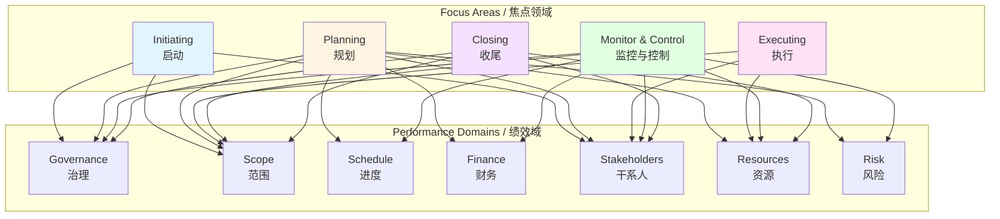
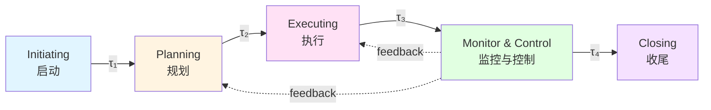

# PMBOK 8th Edition 焦点领域 / PMBOK 8th Edition Focus Areas

## 📋 Table of Contents / 目录

- [PMBOK 8th Edition 焦点领域 / PMBOK 8th Edition Focus Areas](#pmbok-8th-edition-焦点领域--pmbok-8th-edition-focus-areas)
  - [📋 Table of Contents / 目录](#-table-of-contents--目录)
  - [0. 所属层与转换关系 / Layer and Transformation](#0-所属层与转换关系--layer-and-transformation)
  - [1. Overview / 概述](#1-overview--概述)
  - [2. Definition / 定义](#2-definition--定义)
    - [2.1 PMBOK 8th Edition 焦点领域概述](#21-pmbok-8th-edition-焦点领域概述)
    - [2.2 焦点领域1：启动 / Focus Area 1: Initiating](#22-焦点领域1启动--focus-area-1-initiating)
    - [2.3 焦点领域2：规划 / Focus Area 2: Planning](#23-焦点领域2规划--focus-area-2-planning)
    - [2.4 焦点领域3：执行 / Focus Area 3: Executing](#24-焦点领域3执行--focus-area-3-executing)
    - [2.5 焦点领域4：监控与控制 / Focus Area 4: Monitoring and Controlling](#25-焦点领域4监控与控制--focus-area-4-monitoring-and-controlling)
    - [2.6 焦点领域5：收尾 / Focus Area 5: Closing](#26-焦点领域5收尾--focus-area-5-closing)
    - [2.7 焦点领域与过程的映射](#27-焦点领域与过程的映射)
  - [3. Category Theory Perspective / 范畴论视角](#3-category-theory-perspective--范畴论视角)
    - [3.1 焦点领域的范畴论建模](#31-焦点领域的范畴论建模)
    - [3.2 焦点领域之间的态射](#32-焦点领域之间的态射)
    - [3.3 焦点领域与绩效域的自然变换](#33-焦点领域与绩效域的自然变换)
  - [4. Properties / 性质](#4-properties--性质)
    - [4.1 焦点领域的完整性](#41-焦点领域的完整性)
    - [4.2 焦点领域的顺序性](#42-焦点领域的顺序性)
    - [4.3 焦点领域的灵活性](#43-焦点领域的灵活性)
  - [5. Relations / 关系](#5-relations--关系)
    - [5.1 焦点领域之间的关系](#51-焦点领域之间的关系)
    - [5.2 与7个绩效域的关系](#52-与7个绩效域的关系)
    - [5.3 与6个核心原则的关系](#53-与6个核心原则的关系)
    - [5.4 与PMBOK 7th Edition的关系](#54-与pmbok-7th-edition的关系)
  - [6. Examples / 例子](#6-examples--例子)
    - [6.1 软件开发项目中的焦点领域应用](#61-软件开发项目中的焦点领域应用)
    - [6.2 建筑项目中的焦点领域应用](#62-建筑项目中的焦点领域应用)
    - [6.3 数字化转型项目中的焦点领域应用](#63-数字化转型项目中的焦点领域应用)
  - [7. Explanations / 解释](#7-explanations--解释)
    - [7.1 数学解释 / Mathematical Explanation](#71-数学解释--mathematical-explanation)
    - [7.2 直观解释 / Intuitive Explanation](#72-直观解释--intuitive-explanation)
    - [7.3 应用解释 / Application Explanation](#73-应用解释--application-explanation)
    - [7.4 认知解释 / Cognitive Explanation](#74-认知解释--cognitive-explanation)
    - [7.5 历史解释 / Historical Explanation](#75-历史解释--historical-explanation)
    - [7.6 哲学解释 / Philosophical Explanation](#76-哲学解释--philosophical-explanation)
    - [7.7 技术解释 / Technical Explanation](#77-技术解释--technical-explanation)
    - [7.8 实践解释 / Practical Explanation](#78-实践解释--practical-explanation)
    - [7.9 对比解释 / Comparative Explanation](#79-对比解释--comparative-explanation)
    - [7.10 系统解释 / System Explanation](#710-系统解释--system-explanation)
  - [8. Argumentation / 论证](#8-argumentation--论证)
    - [8.1 为什么需要焦点领域](#81-为什么需要焦点领域)
    - [8.2 焦点领域的有效性证明](#82-焦点领域的有效性证明)
  - [9. Applications / 应用](#9-applications--应用)
    - [9.1 在敏捷项目管理中的应用](#91-在敏捷项目管理中的应用)
    - [9.2 在传统项目管理中的应用](#92-在传统项目管理中的应用)
    - [9.3 在混合项目管理中的应用](#93-在混合项目管理中的应用)
  - [10. References / 参考文献](#10-references--参考文献)
    - [10.1 Standards / 标准](#101-standards--标准)
    - [10.2 Category Theory / 范畴论](#102-category-theory--范畴论)
    - [10.3 Related Files / 相关文件](#103-related-files--相关文件)

---

## 0. 所属层与转换关系 / Layer and Transformation

- **所属层**：**核心模型层**（对应 docs/02-project-management）
- **转换关系**：焦点领域作为**生命周期转换** $\delta: S \times \Sigma \to S$ 的**阶段划分**，对应转换点集 $T = \{t_1, t_2, t_3, t_4, t_5\}$，其中 $t_1$=启动、$t_2$=规划、$t_3$=执行、$t_4$=监控与控制、$t_5$=收尾；与 **02-生命周期概念**、**06-PMBOK8绩效域** 对应。

---

## 1. Overview / 概述

**English / 英文**:

The PMBOK 8th Edition (published November 2025) reintroduces **Five Focus Areas** that restore practical structure while maintaining flexibility. These focus areas organize approximately **40 nonprescriptive processes** aligned with the **7 Performance Domains** and support agile, hybrid, and predictive delivery methods. The five focus areas provide a temporal and organizational framework for project activities.

**中文**:

PMBOK 第8版（2025年11月发布）重新引入了**5个焦点领域**，在保持灵活性的同时恢复了实践结构。这些焦点领域组织约**40个非规范性过程**，与**7个绩效域**对齐，并支持敏捷、混合和预测性交付方法。5个焦点领域为项目活动提供了时间和组织框架。

**Key Insights / 关键洞察**:

- **Initiating / 启动**: Starting and authorizing projects / 启动和授权项目
- **Planning / 规划**: Developing project strategies and schedules / 制定项目策略和进度计划
- **Executing / 执行**: Carrying out project work / 执行项目工作
- **Monitoring & Controlling / 监控与控制**: Tracking progress and managing changes / 跟踪进度和管理变更
- **Closing / 收尾**: Finalizing and transitioning project deliverables / 完成和移交项目交付物

**Relationship to Performance Domains / 与绩效域的关系**:

The five focus areas provide the **temporal dimension** (when activities occur), while the seven performance domains provide the **functional dimension** (what areas are managed). Together, they form a comprehensive framework where processes are organized by focus area and aligned with performance domains.

5个焦点领域提供**时间维度**（活动何时发生），而7个绩效域提供**功能维度**（管理哪些领域）。它们共同形成一个综合框架，其中过程按焦点领域组织并与绩效域对齐。

---

## 2. Definition / 定义

### 2.1 PMBOK 8th Edition 焦点领域概述

**Definition 2.1** (PMBOK 8th Edition Focus Areas)

The PMBOK 8th Edition defines five focus areas:

$$\mathcal{F}_{8} = \{F_1, F_2, F_3, F_4, F_5\}$$

where:

- $F_1$: Initiating / 启动
- $F_2$: Planning / 规划
- $F_3$: Executing / 执行
- $F_4$: Monitoring and Controlling / 监控与控制
- $F_5$: Closing / 收尾

**Formal Definition / 形式化定义**:

Each focus area $F_i$ is a temporal category:

$$F_i: \mathbf{Time} \to \mathbf{ProjectActivities}$$

that organizes project activities within a specific time period.

**Process Organization / 过程组织**:

Approximately 40 processes are organized within these five focus areas:

$$\mathcal{P} = \bigcup_{i=1}^{5} \mathcal{P}_{F_i}$$

where $\mathcal{P}_{F_i}$ is the set of processes in focus area $F_i$.

**Alignment with Performance Domains / 与绩效域的对齐**:

Each process $p \in \mathcal{P}$ is mapped to one or more performance domains:

$$\text{Map}: \mathcal{P} \to 2^{\mathcal{D}_{8}}$$

where $\mathcal{D}_{8} = \{D_1, D_2, D_3, D_4, D_5, D_6, D_7\}$ are the seven performance domains.

### 2.2 焦点领域1：启动 / Focus Area 1: Initiating

**Definition 2.2** (Initiating Focus Area)

Initiating is the focus area where projects are formally authorized and initial planning begins.

**Formal Definition / 形式化定义**:

$$\text{Initiating}(P) = \{\text{Authorize}(P), \text{IdentifyStakeholders}(P), \text{InitialRequirements}(P), \text{Charter}(P)\}$$

**Key Processes / 关键过程** (examples):

- Develop Project Charter / 制定项目章程
- Identify Stakeholders / 识别干系人
- Define Initial Scope / 定义初始范围
- Establish Governance / 建立治理

**Category Theory Mapping / 范畴论映射**:

Initiating corresponds to a functor:

$$I: \mathbf{Concept} \to \mathbf{Project}$$

that transforms a project concept into an authorized project.

**Alignment with Performance Domains / 与绩效域的对齐**:

Initiating processes primarily align with:
- **Governance** ($D_1$): Project authorization and governance setup
- **Stakeholders** ($D_5$): Stakeholder identification
- **Scope** ($D_2$): Initial scope definition

### 2.3 焦点领域2：规划 / Focus Area 2: Planning

**Definition 2.3** (Planning Focus Area)

Planning is the focus area where project strategies, schedules, and detailed plans are developed.

**Formal Definition / 形式化定义**:

$$\text{Planning}(P) = \{\text{PlanScope}(P), \text{PlanSchedule}(P), \text{PlanResources}(P), \text{PlanRisk}(P), \text{PlanQuality}(P), \text{PlanFinance}(P)\}$$

**Key Processes / 关键过程** (examples):

- Develop Project Management Plan / 制定项目管理计划
- Plan Scope Management / 规划范围管理
- Plan Schedule Management / 规划进度管理
- Plan Resource Management / 规划资源管理
- Plan Risk Management / 规划风险管理
- Plan Quality Management / 规划质量管理
- Plan Cost Management / 规划成本管理
- Plan Stakeholder Engagement / 规划干系人参与

**Category Theory Mapping / 范畴论映射**:

Planning corresponds to a functor:

$$P: \mathbf{Project} \to \mathbf{Plan}$$

that transforms an authorized project into a detailed plan.

**Alignment with Performance Domains / 与绩效域的对齐**:

Planning processes align with all seven performance domains:
- **Governance** ($D_1$): Planning governance structure
- **Scope** ($D_2$): Scope planning
- **Schedule** ($D_3$): Schedule planning
- **Finance** ($D_4$): Cost and budget planning
- **Stakeholders** ($D_5$): Stakeholder engagement planning
- **Resources** ($D_6$): Resource planning
- **Risk** ($D_7$): Risk planning

### 2.4 焦点领域3：执行 / Focus Area 3: Executing

**Definition 2.4** (Executing Focus Area)

Executing is the focus area where project work is performed to deliver project deliverables.

**Formal Definition / 形式化定义**:

$$\text{Executing}(P) = \{\text{ExecuteWork}(P), \text{ManageResources}(P), \text{EngageStakeholders}(P), \text{ImplementQuality}(P)\}$$

**Key Processes / 关键过程** (examples):

- Direct and Manage Project Work / 指导与管理项目工作
- Manage Project Knowledge / 管理项目知识
- Acquire Resources / 获取资源
- Develop Team / 建设团队
- Manage Team / 管理团队
- Manage Communications / 管理沟通
- Implement Risk Responses / 实施风险应对
- Manage Quality / 管理质量

**Category Theory Mapping / 范畴论映射**:

Executing corresponds to a functor:

$$E: \mathbf{Plan} \to \mathbf{Deliverables}$$

that transforms a plan into actual deliverables.

**Alignment with Performance Domains / 与绩效域的对齐**:

Executing processes align with all performance domains, with emphasis on:
- **Resources** ($D_6$): Resource acquisition and management
- **Stakeholders** ($D_5$): Stakeholder engagement
- **Scope** ($D_2$): Deliverable creation
- **Quality** (embedded): Quality implementation

### 2.5 焦点领域4：监控与控制 / Focus Area 4: Monitoring and Controlling

**Definition 2.5** (Monitoring and Controlling Focus Area)

Monitoring and Controlling is the focus area where project performance is tracked, measured, and controlled.

**Formal Definition / 形式化定义**:

$$\text{MonitorControl}(P) = \{\text{MonitorScope}(P), \text{MonitorSchedule}(P), \text{MonitorCost}(P), \text{MonitorRisk}(P), \text{ControlChanges}(P)\}$$

**Key Processes / 关键过程** (examples):

- Monitor and Control Project Work / 监控项目工作
- Perform Integrated Change Control / 实施整体变更控制
- Validate Scope / 确认范围
- Control Scope / 控制范围
- Control Schedule / 控制进度
- Control Costs / 控制成本
- Monitor Risks / 监督风险
- Control Quality / 控制质量
- Monitor Communications / 监督沟通
- Monitor Stakeholder Engagement / 监督干系人参与

**Category Theory Mapping / 范畴论映射**:

Monitoring and Controlling corresponds to a functor:

$$M: \mathbf{Project} \times \mathbf{Plan} \to \mathbf{Control}$$

that compares actual performance with planned performance.

**Alignment with Performance Domains / 与绩效域的对齐**:

Monitoring and Controlling processes align with all performance domains:
- **Governance** ($D_1$): Governance oversight
- **Scope** ($D_2$): Scope monitoring and control
- **Schedule** ($D_3$): Schedule monitoring and control
- **Finance** ($D_4$): Cost monitoring and control
- **Stakeholders** ($D_5$): Stakeholder engagement monitoring
- **Resources** ($D_6$): Resource monitoring
- **Risk** ($D_7$): Risk monitoring

### 2.6 焦点领域5：收尾 / Focus Area 5: Closing

**Definition 2.6** (Closing Focus Area)

Closing is the focus area where projects are formally closed and deliverables are transitioned.

**Formal Definition / 形式化定义**:

$$\text{Closing}(P) = \{\text{CloseProject}(P), \text{TransitionDeliverables}(P), \text{ReleaseResources}(P), \text{DocumentLessons}(P)\}$$

**Key Processes / 关键过程** (examples):

- Close Project or Phase / 结束项目或阶段
- Transition Deliverables / 移交交付物
- Release Resources / 释放资源
- Document Lessons Learned / 记录经验教训
- Finalize Contracts / 完成合同

**Category Theory Mapping / 范畴论映射**:

Closing corresponds to a functor:

$$C: \mathbf{Project} \to \mathbf{ClosedProject}$$

that transforms an active project into a closed project.

**Alignment with Performance Domains / 与绩效域的对齐**:

Closing processes primarily align with:
- **Governance** ($D_1$): Final governance activities
- **Scope** ($D_2$): Final scope verification
- **Stakeholders** ($D_5$): Final stakeholder communication
- **Resources** ($D_6$): Resource release

### 2.7 焦点领域与过程的映射

**Process-Focus Area Mapping / 过程-焦点领域映射**:

The approximately 40 processes are distributed across the five focus areas:

| Focus Area / 焦点领域 | Process Count / 过程数量 | Key Process Categories / 关键过程类别 |
|---------------------|------------------------|-----------------------------------|
| Initiating / 启动 | ~4-6 | Authorization, Stakeholder Identification, Initial Scope |
| Planning / 规划 | ~20-24 | Comprehensive planning for all domains |
| Executing / 执行 | ~8-10 | Work execution, Resource management, Quality implementation |
| Monitoring & Controlling / 监控与控制 | ~10-12 | Performance monitoring, Change control |
| Closing / 收尾 | ~2-4 | Project closure, Transition, Lessons learned |

**Process-Performance Domain Matrix / 过程-绩效域矩阵**:

Each process can map to one or more performance domains:

---

## 3. Category Theory Perspective / 范畴论视角

### 3.1 焦点领域的范畴论建模

**Definition 3.1** (Focus Areas as Temporal Categories)

Each focus area $F_i$ is a temporal category:

$$F_i: \mathbf{Time} \to \mathbf{ProjectPhase}$$

where $\mathbf{Time}$ is the category of time intervals and $\mathbf{ProjectPhase}$ is the category of project phases.

**Definition 3.2** (Focus Area Sequence)

The five focus areas form a sequence:

$$F_1 \xrightarrow{\tau_1} F_2 \xrightarrow{\tau_2} F_3 \xrightarrow{\tau_3} F_4 \xrightarrow{\tau_4} F_5$$

where $\tau_i$ are transition morphisms.

**Theorem 3.1** (Focus Area Composition)

Focus areas can be composed:

$$(F_j \circ F_i)(P) = F_j(F_i(P))$$

for sequential focus areas.

### 3.2 焦点领域之间的态射

**Definition 3.3** (Focus Area Transition Morphisms)

Transition morphisms between focus areas:

- $\tau_{1 \to 2}: \text{Initiating} \to \text{Planning}$: Project authorization enables planning
- $\tau_{2 \to 3}: \text{Planning} \to \text{Executing}$: Completed plan enables execution
- $\tau_{3 \to 4}: \text{Executing} \to \text{MonitorControl}$: Execution requires monitoring
- $\tau_{4 \to 5}: \text{MonitorControl} \to \text{Closing}$: Successful monitoring enables closure

**Category Theory Representation / 范畴论表示**:

### 3.3 焦点领域与绩效域的自然变换

**Definition 3.4** (Natural Transformation from Focus Areas to Performance Domains)

There exists a natural transformation:

$$\alpha: \mathcal{F}_{8} \Rightarrow \mathcal{D}_{8}$$

that maps focus areas to performance domains through processes.

**Theorem 3.2** (Process-Mediated Transformation)

Each process $p \in \mathcal{P}$ mediates the transformation:

$$\alpha_p: F_i \Rightarrow D_j$$

where $p \in \mathcal{P}_{F_i}$ and $p$ aligns with performance domain $D_j$.

---

## 4. Properties / 性质

### 4.1 焦点领域的完整性

**Property 4.1** (Focus Area Completeness)

The five focus areas together provide complete temporal coverage:

$$\bigcup_{i=1}^{5} \text{Time}(F_i) = \text{ProjectLifecycle}$$

**Proof / 证明**:

Each project phase belongs to exactly one focus area, and the five focus areas cover the entire project lifecycle from initiation to closure.

### 4.2 焦点领域的顺序性

**Property 4.2** (Focus Area Sequentiality)

Focus areas follow a natural sequence, though overlap is possible:

$$F_1 \prec F_2 \prec F_3 \prec F_4 \prec F_5$$

where $\prec$ denotes temporal precedence.

**Note / 注意**:

While focus areas are generally sequential, there can be overlap:
- Planning and Executing may overlap in agile projects
- Monitoring and Controlling occurs throughout all phases
- Closing may begin while some execution activities are still ongoing

### 4.3 焦点领域的灵活性

**Property 4.3** (Focus Area Flexibility)

Focus areas support different delivery approaches:

- **Predictive / 预测性**: Sequential focus areas
- **Agile / 敏捷**: Overlapping and iterative focus areas
- **Hybrid / 混合**: Combination of both approaches

---

## 5. Relations / 关系

### 5.1 焦点领域之间的关系

**Relation 5.1** (Inter-Focus Area Relationships)

Focus areas are interconnected:

- **Initiating** → **Planning**: Authorization enables planning
- **Planning** → **Executing**: Plans guide execution
- **Executing** ↔ **Monitoring & Controlling**: Execution is monitored, monitoring informs execution
- **Monitoring & Controlling** → **Closing**: Successful monitoring enables closure
- **Closing** → **Initiating** (for new projects): Lessons learned inform new projects

### 5.2 与7个绩效域的关系

**Relation 5.2** (Focus Areas-Performance Domains Relationship)

Focus areas provide the **temporal dimension**, while performance domains provide the **functional dimension**:

- Each focus area contains processes aligned with multiple performance domains
- Each performance domain has processes across multiple focus areas
- Together they form a **two-dimensional framework**: (Focus Area, Performance Domain)

**Mapping Matrix / 映射矩阵**:

| Focus Area / 焦点领域 | Governance | Scope | Schedule | Finance | Stakeholders | Resources | Risk |
|---------------------|-----------|-------|----------|---------|-------------|-----------|------|
| Initiating / 启动 | ✓ | ✓ | - | - | ✓ | - | - |
| Planning / 规划 | ✓ | ✓ | ✓ | ✓ | ✓ | ✓ | ✓ |
| Executing / 执行 | - | ✓ | ✓ | ✓ | ✓ | ✓ | ✓ |
| Monitor & Control / 监控与控制 | ✓ | ✓ | ✓ | ✓ | ✓ | ✓ | ✓ |
| Closing / 收尾 | ✓ | ✓ | - | ✓ | ✓ | ✓ | - |

### 5.3 与6个核心原则的关系

**Relation 5.3** (Focus Areas-Core Principles Relationship)

Each focus area applies all six core principles:

- **Adopt a Holistic View**: Consider all aspects in each focus area
- **Focus on Value**: Ensure each focus area delivers value
- **Embed Quality**: Quality is embedded throughout all focus areas
- **Lead Accountably**: Leadership is required in all focus areas
- **Integrate Sustainability**: Sustainability is considered in all focus areas
- **Build Empowered Teams**: Teams are empowered across all focus areas

### 5.4 与PMBOK 7th Edition的关系

**Relation 5.4** (PMBOK 8th vs 7th Edition)

**PMBOK 7th Edition**:
- Principle-driven approach
- 8 Performance Domains
- No explicit process groups

**PMBOK 8th Edition**:
- Principle-driven + Process structure
- 6 Core Principles (reduced from 12)
- 7 Performance Domains (refined from 8)
- **5 Focus Areas** (reintroduced process groups)
- **~40 Processes** (nonprescriptive, aligned with focus areas and performance domains)

**Key Improvement / 关键改进**:

PMBOK 8th Edition balances the principle-driven approach of PMBOK 7th with the practical process structure of earlier editions, providing both **why** (principles) and **how** (processes organized by focus areas).

---

## 6. Examples / 例子

### 6.1 软件开发项目中的焦点领域应用

**Example 6.1** (Software Development Project)

**Initiating / 启动**:
- Develop project charter for new mobile app
- Identify stakeholders (users, developers, product managers)
- Define initial scope (MVP features)

**Planning / 规划**:
- Plan sprint structure (agile approach)
- Plan resource allocation (developers, designers, QA)
- Plan risk management (technical risks, market risks)

**Executing / 执行**:
- Execute sprints (2-week iterations)
- Develop features according to backlog
- Conduct daily standups

**Monitoring & Controlling / 监控与控制**:
- Monitor sprint velocity
- Control scope changes through backlog grooming
- Monitor quality through code reviews and testing

**Closing / 收尾**:
- Release final version to app stores
- Transition to maintenance team
- Document lessons learned

### 6.2 建筑项目中的焦点领域应用

**Example 6.2** (Construction Project)

**Initiating / 启动**:
- Authorize construction project
- Identify stakeholders (owner, architect, contractors, regulators)
- Define initial scope (building specifications)

**Planning / 规划**:
- Plan detailed construction schedule
- Plan resource requirements (materials, equipment, labor)
- Plan safety and quality standards

**Executing / 执行**:
- Execute construction phases (foundation, structure, finishes)
- Manage construction resources
- Implement quality controls

**Monitoring & Controlling / 监控与控制**:
- Monitor construction progress
- Control costs and schedule
- Monitor safety compliance

**Closing / 收尾**:
- Final inspection and acceptance
- Handover to owner
- Release construction resources

### 6.3 数字化转型项目中的焦点领域应用

**Example 6.3** (Digital Transformation Project)

**Initiating / 启动**:
- Authorize digital transformation initiative
- Identify stakeholders (executives, IT, business units, end users)
- Define transformation vision and initial scope

**Planning / 规划**:
- Plan transformation roadmap (phases, milestones)
- Plan change management strategy
- Plan technology implementation

**Executing / 执行**:
- Execute transformation phases
- Implement new systems and processes
- Manage organizational change

**Monitoring & Controlling / 监控与控制**:
- Monitor transformation progress
- Control scope and budget
- Monitor adoption and benefits realization

**Closing / 收尾**:
- Complete transformation rollout
- Transition to operations
- Document transformation outcomes

---

## 7. Explanations / 解释

### 7.1 数学解释 / Mathematical Explanation

**Mathematical Structure / 数学结构**:

The five focus areas form a **temporal sequence**:

$$F: \mathbb{T} \to \mathbf{ProjectPhase}$$

where $\mathbb{T}$ is the time domain and $\mathbf{ProjectPhase}$ is the set of project phases.

Each focus area $F_i$ is a **time interval**:

$$F_i = [t_{i,start}, t_{i,end}]$$

with transitions:

$$\tau_i: F_i \to F_{i+1}$$

**Process Distribution / 过程分布**:

Processes are distributed across focus areas:

$$|\mathcal{P}_{F_i}| \approx \frac{40}{5} = 8 \text{ processes per focus area (average)}$$

with Planning having the most processes (~20-24) and Closing having the fewest (~2-4).

### 7.2 直观解释 / Intuitive Explanation

**Intuitive Understanding / 直观理解**:

Think of the five focus areas as **stages of a journey**:

1. **Initiating / 启动**: "Where are we going?" - Decide to start the journey
2. **Planning / 规划**: "How will we get there?" - Plan the route and prepare
3. **Executing / 执行**: "Let's go!" - Actually travel the route
4. **Monitoring & Controlling / 监控与控制**: "Are we on track?" - Check progress and adjust
5. **Closing / 收尾**: "We've arrived!" - Complete the journey and reflect

Just as a journey has these stages, a project moves through these focus areas, though not always strictly sequentially.

### 7.3 应用解释 / Application Explanation

**Practical Application / 实际应用**:

In practice, project managers use focus areas to:

- **Organize work**: Group activities by when they occur
- **Plan resources**: Allocate resources based on focus area needs
- **Track progress**: Monitor which focus area the project is in
- **Manage transitions**: Ensure smooth transitions between focus areas

**Example / 例子**:

A project manager might say: "We're in the Planning focus area, focusing on scope and schedule planning processes aligned with the Scope and Schedule performance domains."

### 7.4 认知解释 / Cognitive Explanation

**Cognitive Understanding / 认知理解**:

From a cognitive perspective, focus areas help project managers:

- **Mental models**: Organize project knowledge into temporal chunks
- **Decision-making**: Make decisions appropriate to the current focus area
- **Attention management**: Focus attention on relevant processes for the current stage
- **Pattern recognition**: Recognize patterns across similar projects

### 7.5 历史解释 / Historical Explanation

**Historical Development / 历史发展**:

- **PMBOK 1st-6th Editions**: Used "Process Groups" (Initiating, Planning, Executing, Monitoring & Controlling, Closing)
- **PMBOK 7th Edition**: Removed process groups, focused on principles and performance domains
- **PMBOK 8th Edition**: Reintroduced process groups as "Focus Areas" to balance principles with practical structure

The reintroduction reflects the PMI's recognition that practitioners need both **principles** (why) and **processes** (how) organized in a practical structure.

### 7.6 哲学解释 / Philosophical Explanation

**Philosophical Perspective / 哲学视角**:

Focus areas represent the **temporal dimension** of project management:

- **Being / 存在**: Projects exist in time, moving through phases
- **Becoming / 成为**: Projects become what they are through these phases
- **Temporality / 时间性**: Time is fundamental to project existence

The five focus areas capture the essential temporal structure of projects: beginning, planning, doing, monitoring, ending.

### 7.7 技术解释 / Technical Explanation

**Technical Details / 技术细节**:

From a technical perspective:

- **Focus Areas as Categories**: Each focus area is a category with processes as objects and transitions as morphisms
- **Process Alignment**: Processes are aligned with performance domains through mapping functions
- **Temporal Logic**: Focus areas follow temporal logic: $F_1 \prec F_2 \prec F_3 \prec F_4 \prec F_5$
- **Flexibility**: The structure supports different delivery approaches (predictive, agile, hybrid)

### 7.8 实践解释 / Practical Explanation

**Practical Perspective / 实践视角**:

In practice, focus areas:

- **Guide daily work**: Help project managers know what to focus on
- **Organize processes**: Group ~40 processes into manageable sets
- **Support methodologies**: Work with agile, predictive, and hybrid approaches
- **Enable flexibility**: Allow overlap and iteration as needed

### 7.9 对比解释 / Comparative Explanation

**Comparison / 对比**:

| Aspect / 方面 | PMBOK 7th | PMBOK 8th |
|--------------|-----------|-----------|
| Process Groups | ❌ Removed | ✅ Reintroduced as Focus Areas |
| Process Count | ~0 (principle-driven) | ~40 (nonprescriptive) |
| Structure | Principles + Domains | Principles + Domains + Focus Areas |
| Flexibility | High (too flexible?) | Balanced (flexible + structured) |
| Practical Guidance | Low | High |

### 7.10 系统解释 / System Explanation

**System Perspective / 系统视角**:

From a systems perspective, focus areas:

- **System structure**: Organize the project management system temporally
- **System behavior**: Define how the system behaves over time
- **System interactions**: Enable interactions between processes and performance domains
- **System adaptation**: Support adaptation to different contexts (agile, predictive, hybrid)

---

## 8. Argumentation / 论证

### 8.1 为什么需要焦点领域

**Argument 8.1** (Need for Focus Areas)

**Why Focus Areas Are Needed / 为什么需要焦点领域**:

1. **Temporal Organization / 时间组织**: Projects unfold over time; focus areas provide temporal structure
2. **Process Organization / 过程组织**: ~40 processes need organization; focus areas group them logically
3. **Practical Guidance / 实践指导**: Practitioners need "when to do what"; focus areas provide this
4. **Balance / 平衡**: Balance principle-driven approach (PMBOK 7th) with process structure (earlier editions)
5. **Flexibility / 灵活性**: Support different delivery approaches while providing structure

**Evidence / 证据**:

- PMBOK 7th received feedback that it lacked practical guidance
- Earlier editions' process groups were valued by practitioners
- PMBOK 8th reintroduces process groups as focus areas to address this

### 8.2 焦点领域的有效性证明

**Argument 8.2** (Effectiveness of Focus Areas)

**Effectiveness Criteria / 有效性标准**:

1. **Completeness / 完整性**: Cover entire project lifecycle ✅
2. **Clarity / 清晰性**: Clear temporal boundaries ✅
3. **Flexibility / 灵活性**: Support different approaches ✅
4. **Alignment / 对齐**: Align with performance domains ✅
5. **Practical Value / 实践价值**: Provide practical guidance ✅

**Proof / 证明**:

- **Completeness**: $F_1 \cup F_2 \cup F_3 \cup F_4 \cup F_5 = \text{ProjectLifecycle}$ ✅
- **Clarity**: Each focus area has clear purpose and processes ✅
- **Flexibility**: Support predictive, agile, hybrid approaches ✅
- **Alignment**: Processes map to performance domains ✅
- **Practical Value**: Used by practitioners to organize work ✅

---

## 9. Applications / 应用

### 9.1 在敏捷项目管理中的应用

**Agile Application / 敏捷应用**:

In agile projects, focus areas are **iterative and overlapping**:

- **Initiating**: Sprint 0 (project setup)
- **Planning**: Sprint planning (each sprint)
- **Executing**: Sprint execution (each sprint)
- **Monitoring & Controlling**: Daily standups, sprint reviews (continuous)
- **Closing**: Release planning, retrospectives (each sprint)

**Key Characteristics / 关键特征**:

- Focus areas repeat in each sprint
- Planning and Executing overlap significantly
- Monitoring & Controlling is continuous
- Closing occurs at sprint end, not just project end

### 9.2 在传统项目管理中的应用

**Traditional Application / 传统应用**:

In traditional (predictive) projects, focus areas are **sequential**:

- **Initiating**: Project authorization (once)
- **Planning**: Comprehensive planning (once, upfront)
- **Executing**: Work execution (main phase)
- **Monitoring & Controlling**: Continuous monitoring during execution
- **Closing**: Project closure (once, at end)

**Key Characteristics / 关键特征**:

- Focus areas follow strict sequence
- Planning is comprehensive and upfront
- Executing is the longest phase
- Monitoring & Controlling is continuous but separate
- Closing is distinct final phase

### 9.3 在混合项目管理中的应用

**Hybrid Application / 混合应用**:

In hybrid projects, focus areas **combine approaches**:

- **Initiating**: Traditional authorization
- **Planning**: Hybrid planning (high-level predictive, detailed agile)
- **Executing**: Agile sprints within predictive framework
- **Monitoring & Controlling**: Both predictive metrics and agile metrics
- **Closing**: Traditional closure with agile retrospectives

**Key Characteristics / 关键特征**:

- Combines predictive and agile elements
- Planning has both levels (strategic predictive, tactical agile)
- Executing uses agile methods within predictive structure
- Monitoring uses both approaches
- Closing incorporates both methods

---

## 10. References / 参考文献

### 10.1 Standards / 标准

- **PMBOK Guide 8th Edition** (2025): Project Management Institute
- **ISO 21500:2021**: Project, programme and portfolio management — Context and concepts
- **ISO 21502:2020**: Guidance on project management

### 10.2 Category Theory / 范畴论

- Category theory foundations for temporal structures
- Functorial relationships between focus areas and performance domains
- Natural transformations in project management

### 10.3 Related Files / 相关文件

- [06-PMBOK8绩效域.md](06-PMBOK8绩效域.md) - PMBOK 8th Edition Performance Domains
- [06-PMBOK8核心原则.md](../01-项目管理基础/06-PMBOK8核心原则.md) - PMBOK 8th Edition Core Principles
- [01-项目启动.md](01-项目启动.md) - Project Initiation
- [02-项目规划.md](02-项目规划.md) - Project Planning
- [03-项目执行.md](03-项目执行.md) - Project Execution
- [04-项目监控.md](04-项目监控.md) - Project Monitoring
- [05-项目收尾.md](05-项目收尾.md) - Project Closure

---

**Last Updated / 最后更新**: 2026-01-27  
**Version / 版本**: 1.0  
**Status / 状态**: ✅ Complete / 完成

---

## 📊 Summary / 总结

The PMBOK 8th Edition Five Focus Areas provide a **temporal framework** that organizes approximately 40 processes and aligns with 7 performance domains. This structure balances the principle-driven approach of PMBOK 7th with the practical process guidance of earlier editions, providing both **why** (principles) and **how** (processes organized by focus areas).

PMBOK 第8版5个焦点领域提供了一个**时间框架**，组织约40个过程并与7个绩效域对齐。这种结构平衡了PMBOK 7th的原则驱动方法与早期版本的实践过程指导，同时提供了**为什么**（原则）和**如何**（按焦点领域组织的过程）。
