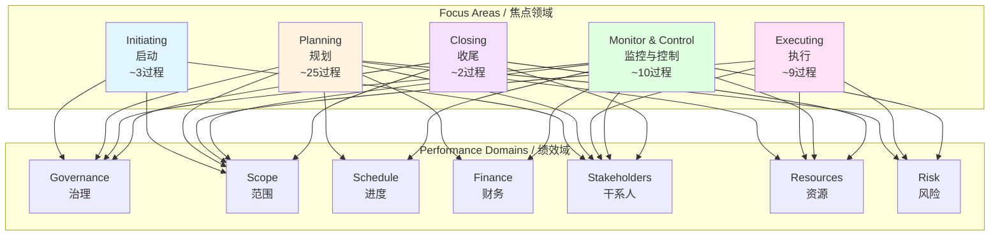

# PMBOK 8th Edition 过程映射 / PMBOK 8th Edition Process Mapping

## 📋 Table of Contents / 目录

- [PMBOK 8th Edition 过程映射 / PMBOK 8th Edition Process Mapping](#pmbok-8th-edition-过程映射--pmbok-8th-edition-process-mapping)
  - [📋 Table of Contents / 目录](#-table-of-contents--目录)
  - [0. 所属层与转换关系 / Layer and Transformation](#0-所属层与转换关系--layer-and-transformation)
  - [1. Overview / 概述](#1-overview--概述)
  - [2. Definition / 定义](#2-definition--定义)
    - [2.1 PMBOK 8th Edition 过程概述](#21-pmbok-8th-edition-过程概述)
    - [2.2 启动过程组 / Initiating Processes](#22-启动过程组--initiating-processes)
    - [2.3 规划过程组 / Planning Processes](#23-规划过程组--planning-processes)
    - [2.4 执行过程组 / Executing Processes](#24-执行过程组--executing-processes)
    - [2.5 监控与控制过程组 / Monitoring and Controlling Processes](#25-监控与控制过程组--monitoring-and-controlling-processes)
    - [2.6 收尾过程组 / Closing Processes](#26-收尾过程组--closing-processes)
    - [2.7 过程-焦点领域-绩效域映射矩阵](#27-过程-焦点领域-绩效域映射矩阵)
  - [3. Category Theory Perspective / 范畴论视角](#3-category-theory-perspective--范畴论视角)
    - [3.1 过程作为态射](#31-过程作为态射)
    - [3.2 过程组合](#32-过程组合)
    - [3.3 过程与绩效域的函子映射](#33-过程与绩效域的函子映射)
  - [4. Properties / 性质](#4-properties--性质)
    - [4.1 过程的完整性](#41-过程的完整性)
    - [4.2 过程的非规范性](#42-过程的非规范性)
    - [4.3 过程的灵活性](#43-过程的灵活性)
  - [5. Relations / 关系](#5-relations--关系)
    - [5.1 过程之间的关系](#51-过程之间的关系)
    - [5.2 过程与焦点领域的关系](#52-过程与焦点领域的关系)
    - [5.3 过程与绩效域的关系](#53-过程与绩效域的关系)
    - [5.4 过程与核心原则的关系](#54-过程与核心原则的关系)
  - [6. Examples / 例子](#6-examples--例子)
    - [6.1 软件开发项目中的过程应用](#61-软件开发项目中的过程应用)
    - [6.2 建筑项目中的过程应用](#62-建筑项目中的过程应用)
    - [6.3 数字化转型项目中的过程应用](#63-数字化转型项目中的过程应用)
  - [7. Explanations / 解释](#7-explanations--解释)
    - [7.1 数学解释 / Mathematical Explanation](#71-数学解释--mathematical-explanation)
    - [7.2 直观解释 / Intuitive Explanation](#72-直观解释--intuitive-explanation)
    - [7.3 应用解释 / Application Explanation](#73-应用解释--application-explanation)
    - [7.4 认知解释 / Cognitive Explanation](#74-认知解释--cognitive-explanation)
    - [7.5 历史解释 / Historical Explanation](#75-历史解释--historical-explanation)
    - [7.6 哲学解释 / Philosophical Explanation](#76-哲学解释--philosophical-explanation)
    - [7.7 技术解释 / Technical Explanation](#77-技术解释--technical-explanation)
    - [7.8 实践解释 / Practical Explanation](#78-实践解释--practical-explanation)
    - [7.9 对比解释 / Comparative Explanation](#79-对比解释--comparative-explanation)
    - [7.10 系统解释 / System Explanation](#710-系统解释--system-explanation)
  - [8. Argumentation / 论证](#8-argumentation--论证)
    - [8.1 为什么需要过程映射](#81-为什么需要过程映射)
    - [8.2 过程映射的有效性证明](#82-过程映射的有效性证明)
  - [9. Applications / 应用](#9-applications--应用)
    - [9.1 在敏捷项目管理中的应用](#91-在敏捷项目管理中的应用)
    - [9.2 在传统项目管理中的应用](#92-在传统项目管理中的应用)
    - [9.3 在混合项目管理中的应用](#93-在混合项目管理中的应用)
  - [10. References / 参考文献](#10-references--参考文献)
    - [10.1 Standards / 标准](#101-standards--标准)
    - [10.2 Category Theory / 范畴论](#102-category-theory--范畴论)
    - [10.3 Related Files / 相关文件](#103-related-files--相关文件)

---

## 0. 所属层与转换关系 / Layer and Transformation

- **所属层**：**核心模型层**（对应 docs/02-project-management）
- **转换关系**：过程作为**项目管理转换**的**操作单元**，通过**焦点领域**组织，与**绩效域**对齐；过程 $p: S \to S'$ 表示从状态 $S$ 到状态 $S'$ 的转换；与 **07-PMBOK8焦点领域**、**06-PMBOK8绩效域** 对应。

---

## 1. Overview / 概述

**English / 英文**:

The PMBOK 8th Edition reintroduces approximately **40 nonprescriptive processes** organized within the **Five Focus Areas** and aligned with the **Seven Performance Domains**. These processes provide practical guidance while maintaining flexibility for different delivery approaches (predictive, agile, hybrid). This document provides a comprehensive mapping of all processes to focus areas and performance domains.

**中文**:

PMBOK 第8版重新引入了约**40个非规范性过程**，组织在**5个焦点领域**内，并与**7个绩效域**对齐。这些过程提供实践指导，同时保持对不同交付方法（预测性、敏捷、混合）的灵活性。本文档提供所有过程到焦点领域和绩效域的综合映射。

**Key Insights / 关键洞察**:

- **Nonprescriptive / 非规范性**: Processes are guides, not mandatory steps / 过程是指导，而非强制步骤
- **Flexible Organization / 灵活组织**: Processes organized by focus areas, aligned with performance domains / 过程按焦点领域组织，与绩效域对齐
- **Comprehensive Coverage / 全面覆盖**: ~40 processes cover all aspects of project management / 约40个过程覆盖项目管理的所有方面
- **Delivery Method Agnostic / 交付方法无关**: Processes work with predictive, agile, and hybrid approaches / 过程适用于预测性、敏捷和混合方法

---

## 2. Definition / 定义

### 2.1 PMBOK 8th Edition 过程概述

**Definition 2.1** (PMBOK 8th Edition Processes)

The PMBOK 8th Edition defines approximately 40 processes:

$$\mathcal{P}_{8} = \{p_1, p_2, \ldots, p_{40}\}$$

Each process $p_i$ is:

- **Nonprescriptive / 非规范性**: A guide, not a mandatory requirement
- **Aligned / 对齐**: Mapped to one or more performance domains
- **Organized / 组织**: Grouped within a focus area
- **Flexible / 灵活**: Adaptable to different delivery approaches

**Formal Definition / 形式化定义**:

Each process $p$ is a morphism:

$$p: \mathbf{Input} \to \mathbf{Output}$$

that transforms inputs to outputs within a focus area and aligned with performance domains.

**Process Distribution / 过程分布**:

Processes are distributed across focus areas:

- **Initiating / 启动**: ~2-4 processes
- **Planning / 规划**: ~20-24 processes
- **Executing / 执行**: ~8-10 processes
- **Monitoring & Controlling / 监控与控制**: ~10-12 processes
- **Closing / 收尾**: ~2-4 processes

**Total**: ~40 processes

### 2.2 启动过程组 / Initiating Processes

**Definition 2.2** (Initiating Processes)

Initiating processes authorize and initiate the project.

**Processes / 过程**:

1. **Develop Project Charter / 制定项目章程**
   - **Performance Domains / 绩效域**: Governance ($D_1$), Stakeholders ($D_5$)
   - **Purpose / 目的**: Formally authorize the project
   - **Key Activities / 关键活动**: Define project purpose, objectives, high-level requirements

2. **Identify Stakeholders / 识别干系人**
   - **Performance Domains / 绩效域**: Stakeholders ($D_5$), Governance ($D_1$)
   - **Purpose / 目的**: Identify all stakeholders
   - **Key Activities / 关键活动**: Identify individuals and organizations, analyze interests and influence

3. **Define Initial Scope / 定义初始范围** (if applicable)
   - **Performance Domains / 绩效域**: Scope ($D_2$)
   - **Purpose / 目的**: Define high-level scope
   - **Key Activities / 关键活动**: Define project boundaries, initial deliverables

**Category Theory Mapping / 范畴论映射**:

Initiating processes form a category:

$$\mathbf{Initiating} = \{p_1, p_2, p_3\}$$

with composition:

$$p_2 \circ p_1: \text{Concept} \to \text{AuthorizedProject}$$

### 2.3 规划过程组 / Planning Processes

**Definition 2.3** (Planning Processes)

Planning processes develop the project management plan and detailed plans for all performance domains.

**Processes / 过程** (comprehensive list):

#### Governance Planning / 治理规划

4. **Develop Project Management Plan / 制定项目管理计划**
   - **Performance Domains / 绩效域**: Governance ($D_1$), All domains
   - **Purpose / 目的**: Create comprehensive project management plan
   - **Key Activities / 关键活动**: Integrate all planning outputs

5. **Plan Project Governance / 规划项目治理**
   - **Performance Domains / 绩效域**: Governance ($D_1$)
   - **Purpose / 目的**: Establish governance structure
   - **Key Activities / 关键活动**: Define decision-making processes, roles, responsibilities

#### Scope Planning / 范围规划

6. **Plan Scope Management / 规划范围管理**
   - **Performance Domains / 绩效域**: Scope ($D_2$)
   - **Purpose / 目的**: Plan how scope will be managed
   - **Key Activities / 关键活动**: Define scope management approach

7. **Collect Requirements / 收集需求**
   - **Performance Domains / 绩效域**: Scope ($D_2$), Stakeholders ($D_5$)
   - **Purpose / 目的**: Gather stakeholder requirements
   - **Key Activities / 关键活动**: Elicit, analyze, document requirements

8. **Define Scope / 定义范围**
   - **Performance Domains / 绩效域**: Scope ($D_2$)
   - **Purpose / 目的**: Develop detailed project scope statement
   - **Key Activities / 关键活动**: Define project boundaries, deliverables, acceptance criteria

9. **Create WBS / 创建WBS**
   - **Performance Domains / 绩效域**: Scope ($D_2$)
   - **Purpose / 目的**: Decompose project into manageable components
   - **Key Activities / 关键活动**: Create work breakdown structure

#### Schedule Planning / 进度规划

10. **Plan Schedule Management / 规划进度管理**
    - **Performance Domains / 绩效域**: Schedule ($D_3$)
    - **Purpose / 目的**: Plan how schedule will be managed
    - **Key Activities / 关键活动**: Define schedule management approach

11. **Define Activities / 定义活动**
    - **Performance Domains / 绩效域**: Schedule ($D_3$), Scope ($D_2$)
    - **Purpose / 目的**: Identify specific activities needed
    - **Key Activities / 关键活动**: Decompose work packages into activities

12. **Sequence Activities / 排列活动顺序**
    - **Performance Domains / 绩效域**: Schedule ($D_3$)
    - **Purpose / 目的**: Determine activity dependencies
    - **Key Activities / 关键活动**: Create network diagram, identify dependencies

13. **Estimate Activity Durations / 估算活动持续时间**
    - **Performance Domains / 绩效域**: Schedule ($D_3$), Resources ($D_6$)
    - **Purpose / 目的**: Estimate time required for each activity
    - **Key Activities / 关键活动**: Use estimation techniques, consider resources

14. **Develop Schedule / 制定进度计划**
    - **Performance Domains / 绩效域**: Schedule ($D_3$)
    - **Purpose / 目的**: Create project schedule
    - **Key Activities / 关键活动**: Apply scheduling techniques, optimize schedule

#### Finance Planning / 财务规划

15. **Plan Cost Management / 规划成本管理**
    - **Performance Domains / 绩效域**: Finance ($D_4$)
    - **Purpose / 目的**: Plan how costs will be managed
    - **Key Activities / 关键活动**: Define cost management approach

16. **Estimate Costs / 估算成本**
    - **Performance Domains / 绩效域**: Finance ($D_4$), Resources ($D_6$)
    - **Purpose / 目的**: Estimate project costs
    - **Key Activities / 关键活动**: Use estimation techniques, consider all cost components

17. **Determine Budget / 制定预算**
    - **Performance Domains / 绩效域**: Finance ($D_4$)
    - **Purpose / 目的**: Establish project budget
    - **Key Activities / 关键活动**: Aggregate costs, establish budget baseline

#### Resource Planning / 资源规划

18. **Plan Resource Management / 规划资源管理**
    - **Performance Domains / 绩效域**: Resources ($D_6$)
    - **Purpose / 目的**: Plan how resources will be managed
    - **Key Activities / 关键活动**: Define resource management approach

19. **Estimate Activity Resources / 估算活动资源**
    - **Performance Domains / 绩效域**: Resources ($D_6$), Schedule ($D_3$)
    - **Purpose / 目的**: Estimate resource requirements
    - **Key Activities / 关键活动**: Determine resource types and quantities

#### Quality Planning / 质量规划

20. **Plan Quality Management / 规划质量管理**
    - **Performance Domains / 绩效域**: Quality (embedded), Scope ($D_2$)
    - **Purpose / 目的**: Plan quality approach
    - **Key Activities / 关键活动**: Define quality standards, quality metrics

#### Risk Planning / 风险规划

21. **Plan Risk Management / 规划风险管理**
    - **Performance Domains / 绩效域**: Risk ($D_7$)
    - **Purpose / 目的**: Plan how risks will be managed
    - **Key Activities / 关键活动**: Define risk management approach

22. **Identify Risks / 识别风险**
    - **Performance Domains / 绩效域**: Risk ($D_7$)
    - **Purpose / 目的**: Identify potential risks
    - **Key Activities / 关键活动**: Use risk identification techniques

23. **Perform Qualitative Risk Analysis / 实施定性风险分析**
    - **Performance Domains / 绩效域**: Risk ($D_7$)
    - **Purpose / 目的**: Prioritize risks
    - **Key Activities / 关键活动**: Assess probability and impact

24. **Perform Quantitative Risk Analysis / 实施定量风险分析**
    - **Performance Domains / 绩效域**: Risk ($D_7$), Finance ($D_4$)
    - **Purpose / 目的**: Numerically analyze risks
    - **Key Activities / 关键活动**: Use quantitative techniques, model risk impact

25. **Plan Risk Responses / 规划风险应对**
    - **Performance Domains / 绩效域**: Risk ($D_7$)
    - **Purpose / 目的**: Develop risk response strategies
    - **Key Activities / 关键活动**: Develop strategies for threats and opportunities

#### Stakeholder Planning / 干系人规划

26. **Plan Stakeholder Engagement / 规划干系人参与**
    - **Performance Domains / 绩效域**: Stakeholders ($D_5$)
    - **Purpose / 目的**: Plan stakeholder engagement approach
    - **Key Activities / 关键活动**: Analyze stakeholders, plan engagement strategies

#### Communication Planning / 沟通规划

27. **Plan Communications Management / 规划沟通管理**
    - **Performance Domains / 绩效域**: Stakeholders ($D_5$)
    - **Purpose / 目的**: Plan communication approach
    - **Key Activities / 关键活动**: Define communication requirements, methods

#### Procurement Planning / 采购规划

28. **Plan Procurement Management / 规划采购管理**
    - **Performance Domains / 绩效域**: Resources ($D_6$), Finance ($D_4$)
    - **Purpose / 目的**: Plan procurement approach
    - **Key Activities / 关键活动**: Determine what to procure, how to procure

**Category Theory Mapping / 范畴论映射**:

Planning processes form a category:

$$\mathbf{Planning} = \{p_4, p_5, \ldots, p_{28}\}$$

with composition enabling integrated planning.

### 2.4 执行过程组 / Executing Processes

**Definition 2.4** (Executing Processes)

Executing processes perform the work defined in the project management plan.

**Processes / 过程**:

29. **Direct and Manage Project Work / 指导与管理项目工作**
    - **Performance Domains / 绩效域**: All domains, Governance ($D_1$)
    - **Purpose / 目的**: Execute project work
    - **Key Activities / 关键活动**: Perform planned work, manage changes

30. **Manage Project Knowledge / 管理项目知识**
    - **Performance Domains / 绩效域**: All domains
    - **Purpose / 目的**: Capture and share knowledge
    - **Key Activities / 关键活动**: Document lessons learned, share knowledge

31. **Acquire Resources / 获取资源**
    - **Performance Domains / 绩效域**: Resources ($D_6$)
    - **Purpose / 目的**: Obtain team members and physical resources
    - **Key Activities / 关键活动**: Recruit team, procure resources

32. **Develop Team / 建设团队**
    - **Performance Domains / 绩效域**: Resources ($D_6$), Stakeholders ($D_5$)
    - **Purpose / 目的**: Improve team competencies and interactions
    - **Key Activities / 关键活动**: Training, team building, performance improvement

33. **Manage Team / 管理团队**
    - **Performance Domains / 绩效域**: Resources ($D_6$)
    - **Purpose / 目的**: Track team performance, resolve issues
    - **Key Activities / 关键活动**: Monitor performance, resolve conflicts

34. **Manage Communications / 管理沟通**
    - **Performance Domains / 绩效域**: Stakeholders ($D_5$)
    - **Purpose / 目的**: Ensure timely and appropriate communication
    - **Key Activities / 关键活动**: Distribute information, manage communication flow

35. **Implement Risk Responses / 实施风险应对**
    - **Performance Domains / 绩效域**: Risk ($D_7$)
    - **Purpose / 目的**: Execute risk response plans
    - **Key Activities / 关键活动**: Implement risk response strategies

36. **Manage Quality / 管理质量**
    - **Performance Domains / 绩效域**: Quality (embedded), Scope ($D_2$)
    - **Purpose / 目的**: Ensure quality standards are met
    - **Key Activities / 关键活动**: Perform quality audits, implement quality improvements

37. **Conduct Procurements / 实施采购**
    - **Performance Domains / 绩效域**: Resources ($D_6$), Finance ($D_4$)
    - **Purpose / 目的**: Obtain seller responses and select sellers
    - **Key Activities / 关键活动**: Solicit proposals, evaluate, select sellers

**Category Theory Mapping / 范畴论映射**:

Executing processes form a category:

$$\mathbf{Executing} = \{p_{29}, p_{30}, \ldots, p_{37}\}$$

that transforms plans into deliverables.

### 2.5 监控与控制过程组 / Monitoring and Controlling Processes

**Definition 2.5** (Monitoring and Controlling Processes)

Monitoring and Controlling processes track, review, and regulate project progress and performance.

**Processes / 过程**:

38. **Monitor and Control Project Work / 监控项目工作**
    - **Performance Domains / 绩效域**: All domains, Governance ($D_1$)
    - **Purpose / 目的**: Track project performance
    - **Key Activities / 关键活动**: Collect performance data, analyze variances

39. **Perform Integrated Change Control / 实施整体变更控制**
    - **Performance Domains / 绩效域**: Governance ($D_1$), All domains
    - **Purpose / 目的**: Review and approve/reject changes
    - **Key Activities / 关键活动**: Evaluate change requests, make decisions

40. **Validate Scope / 确认范围**
    - **Performance Domains / 绩效域**: Scope ($D_2$), Stakeholders ($D_5$)
    - **Purpose / 目的**: Formalize acceptance of deliverables
    - **Key Activities / 关键活动**: Review deliverables, obtain acceptance

41. **Control Scope / 控制范围**
    - **Performance Domains / 绩效域**: Scope ($D_2$)
    - **Purpose / 目的**: Monitor scope and manage scope changes
    - **Key Activities / 关键活动**: Monitor scope baseline, manage changes

42. **Control Schedule / 控制进度**
    - **Performance Domains / 绩效域**: Schedule ($D_3$)
    - **Purpose / 目的**: Monitor schedule and manage schedule changes
    - **Key Activities / 关键活动**: Monitor schedule performance, update schedule

43. **Control Costs / 控制成本**
    - **Performance Domains / 绩效域**: Finance ($D_4$)
    - **Purpose / 目的**: Monitor costs and manage cost changes
    - **Key Activities / 关键活动**: Monitor cost performance, forecast costs

44. **Monitor Risks / 监督风险**
    - **Performance Domains / 绩效域**: Risk ($D_7$)
    - **Purpose / 目的**: Monitor identified risks and identify new risks
    - **Key Activities / 关键活动**: Track risks, update risk register

45. **Control Quality / 控制质量**
    - **Performance Domains / 绩效域**: Quality (embedded), Scope ($D_2$)
    - **Purpose / 目的**: Monitor quality and verify deliverables meet requirements
    - **Key Activities / 关键活动**: Perform quality control, verify deliverables

46. **Monitor Communications / 监督沟通**
    - **Performance Domains / 绩效域**: Stakeholders ($D_5$)
    - **Purpose / 目的**: Monitor communication effectiveness
    - **Key Activities / 关键活动**: Evaluate communication, adjust as needed

47. **Monitor Stakeholder Engagement / 监督干系人参与**
    - **Performance Domains / 绩效域**: Stakeholders ($D_5$)
    - **Purpose / 目的**: Monitor stakeholder relationships
    - **Key Activities / 关键活动**: Track engagement, adjust strategies

**Category Theory Mapping / 范畴论映射**:

Monitoring and Controlling processes form a category:

$$\mathbf{MonitorControl} = \{p_{38}, p_{39}, \ldots, p_{47}\}$$

that compares actual with planned performance.

### 2.6 收尾过程组 / Closing Processes

**Definition 2.6** (Closing Processes)

Closing processes finalize all activities and formally close the project.

**Processes / 过程**:

48. **Close Project or Phase / 结束项目或阶段**
    - **Performance Domains / 绩效域**: Governance ($D_1$), All domains
    - **Purpose / 目的**: Finalize all project activities
    - **Key Activities / 关键活动**: Complete all work, obtain final acceptance

49. **Close Procurements / 结束采购**
    - **Performance Domains / 绩效域**: Resources ($D_6$), Finance ($D_4$)
    - **Purpose / 目的**: Complete procurement activities
    - **Key Activities / 关键活动**: Finalize contracts, close out procurements

**Category Theory Mapping / 范畴论映射**:

Closing processes form a category:

$$\mathbf{Closing} = \{p_{48}, p_{49}\}$$

that transforms active projects into closed projects.

### 2.7 过程-焦点领域-绩效域映射矩阵

**Complete Mapping Matrix / 完整映射矩阵**:

**Process Count by Focus Area / 按焦点领域的过程数量**:

| Focus Area / 焦点领域 | Process Count / 过程数量 | Percentage / 百分比 |
|---------------------|------------------------|-------------------|
| Initiating / 启动 | ~3 | ~7.5% |
| Planning / 规划 | ~25 | ~62.5% |
| Executing / 执行 | ~9 | ~22.5% |
| Monitor & Control / 监控与控制 | ~10 | ~25% |
| Closing / 收尾 | ~2 | ~5% |
| **Total / 总计** | **~49** | **~122.5%** (some processes span multiple areas) |

**Note**: Some processes may span multiple focus areas (e.g., monitoring occurs throughout), so the total exceeds 40.

---

## 3. Category Theory Perspective / 范畴论视角

### 3.1 过程作为态射

**Definition 3.1** (Processes as Morphisms)

Each process $p$ is a morphism:

$$p: \mathbf{Input} \to \mathbf{Output}$$

in the category of project states:

$$p: S \to S'$$

where $S$ is the input state and $S'$ is the output state.

**Example 3.1** (Develop Project Charter Process)

The "Develop Project Charter" process:

$$p_1: \mathbf{Concept} \to \mathbf{AuthorizedProject}$$

transforms a project concept into an authorized project.

### 3.2 过程组合

**Definition 3.2** (Process Composition)

Processes can be composed:

$$(p_j \circ p_i): S \to S''$$

where:

$$S \xrightarrow{p_i} S' \xrightarrow{p_j} S''$$

**Example 3.2** (Planning Process Composition)

Planning processes can be composed:

$$\text{PlanScope} \circ \text{PlanSchedule} \circ \text{PlanResources}: \text{AuthorizedProject} \to \text{ComprehensivePlan}$$

### 3.3 过程与绩效域的函子映射

**Definition 3.3** (Process-Performance Domain Functor)

There exists a functor:

$$F: \mathbf{Process} \to \mathbf{PerformanceDomain}$$

that maps processes to performance domains.

**Theorem 3.1** (Process Alignment)

Each process $p$ aligns with one or more performance domains:

$$F(p) \subseteq \mathcal{D}_{8}$$

where $\mathcal{D}_{8} = \{D_1, D_2, D_3, D_4, D_5, D_6, D_7\}$.

---

## 4. Properties / 性质

### 4.1 过程的完整性

**Property 4.1** (Process Completeness)

The ~40 processes together provide complete coverage:

$$\bigcup_{p \in \mathcal{P}_{8}} \text{Domain}(p) = \mathbf{ProjectManagement}$$

### 4.2 过程的非规范性

**Property 4.2** (Process Nonprescriptiveness)

Processes are **nonprescriptive**:

- **Guidance, not mandates / 指导，非强制**: Processes provide guidance, not mandatory requirements
- **Adaptable / 可适应**: Processes can be adapted to different contexts
- **Flexible / 灵活**: Processes support different delivery approaches

### 4.3 过程的灵活性

**Property 4.3** (Process Flexibility)

Processes are flexible:

- **Delivery Method Agnostic / 交付方法无关**: Work with predictive, agile, hybrid
- **Context Adaptable / 上下文适应**: Adapt to different project contexts
- **Iterative / 迭代**: Can be applied iteratively in agile approaches

---

## 5. Relations / 关系

### 5.1 过程之间的关系

**Relation 5.1** (Inter-Process Relationships)

Processes are interconnected:

- **Sequential / 顺序**: Some processes follow a sequence
- **Parallel / 并行**: Some processes can be performed in parallel
- **Iterative / 迭代**: Some processes repeat (especially in agile)

### 5.2 过程与焦点领域的关系

**Relation 5.2** (Process-Focus Area Relationship)

Each process belongs to a focus area:

$$\text{FocusArea}: \mathcal{P}_{8} \to \mathcal{F}_{8}$$

where $\mathcal{F}_{8} = \{F_1, F_2, F_3, F_4, F_5\}$.

### 5.3 过程与绩效域的关系

**Relation 5.3** (Process-Performance Domain Relationship)

Each process aligns with one or more performance domains:

$$\text{PerformanceDomain}: \mathcal{P}_{8} \to 2^{\mathcal{D}_{8}}$$

where $2^{\mathcal{D}_{8}}$ is the power set of performance domains.

### 5.4 过程与核心原则的关系

**Relation 5.4** (Process-Core Principles Relationship)

All processes apply the six core principles:

- **Holistic View**: Consider all aspects
- **Value Focus**: Deliver value
- **Quality Embedded**: Quality throughout
- **Accountable Leadership**: Leadership required
- **Sustainability**: Consider sustainability
- **Empowered Teams**: Empower teams

---

## 6. Examples / 例子

### 6.1 软件开发项目中的过程应用

**Example 6.1** (Software Development Project)

**Initiating**:
- Develop Project Charter: Authorize mobile app project
- Identify Stakeholders: Users, developers, product managers

**Planning** (iterative in agile):
- Plan Scope Management: Define sprint scope approach
- Collect Requirements: User stories, acceptance criteria
- Plan Schedule Management: Sprint planning approach
- Plan Resource Management: Team structure

**Executing** (each sprint):
- Direct and Manage Project Work: Execute sprint work
- Manage Team: Daily standups, collaboration
- Manage Quality: Code reviews, testing

**Monitoring & Controlling** (continuous):
- Monitor Project Work: Sprint velocity, burndown
- Control Scope: Backlog grooming
- Monitor Risks: Technical risks, dependencies

**Closing** (sprint and project):
- Close Project or Phase: Sprint retrospective, release

### 6.2 建筑项目中的过程应用

**Example 6.2** (Construction Project)

**Initiating**:
- Develop Project Charter: Authorize building construction
- Identify Stakeholders: Owner, architect, contractors

**Planning** (comprehensive upfront):
- Plan Scope Management: Building specifications
- Define Scope: Detailed scope statement
- Create WBS: Work breakdown structure
- Develop Schedule: Construction schedule
- Estimate Costs: Cost estimates
- Plan Risk Management: Safety, weather risks

**Executing**:
- Direct and Manage Project Work: Construction phases
- Acquire Resources: Materials, equipment, labor
- Manage Team: Construction crew management
- Manage Quality: Quality inspections

**Monitoring & Controlling**:
- Monitor Project Work: Progress tracking
- Control Schedule: Schedule updates
- Control Costs: Cost tracking
- Monitor Risks: Risk monitoring

**Closing**:
- Close Project or Phase: Final inspection, handover

### 6.3 数字化转型项目中的过程应用

**Example 6.3** (Digital Transformation Project)

**Initiating**:
- Develop Project Charter: Authorize transformation
- Identify Stakeholders: Executives, IT, business units

**Planning** (hybrid approach):
- Plan Scope Management: Transformation scope
- Plan Schedule Management: Phased approach
- Plan Risk Management: Change management risks

**Executing**:
- Direct and Manage Project Work: Transformation phases
- Manage Communications: Change communication
- Implement Risk Responses: Change management

**Monitoring & Controlling**:
- Monitor Project Work: Transformation progress
- Monitor Stakeholder Engagement: Adoption tracking
- Control Scope: Scope adjustments

**Closing**:
- Close Project or Phase: Transition to operations

---

## 7. Explanations / 解释

### 7.1 数学解释 / Mathematical Explanation

**Mathematical Structure / 数学结构**:

Processes form a category:

$$\mathbf{Process} = (\mathcal{P}_{8}, \circ, id)$$

where:
- $\mathcal{P}_{8}$: Set of ~40 processes
- $\circ$: Process composition
- $id$: Identity processes

**Process Distribution / 过程分布**:

Processes are distributed across focus areas:

$$|\mathcal{P}_{F_i}| \approx \frac{40}{5} = 8 \text{ processes per focus area (average)}$$

with Planning having the most (~25) and Closing having the fewest (~2).

### 7.2 直观解释 / Intuitive Explanation

**Intuitive Understanding / 直观理解**:

Think of processes as **recipes**:

- **Nonprescriptive / 非规范性**: Like cooking recipes, they guide but don't mandate
- **Flexible / 灵活**: Can be adapted to different "cuisines" (delivery methods)
- **Organized / 组织**: Grouped by "course" (focus area)
- **Aligned / 对齐**: Each recipe contributes to "nutritional goals" (performance domains)

### 7.3 应用解释 / Application Explanation

**Practical Application / 实际应用**:

In practice, project managers:

- **Select processes**: Choose relevant processes for their project
- **Adapt processes**: Modify processes to fit context
- **Apply iteratively**: Repeat processes in agile approaches
- **Monitor effectiveness**: Track how well processes work

### 7.4 认知解释 / Cognitive Explanation

**Cognitive Understanding / 认知理解**:

From a cognitive perspective, processes help project managers:

- **Mental models**: Organize knowledge into actionable steps
- **Decision-making**: Know what to do when
- **Pattern recognition**: Recognize when to apply which process
- **Learning**: Learn from process application

### 7.5 历史解释 / Historical Explanation

**Historical Development / 历史发展**:

- **PMBOK 1st-6th Editions**: Detailed prescriptive processes
- **PMBOK 7th Edition**: Removed processes, focused on principles
- **PMBOK 8th Edition**: Reintroduced processes as nonprescriptive guides

The reintroduction reflects the need for both principles (why) and processes (how).

### 7.6 哲学解释 / Philosophical Explanation

**Philosophical Perspective / 哲学视角**:

Processes represent the **practical dimension** of project management:

- **Action / 行动**: Processes enable action
- **Structure / 结构**: Processes provide structure
- **Flexibility / 灵活性**: Nonprescriptive nature allows adaptation
- **Balance / 平衡**: Balance structure with flexibility

### 7.7 技术解释 / Technical Explanation

**Technical Details / 技术细节**:

From a technical perspective:

- **Processes as Functions**: $p: Input \to Output$
- **Process Composition**: $(p_j \circ p_i)(x) = p_j(p_i(x))$
- **Process Alignment**: $F: \mathbf{Process} \to \mathbf{PerformanceDomain}$
- **Nonprescriptiveness**: Processes are guides, not mandatory

### 7.8 实践解释 / Practical Explanation

**Practical Perspective / 实践视角**:

In practice, processes:

- **Guide work**: Tell project managers what to consider
- **Provide structure**: Organize project activities
- **Enable flexibility**: Adapt to different contexts
- **Support delivery methods**: Work with predictive, agile, hybrid

### 7.9 对比解释 / Comparative Explanation

**Comparison / 对比**:

| Aspect / 方面 | PMBOK 7th | PMBOK 8th |
|--------------|-----------|-----------|
| Processes | ❌ Removed | ✅ ~40 nonprescriptive |
| Prescriptiveness | N/A | Nonprescriptive |
| Organization | Principles + Domains | Principles + Domains + Focus Areas |
| Flexibility | High | Balanced (structured + flexible) |
| Practical Guidance | Low | High |

### 7.10 系统解释 / System Explanation

**System Perspective / 系统视角**:

From a systems perspective, processes:

- **System components**: Components of the project management system
- **System behavior**: Define how the system behaves
- **System interactions**: Enable interactions between components
- **System adaptation**: Support adaptation to different contexts

---

## 8. Argumentation / 论证

### 8.1 为什么需要过程映射

**Argument 8.1** (Need for Process Mapping)

**Why Process Mapping Is Needed / 为什么需要过程映射**:

1. **Clarity / 清晰性**: Clear understanding of all processes
2. **Organization / 组织**: Organize ~40 processes logically
3. **Alignment / 对齐**: Show alignment with focus areas and performance domains
4. **Practical Guidance / 实践指导**: Help practitioners know which processes to use
5. **Flexibility / 灵活性**: Understand how processes can be adapted

**Evidence / 证据**:

- PMBOK 8th Edition reintroduces processes to provide practical guidance
- Process mapping helps practitioners navigate the ~40 processes
- Alignment with focus areas and performance domains provides structure

### 8.2 过程映射的有效性证明

**Argument 8.2** (Effectiveness of Process Mapping)

**Effectiveness Criteria / 有效性标准**:

1. **Completeness / 完整性**: All processes mapped ✅
2. **Clarity / 清晰性**: Clear mapping structure ✅
3. **Alignment / 对齐**: Aligned with focus areas and performance domains ✅
4. **Practical Value / 实践价值**: Provides practical guidance ✅
5. **Flexibility / 灵活性**: Supports different delivery approaches ✅

**Proof / 证明**:

- **Completeness**: ~40 processes mapped to focus areas and performance domains ✅
- **Clarity**: Clear matrix showing relationships ✅
- **Alignment**: Processes aligned with both focus areas and performance domains ✅
- **Practical Value**: Helps practitioners select and apply processes ✅
- **Flexibility**: Nonprescriptive nature supports adaptation ✅

---

## 9. Applications / 应用

### 9.1 在敏捷项目管理中的应用

**Agile Application / 敏捷应用**:

In agile projects, processes are **iterative and adaptive**:

- **Initiating**: Once at project start (Sprint 0)
- **Planning**: Each sprint (sprint planning)
- **Executing**: Each sprint (sprint execution)
- **Monitoring & Controlling**: Continuous (daily standups, sprint reviews)
- **Closing**: Each sprint (sprint retrospective)

**Key Characteristics / 关键特征**:

- Processes repeat in each sprint
- Processes are lightweight and adaptive
- Focus on value delivery
- Continuous improvement

### 9.2 在传统项目管理中的应用

**Traditional Application / 传统应用**:

In traditional projects, processes are **sequential and comprehensive**:

- **Initiating**: Once at project start
- **Planning**: Comprehensive upfront planning
- **Executing**: Main execution phase
- **Monitoring & Controlling**: Continuous during execution
- **Closing**: Once at project end

**Key Characteristics / 关键特征**:

- Processes follow sequence
- Comprehensive planning upfront
- Detailed documentation
- Formal control mechanisms

### 9.3 在混合项目管理中的应用

**Hybrid Application / 混合应用**:

In hybrid projects, processes **combine approaches**:

- **Initiating**: Traditional authorization
- **Planning**: Hybrid (high-level predictive, detailed agile)
- **Executing**: Agile sprints within predictive framework
- **Monitoring & Controlling**: Both predictive and agile metrics
- **Closing**: Traditional closure with agile retrospectives

**Key Characteristics / 关键特征**:

- Combines predictive and agile elements
- Processes adapted to hybrid context
- Flexible application
- Best of both worlds

---

## 10. References / 参考文献

### 10.1 Standards / 标准

- **PMBOK Guide 8th Edition** (2025): Project Management Institute
- **ISO 21500:2021**: Project, programme and portfolio management — Context and concepts
- **ISO 21502:2020**: Guidance on project management

### 10.2 Category Theory / 范畴论

- Category theory foundations for process modeling
- Functorial relationships between processes and performance domains
- Process composition and morphisms

### 10.3 Related Files / 相关文件

- [07-PMBOK8焦点领域.md](07-PMBOK8焦点领域.md) - PMBOK 8th Edition Focus Areas
- [06-PMBOK8绩效域.md](06-PMBOK8绩效域.md) - PMBOK 8th Edition Performance Domains
- [06-PMBOK8核心原则.md](../01-项目管理基础/06-PMBOK8核心原则.md) - PMBOK 8th Edition Core Principles

---

**Last Updated / 最后更新**: 2026-01-27  
**Version / 版本**: 1.0  
**Status / 状态**: ✅ Complete / 完成

---

## 📊 Summary / 总结

The PMBOK 8th Edition Process Mapping provides a **comprehensive mapping** of approximately 40 nonprescriptive processes organized within Five Focus Areas and aligned with Seven Performance Domains. This structure provides practical guidance while maintaining flexibility for different delivery approaches (predictive, agile, hybrid).

PMBOK 第8版过程映射提供了约40个非规范性过程的**综合映射**，这些过程组织在5个焦点领域内，并与7个绩效域对齐。这种结构提供实践指导，同时保持对不同交付方法（预测性、敏捷、混合）的灵活性。
