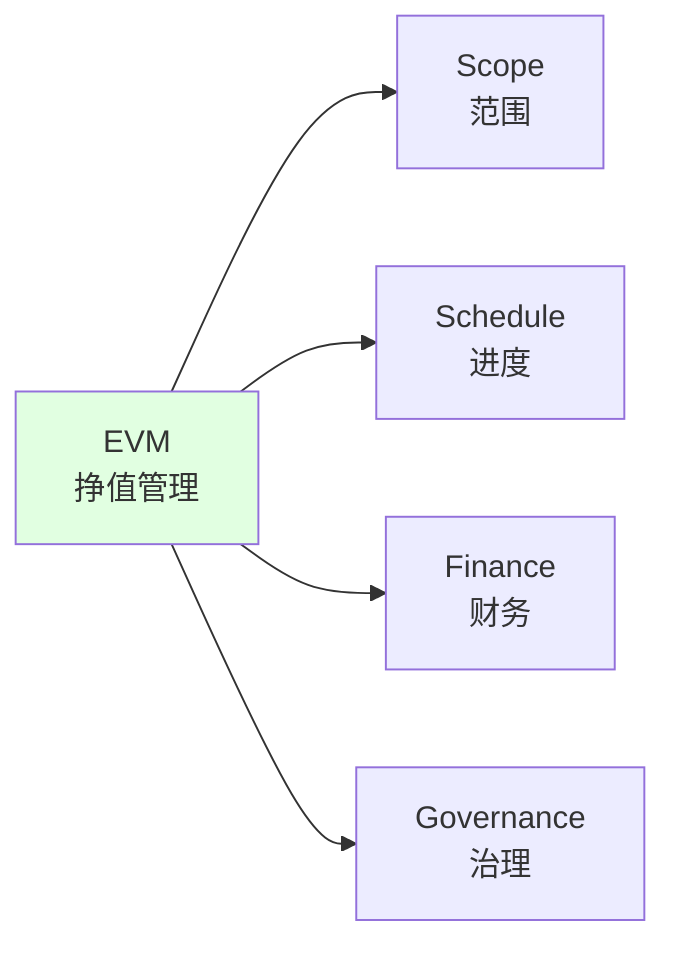

# 挣值管理 / Earned Value Management

## 📋 Table of Contents / 目录

- [挣值管理 / Earned Value Management](#挣值管理--earned-value-management)
  - [📋 Table of Contents / 目录](#-table-of-contents--目录)
  - [0. 所属层与转换关系 / Layer and Transformation](#0-所属层与转换关系--layer-and-transformation)
  - [1. Overview / 概述](#1-overview--概述)
  - [2. Definition / 定义](#2-definition--定义)
    - [2.1 ISO 21512:2024 Definition / ISO 21512:2024定义](#21-iso-215122024-definition--iso-215122024定义)
    - [2.2 挣值管理基本概念](#22-挣值管理基本概念)
    - [2.3 挣值管理关键指标](#23-挣值管理关键指标)
    - [2.4 挣值管理系统](#24-挣值管理系统)
  - [3. Category Theory Perspective / 范畴论视角](#3-category-theory-perspective--范畴论视角)
    - [3.1 挣值作为对象](#31-挣值作为对象)
    - [3.2 挣值计算作为态射](#32-挣值计算作为态射)
    - [3.3 挣值管理函子](#33-挣值管理函子)
  - [4. Properties / 性质](#4-properties--性质)
    - [4.1 挣值的可测量性](#41-挣值的可测量性)
    - [4.2 挣值的准确性](#42-挣值的准确性)
    - [4.3 挣值的预测性](#43-挣值的预测性)
  - [5. Relations / 关系](#5-relations--关系)
    - [5.1 与ISO 21508:2018的关系](#51-与iso-215082018的关系)
    - [5.2 与PMBOK 8th绩效域的关系](#52-与pmbok-8th绩效域的关系)
    - [5.3 与其他资源管理概念的关系](#53-与其他资源管理概念的关系)
  - [6. Examples / 例子](#6-examples--例子)
    - [6.1 软件开发项目挣值管理](#61-软件开发项目挣值管理)
    - [6.2 建筑项目挣值管理](#62-建筑项目挣值管理)
    - [6.3 制造项目挣值管理](#63-制造项目挣值管理)
  - [7. Explanations / 解释](#7-explanations--解释)
    - [7.1 数学解释 / Mathematical Explanation](#71-数学解释--mathematical-explanation)
    - [7.2 直观解释 / Intuitive Explanation](#72-直观解释--intuitive-explanation)
    - [7.3 应用解释 / Application Explanation](#73-应用解释--application-explanation)
    - [7.4 认知解释 / Cognitive Explanation](#74-认知解释--cognitive-explanation)
    - [7.5 历史解释 / Historical Explanation](#75-历史解释--historical-explanation)
    - [7.6 哲学解释 / Philosophical Explanation](#76-哲学解释--philosophical-explanation)
    - [7.7 技术解释 / Technical Explanation](#77-技术解释--technical-explanation)
    - [7.8 实践解释 / Practical Explanation](#78-实践解释--practical-explanation)
    - [7.9 对比解释 / Comparative Explanation](#79-对比解释--comparative-explanation)
    - [7.10 系统解释 / System Explanation](#710-系统解释--system-explanation)
  - [8. Argumentation / 论证](#8-argumentation--论证)
    - [8.1 为什么需要挣值管理](#81-为什么需要挣值管理)
    - [8.2 挣值管理的有效性证明](#82-挣值管理的有效性证明)
  - [9. Applications / 应用](#9-applications--应用)
    - [9.1 在传统项目管理中的应用](#91-在传统项目管理中的应用)
    - [9.2 在敏捷项目管理中的应用](#92-在敏捷项目管理中的应用)
    - [9.3 在混合项目管理中的应用](#93-在混合项目管理中的应用)
  - [10. References / 参考文献](#10-references--参考文献)
    - [10.1 Standards / 标准](#101-standards--标准)
    - [10.2 Category Theory / 范畴论](#102-category-theory--范畴论)
    - [10.3 Related Files / 相关文件](#103-related-files--相关文件)

---

## 0. 所属层与转换关系 / Layer and Transformation

- **所属层**：**核心模型层**（对应 docs/02-project-management）
- **转换关系**：挣值管理作为**资源转换**和**财务转换**的集成，通过挣值指标 $EV$、计划价值 $PV$、实际成本 $AC$ 进行**绩效转换**；与 **03-资源管理概念**、**06-PMBOK8绩效域**（财务、进度、范围）对应。

---

## 1. Overview / 概述

**English / 英文**:

Earned Value Management (EVM) is a project management technique that integrates scope, schedule, and cost to measure project performance and predict future performance. ISO 21512:2024 provides comprehensive guidance for establishing, implementing, and maintaining an EVM system based on ISO 21508:2018. EVM enables objective measurement of project progress and early identification of performance issues.

**中文**:

挣值管理（EVM）是一种项目管理技术，集成范围、进度和成本以测量项目绩效并预测未来绩效。ISO 21512:2024提供了基于ISO 21508:2018建立、实施和维护EVM系统的综合指南。EVM能够客观测量项目进度并早期识别绩效问题。

**Key Insights / 关键洞察**:

- **Integrated Measurement / 集成测量**: Combines scope, schedule, and cost / 结合范围、进度和成本
- **Performance Indicators / 绩效指标**: EV, PV, AC, CPI, SPI / 挣值、计划价值、实际成本、成本绩效指数、进度绩效指数
- **Predictive Capability / 预测能力**: Forecasts project completion / 预测项目完成情况
- **Early Warning / 早期预警**: Identifies issues early / 早期识别问题

---

## 2. Definition / 定义

### 2.1 ISO 21512:2024 Definition / ISO 21512:2024定义

**Definition 2.1** (Earned Value Management - ISO 21512:2024)

Earned Value Management (EVM) is a project management methodology that integrates scope, schedule, and cost baselines to measure project performance and forecast project completion.

**Formal Definition / 形式化定义**:

$$\text{EVM} = (\text{Scope}, \text{Schedule}, \text{Cost}, \text{Performance}, \text{Forecast})$$

where:

- $\text{Scope}$: Scope baseline
- $\text{Schedule}$: Schedule baseline
- $\text{Cost}$: Cost baseline
- $\text{Performance}$: Performance measurement
- $\text{Forecast}$: Completion forecast

**ISO 21512:2024 Scope / ISO 21512:2024范围**:

ISO 21512:2024 provides guidance for:

- Establishing an EVM system
- Implementing EVM in projects, programmes, and portfolios
- Maintaining EVM systems
- Practical approaches and examples

**Based on ISO 21508:2018 / 基于ISO 21508:2018**:

ISO 21512:2024 is based on ISO 21508:2018, which provides the foundational framework for EVM.

### 2.2 挣值管理基本概念

**Definition 2.2** (Earned Value Management Basic Concepts)

EVM uses three key values:

1. **Planned Value (PV) / 计划价值 (PV)**
   - Budgeted cost of work scheduled
   - 计划工作的预算成本

2. **Earned Value (EV) / 挣值 (EV)**
   - Budgeted cost of work performed
   - 已完成工作的预算成本

3. **Actual Cost (AC) / 实际成本 (AC)**
   - Actual cost of work performed
   - 已完成工作的实际成本

**Formal Definition / 形式化定义**:

$$\text{EVM} = (PV, EV, AC)$$

where:

- $PV(t)$: Planned value at time $t$
- $EV(t)$: Earned value at time $t$
- $AC(t)$: Actual cost at time $t$

**Key Insight / 关键洞察**:

EVM compares **what was planned** (PV), **what was accomplished** (EV), and **what it cost** (AC) to provide integrated performance measurement.

### 2.3 挣值管理关键指标

**Definition 2.3** (EVM Key Performance Indicators)

EVM uses several key performance indicators:

**Cost Performance Indicators / 成本绩效指标**:

1. **Cost Variance (CV) / 成本偏差 (CV)**
   $$CV = EV - AC$$

2. **Cost Performance Index (CPI) / 成本绩效指数 (CPI)**
   $$CPI = \frac{EV}{AC}$$

**Schedule Performance Indicators / 进度绩效指标**:

1. **Schedule Variance (SV) / 进度偏差 (SV)**
   $$SV = EV - PV$$

2. **Schedule Performance Index (SPI) / 进度绩效指数 (SPI)**
   $$SPI = \frac{EV}{PV}$$

**Forecasting Indicators / 预测指标**:

1. **Estimate at Completion (EAC) / 完工估算 (EAC)**
   $$EAC = \frac{BAC}{CPI}$$

2. **Estimate to Complete (ETC) / 完工尚需估算 (ETC)**
   $$ETC = EAC - AC$$

3. **Variance at Completion (VAC) / 完工偏差 (VAC)**
   $$VAC = BAC - EAC$$

where $BAC$ is Budget at Completion (完工预算).

**Performance Interpretation / 绩效解释**:

- **CV > 0** or **CPI > 1**: Under budget / 低于预算
- **CV < 0** or **CPI < 1**: Over budget / 超过预算
- **SV > 0** or **SPI > 1**: Ahead of schedule / 提前于计划
- **SV < 0** or **SPI < 1**: Behind schedule / 落后于计划

### 2.4 挣值管理系统

**Definition 2.4** (EVM System)

An EVM system consists of:

$$\text{EVMSystem} = (\text{Baselines}, \text{DataCollection}, \text{Analysis}, \text{Reporting}, \text{Forecasting})$$

**System Components / 系统组件**:

1. **Baselines / 基线**: Scope, schedule, cost baselines
2. **Data Collection / 数据收集**: Collect PV, EV, AC data
3. **Analysis / 分析**: Calculate performance indicators
4. **Reporting / 报告**: Report performance and forecasts
5. **Forecasting / 预测**: Forecast project completion

**ISO 21512:2024 Implementation Guidance / ISO 21512:2024实施指南**:

ISO 21512:2024 provides step-by-step guidance for:

- Establishing EVM system
- Implementing EVM processes
- Maintaining EVM system
- Using EVM for decision-making

---

## 3. Category Theory Perspective / 范畴论视角

### 3.1 挣值作为对象

**Definition 3.1** (Earned Value Object)

Earned value $EV \in \mathbf{EarnedValue}$ is an object:

$$EV = (\text{Value}, \text{Time}, \text{Work}, \text{Baseline})$$

where:

- $\text{Value}$: Earned value amount
- $\text{Time}$: Time period
- $\text{Work}$: Work performed
- $\text{Baseline}$: Baseline reference

**Example 3.1** (Project Earned Value Object)

A project earned value:

$$EV_{project} = (\$500K, t_{current}, \text{Work}_{completed}, \text{Baseline}_{project})$$

where:

- Value: \$500K earned
- Time: Current time
- Work: Completed work packages
- Baseline: Project baseline

### 3.2 挣值计算作为态射

**Definition 3.2** (Earned Value Calculation Morphism)

Earned value calculation is a morphism:

$$calc_{EV}: \text{Work} \times \text{Baseline} \to EV$$

that calculates earned value from completed work and baseline.

**Example 3.2** (Work Package EV Calculation)

Calculating EV for a work package:

$$calc_{EV}(\text{WP}_{completed}, \text{Baseline}_{WP}) = EV_{WP}$$

where:

- $\text{WP}_{completed}$: Completed work package
- $\text{Baseline}_{WP}$: Work package baseline
- $EV_{WP}$: Earned value for work package

### 3.3 挣值管理函子

**Definition 3.3** (Earned Value Management Functor)

EVM corresponds to a functor:

$$EVM: \mathbf{Project} \to \mathbf{Performance}$$

that maps projects to performance measurements.

**Theorem 3.1** (EVM Composition)

EVM calculations can be composed:

$$(EVM_{WP2} \circ EVM_{WP1})(P) = EVM_{WP2}(EVM_{WP1}(P))$$

where $WP1$ and $WP2$ are work packages.

---

## 4. Properties / 性质

### 4.1 挣值的可测量性

**Property 4.1** (Earned Value Measurability)

Earned value is measurable:

$$\text{Measurability}(EV) = \text{WorkCompleted} \times \text{BaselineValue}$$

where earned value can be objectively measured.

### 4.2 挣值的准确性

**Property 4.2** (Earned Value Accuracy)

Earned value accuracy depends on:

$$\text{Accuracy}(EV) = f(\text{BaselineAccuracy}, \text{WorkMeasurementAccuracy})$$

where accurate baselines and work measurement lead to accurate EV.

### 4.3 挣值的预测性

**Property 4.3** (Earned Value Predictability)

Earned value enables prediction:

$$\text{Predict}(EV, CPI, SPI) = \text{Forecast}(EAC, ETC, VAC)$$

where current performance predicts future performance.

---

## 5. Relations / 关系

### 5.1 与ISO 21508:2018的关系

**Relation 5.1** (ISO 21508:2018 Relationship)

ISO 21512:2024 is based on ISO 21508:2018:

- **ISO 21508:2018**: Foundational EVM framework
- **ISO 21512:2024**: Implementation guidance based on ISO 21508:2018
- **Relationship**: ISO 21512 provides practical guidance for implementing ISO 21508 framework

### 5.2 与PMBOK 8th绩效域的关系

**Relation 5.2** (PMBOK 8th Performance Domains Relationship)

EVM relates to multiple performance domains:

- **Scope** ($D_2$): EV measures scope completion
- **Schedule** ($D_3$): SPI measures schedule performance
- **Finance** ($D_4$): CPI measures cost performance
- **Governance** ($D_1$): EVM supports governance decisions

**Mapping / 映射**:

### 5.3 与其他资源管理概念的关系

**Relation 5.3** (Resource Management Concepts Relationship)

EVM relates to:

- **Resource Allocation / 资源分配**: EVM tracks resource costs
- **Resource Scheduling / 资源调度**: EVM measures schedule performance
- **Resource Optimization / 资源优化**: EVM identifies optimization opportunities

---

## 6. Examples / 例子

### 6.1 软件开发项目挣值管理

**Example 6.1** (Software Development Project EVM)

**Project / 项目**: Mobile app development

**Baseline / 基线**:

- Budget: \$500K
- Duration: 6 months
- Scope: 50 features

**At Month 3 / 第3个月**:

- PV: \$250K (50% planned)
- EV: \$200K (40% completed)
- AC: \$220K (actual cost)

**Performance Indicators / 绩效指标**:

- CV = \$200K - \$220K = -\$20K (over budget)
- CPI = \$200K / \$220K = 0.91 (9% over budget)
- SV = \$200K - \$250K = -\$50K (behind schedule)
- SPI = \$200K / \$250K = 0.80 (20% behind schedule)

**Forecast / 预测**:

- EAC = \$500K / 0.91 = \$549K
- ETC = \$549K - \$220K = \$329K
- VAC = \$500K - \$549K = -\$49K (over budget forecast)

### 6.2 建筑项目挣值管理

**Example 6.2** (Construction Project EVM)

**Project / 项目**: Office building construction

**Baseline / 基线**:

- Budget: \$10M
- Duration: 12 months
- Scope: Building completion

**At Month 6 / 第6个月**:

- PV: \$5M (50% planned)
- EV: \$5.5M (55% completed)
- AC: \$5.2M (actual cost)

**Performance Indicators / 绩效指标**:

- CV = \$5.5M - \$5.2M = +\$300K (under budget)
- CPI = \$5.5M / \$5.2M = 1.06 (6% under budget)
- SV = \$5.5M - \$5M = +\$500K (ahead of schedule)
- SPI = \$5.5M / \$5M = 1.10 (10% ahead of schedule)

**Forecast / 预测**:

- EAC = \$10M / 1.06 = \$9.43M
- ETC = \$9.43M - \$5.2M = \$4.23M
- VAC = \$10M - \$9.43M = +\$570K (under budget forecast)

### 6.3 制造项目挣值管理

**Example 6.3** (Manufacturing Project EVM)

**Project / 项目**: Product manufacturing line

**Baseline / 基线**:

- Budget: \$2M
- Duration: 8 months
- Scope: Production line setup

**At Month 4 / 第4个月**:

- PV: \$1M (50% planned)
- EV: \$900K (45% completed)
- AC: \$950K (actual cost)

**Performance Indicators / 绩效指标**:

- CV = \$900K - \$950K = -\$50K (over budget)
- CPI = \$900K / \$950K = 0.95 (5% over budget)
- SV = \$900K - \$1M = -\$100K (behind schedule)
- SPI = \$900K / \$1M = 0.90 (10% behind schedule)

**Forecast / 预测**:

- EAC = \$2M / 0.95 = \$2.11M
- ETC = \$2.11M - \$950K = \$1.16M
- VAC = \$2M - \$2.11M = -\$110K (over budget forecast)

---

## 7. Explanations / 解释

### 7.1 数学解释 / Mathematical Explanation

**Mathematical Structure / 数学结构**:

EVM uses mathematical relationships:

$$EV = \sum_{i} \text{Completion}_i \times \text{Baseline}_i$$

$$CPI = \frac{EV}{AC}, \quad SPI = \frac{EV}{PV}$$

$$EAC = \frac{BAC}{CPI}, \quad ETC = EAC - AC$$

**Performance Trends / 绩效趋势**:

Performance trends can be analyzed:

$$\text{Trend}(CPI) = \frac{d(CPI)}{dt}, \quad \text{Trend}(SPI) = \frac{d(SPI)}{dt}$$

### 7.2 直观解释 / Intuitive Explanation

**Intuitive Understanding / 直观理解**:

Think of EVM as **comparing planned vs. actual progress**:

- **PV (Planned Value) / 计划价值**: "How much work should be done?" / "应该完成多少工作？"
- **EV (Earned Value) / 挣值**: "How much work was actually done?" / "实际完成了多少工作？"
- **AC (Actual Cost) / 实际成本**: "How much did it cost?" / "花费了多少？"

Just as a GPS compares planned route with actual route, EVM compares planned progress with actual progress.

### 7.3 应用解释 / Application Explanation

**Practical Application / 实际应用**:

In practice, EVM:

- **Measures progress**: Objectively measures project progress
- **Identifies issues**: Early identification of cost and schedule issues
- **Forecasts completion**: Predicts project completion cost and date
- **Supports decisions**: Provides data for decision-making

### 7.4 认知解释 / Cognitive Explanation

**Cognitive Understanding / 认知理解**:

From a cognitive perspective, EVM:

- **Reduces bias**: Objective measurement reduces subjective bias
- **Improves understanding**: Clear picture of project status
- **Enhances decision-making**: Data-driven decisions
- **Supports learning**: Learn from performance patterns

### 7.5 历史解释 / Historical Explanation

**Historical Development / 历史发展**:

- **1960s**: EVM developed by US Department of Defense
- **1990s**: EVM adopted by private sector
- **2000s**: EVM standards developed (ANSI/EIA-748)
- **2018**: ISO 21508:2018 published
- **2024**: ISO 21512:2024 published (implementation guidance)

### 7.6 哲学解释 / Philosophical Explanation

**Philosophical Perspective / 哲学视角**:

EVM represents:

- **Objectivity / 客观性**: Objective measurement
- **Integration / 整合**: Integration of scope, schedule, cost
- **Predictability / 可预测性**: Ability to predict future
- **Accountability / 问责制**: Clear accountability for performance

### 7.7 技术解释 / Technical Explanation

**Technical Details / 技术细节**:

From a technical perspective:

- **Data Collection / 数据收集**: Collect PV, EV, AC data
- **Calculation / 计算**: Calculate performance indicators
- **Analysis / 分析**: Analyze performance trends
- **Forecasting / 预测**: Forecast completion using formulas
- **Reporting / 报告**: Report performance and forecasts

### 7.8 实践解释 / Practical Explanation

**Practical Perspective / 实践视角**:

In practice, EVM:

- **Requires discipline**: Requires disciplined data collection
- **Provides insights**: Provides valuable performance insights
- **Enables control**: Enables proactive project control
- **Improves outcomes**: Improves project outcomes

### 7.9 对比解释 / Comparative Explanation

**Comparison / 对比**:

| Aspect / 方面 | Traditional PM | EVM |
|--------------|---------------|-----|
| Progress Measurement / 进度测量 | Subjective / 主观 | Objective / 客观 |
| Cost Tracking / 成本跟踪 | Separate / 分离 | Integrated / 集成 |
| Forecasting / 预测 | Limited / 有限 | Comprehensive / 全面 |
| Early Warning / 早期预警 | Limited / 有限 | Strong / 强 |

### 7.10 系统解释 / System Explanation

**System Perspective / 系统视角**:

From a systems perspective, EVM:

- **System inputs / 系统输入**: Scope, schedule, cost baselines
- **System processing / 系统处理**: Performance calculation and analysis
- **System outputs / 系统输出**: Performance indicators and forecasts
- **System feedback / 系统反馈**: Performance data informs decisions

---

## 8. Argumentation / 论证

### 8.1 为什么需要挣值管理

**Argument 8.1** (Need for Earned Value Management)

**Why EVM Is Needed / 为什么需要挣值管理**:

1. **Integrated Measurement / 集成测量**: Integrates scope, schedule, cost
2. **Objective Measurement / 客观测量**: Objective progress measurement
3. **Early Warning / 早期预警**: Early identification of issues
4. **Predictive Capability / 预测能力**: Predicts project completion
5. **Decision Support / 决策支持**: Supports data-driven decisions
6. **Standard Practice / 标准实践**: Industry standard practice

**Evidence / 证据**:

- ISO 21512:2024 provides comprehensive EVM guidance
- EVM is widely used in project management
- EVM improves project outcomes
- EVM enables proactive project control

### 8.2 挣值管理的有效性证明

**Argument 8.2** (Effectiveness of Earned Value Management)

**Effectiveness Criteria / 有效性标准**:

1. **Accuracy Improvement / 准确性提高**: More accurate progress measurement ✅
2. **Early Detection / 早期检测**: Early detection of issues ✅
3. **Forecast Accuracy / 预测准确性**: Accurate completion forecasts ✅
4. **Decision Quality / 决策质量**: Better decision-making ✅
5. **Project Outcomes / 项目成果**: Improved project outcomes ✅

**Proof / 证明**:

- **Accuracy**: EVM provides objective measurement ✅
- **Early Detection**: EVM identifies issues early ✅
- **Forecast**: EVM forecasts are typically within 10% accuracy ✅
- **Decisions**: EVM supports data-driven decisions ✅
- **Outcomes**: Projects using EVM show better outcomes ✅

---

## 9. Applications / 应用

### 9.1 在传统项目管理中的应用

**Application 9.1** (Traditional Project Management)

**EVM Application / EVM应用**:

- **Baseline Establishment / 基线建立**: Establish detailed baselines
- **Regular Reporting / 定期报告**: Monthly EVM reports
- **Performance Analysis / 绩效分析**: Analyze CPI and SPI trends
- **Forecasting / 预测**: Forecast completion cost and date
- **Control Actions / 控制行动**: Take corrective actions based on EVM data

**Benefits / 效益**:

- Objective progress measurement
- Early issue identification
- Accurate forecasting
- Better project control

### 9.2 在敏捷项目管理中的应用

**Application 9.2** (Agile Project Management)

**EVM Adaptation / EVM适应**:

- **Sprint-Based EVM / 基于Sprint的EVM**: Apply EVM at sprint level
- **Story Points / 故事点**: Use story points for EV calculation
- **Velocity-Based / 基于速度**: Use velocity for planning
- **Adaptive Baselines / 自适应基线**: Update baselines as needed

**Benefits / 效益**:

- Agile-compatible EVM
- Objective sprint measurement
- Velocity tracking
- Adaptive planning

### 9.3 在混合项目管理中的应用

**Application 9.3** (Hybrid Project Management)

**EVM Application / EVM应用**:

- **Hybrid Baselines / 混合基线**: Predictive high-level, agile detailed
- **Integrated Reporting / 集成报告**: Combine predictive and agile metrics
- **Flexible Application / 灵活应用**: Apply EVM where appropriate
- **Adaptive Forecasting / 自适应预测**: Update forecasts based on performance

**Benefits / 效益**:

- Best of both approaches
- Comprehensive measurement
- Flexible application
- Better outcomes

---

## 10. References / 参考文献

### 10.1 Standards / 标准

- **ISO 21512:2024**: Project, programme and portfolio management — Earned value management implementation guidance
- **ISO 21508:2018**: Project, programme and portfolio management — Earned value management — Concepts and terminology
- **PMBOK Guide 8th Edition** (2025): Earned value management
- **ANSI/EIA-748**: Earned Value Management Systems

### 10.2 Category Theory / 范畴论

- Category theory foundations for earned value
- Functorial relationships between projects and performance
- Natural transformations in EVM calculations

### 10.3 Related Files / 相关文件

- [02-资源分配.md](02-资源分配.md) - Resource Allocation
- [03-资源调度.md](03-资源调度.md) - Resource Scheduling
- [04-资源优化.md](04-资源优化.md) - Resource Optimization
- [06-PMBOK8绩效域.md](../02-生命周期概念/06-PMBOK8绩效域.md) - PMBOK 8th Edition Performance Domains

---

**Last Updated / 最后更新**: 2026-01-27
**Version / 版本**: 1.0
**Status / 状态**: ✅ Complete / 完成

---

## 📊 Summary / 总结

Earned Value Management (EVM) integrates scope, schedule, and cost to measure project performance and predict completion. ISO 21512:2024 provides comprehensive guidance for implementing EVM systems based on ISO 21508:2018. EVM enables objective measurement, early issue identification, and accurate forecasting, supporting effective project management.

挣值管理（EVM）集成范围、进度和成本以测量项目绩效并预测完成情况。ISO 21512:2024提供了基于ISO 21508:2018实施EVM系统的综合指南。EVM能够实现客观测量、早期问题识别和准确预测，支持有效的项目管理。
