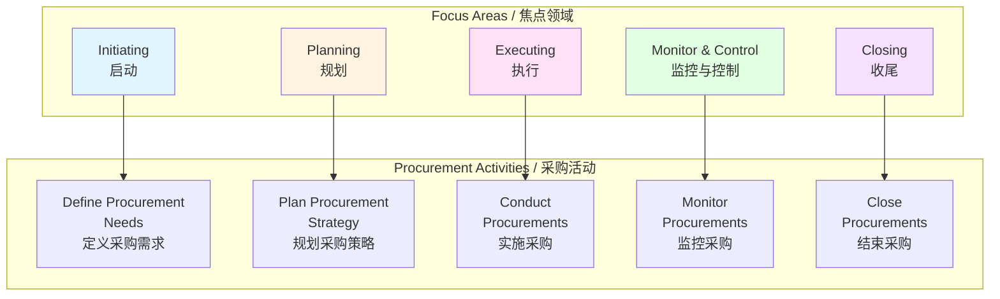

# 采购策略 / Procurement Strategy

## 📋 Table of Contents / 目录

- [采购策略 / Procurement Strategy](#采购策略--procurement-strategy)
  - [📋 Table of Contents / 目录](#-table-of-contents--目录)
  - [0. 所属层与转换关系 / Layer and Transformation](#0-所属层与转换关系--layer-and-transformation)
  - [1. Overview / 概述](#1-overview--概述)
  - [2. Definition / 定义](#2-definition--定义)
    - [2.1 PMBOK 8th Edition Definition / PMBOK 第8版定义](#21-pmbok-8th-edition-definition--pmbok-第8版定义)
    - [2.2 现代采购方法](#22-现代采购方法)
    - [2.3 供应商管理](#23-供应商管理)
    - [2.4 合同管理](#24-合同管理)
    - [2.5 采购策略框架](#25-采购策略框架)
  - [3. Category Theory Perspective / 范畴论视角](#3-category-theory-perspective--范畴论视角)
    - [3.1 采购作为对象](#31-采购作为对象)
    - [3.2 采购过程作为态射](#32-采购过程作为态射)
    - [3.3 采购策略函子](#33-采购策略函子)
  - [4. Properties / 性质](#4-properties--性质)
    - [4.1 采购策略的灵活性](#41-采购策略的灵活性)
    - [4.2 采购策略的有效性](#42-采购策略的有效性)
    - [4.3 采购策略的风险管理](#43-采购策略的风险管理)
  - [5. Relations / 关系](#5-relations--关系)
    - [5.1 与资源管理的关系](#51-与资源管理的关系)
    - [5.2 与财务绩效域的关系](#52-与财务绩效域的关系)
    - [5.3 与风险管理的关系](#53-与风险管理的关系)
  - [6. Examples / 例子](#6-examples--例子)
    - [6.1 软件项目采购策略](#61-软件项目采购策略)
    - [6.2 建筑项目采购策略](#62-建筑项目采购策略)
    - [6.3 制造项目采购策略](#63-制造项目采购策略)
  - [7. Explanations / 解释](#7-explanations--解释)
    - [7.1 数学解释 / Mathematical Explanation](#71-数学解释--mathematical-explanation)
    - [7.2 直观解释 / Intuitive Explanation](#72-直观解释--intuitive-explanation)
    - [7.3 应用解释 / Application Explanation](#73-应用解释--application-explanation)
    - [7.4 认知解释 / Cognitive Explanation](#74-认知解释--cognitive-explanation)
    - [7.5 历史解释 / Historical Explanation](#75-历史解释--historical-explanation)
    - [7.6 哲学解释 / Philosophical Explanation](#76-哲学解释--philosophical-explanation)
    - [7.7 技术解释 / Technical Explanation](#77-技术解释--technical-explanation)
    - [7.8 实践解释 / Practical Explanation](#78-实践解释--practical-explanation)
    - [7.9 对比解释 / Comparative Explanation](#79-对比解释--comparative-explanation)
    - [7.10 系统解释 / System Explanation](#710-系统解释--system-explanation)
  - [8. Argumentation / 论证](#8-argumentation--论证)
    - [8.1 为什么需要采购策略](#81-为什么需要采购策略)
    - [8.2 采购策略的有效性证明](#82-采购策略的有效性证明)
  - [9. Applications / 应用](#9-applications--应用)
    - [9.1 在传统项目管理中的应用](#91-在传统项目管理中的应用)
    - [9.2 在敏捷项目管理中的应用](#92-在敏捷项目管理中的应用)
    - [9.3 在混合项目管理中的应用](#93-在混合项目管理中的应用)
  - [10. References / 参考文献](#10-references--参考文献)
    - [10.1 Standards / 标准](#101-standards--标准)
    - [10.2 Category Theory / 范畴论](#102-category-theory--范畴论)
    - [10.3 Related Files / 相关文件](#103-related-files--相关文件)

---

## 0. 所属层与转换关系 / Layer and Transformation

- **所属层**：**核心模型层**（对应 docs/02-project-management）
- **转换关系**：采购策略作为**资源转换**和**财务转换**的集成，通过采购过程 $procure: Need \to Contract$ 进行**资源获取转换**；与 **03-资源管理概念**、**06-PMBOK8绩效域**（资源、财务）对应。

---

## 1. Overview / 概述

**English / 英文**:

Procurement strategy in project management involves planning, acquiring, and managing external resources and services. PMBOK 8th Edition (2025) emphasizes modern procurement methods, strategic supplier relationships, and integrated contract management. This document covers updated procurement strategies aligned with PMBOK 8th Edition and modern project management practices.

**中文**:

项目管理中的采购策略涉及规划、获取和管理外部资源和服务。PMBOK 第8版（2025）强调现代采购方法、战略供应商关系和集成合同管理。本文档涵盖与PMBOK 第8版和现代项目管理实践对齐的更新采购策略。

**Key Insights / 关键洞察**:

- **Modern Methods / 现代方法**: Agile procurement, strategic partnerships / 敏捷采购、战略伙伴关系
- **Supplier Management / 供应商管理**: Strategic supplier relationships / 战略供应商关系
- **Contract Management / 合同管理**: Integrated contract lifecycle management / 集成合同生命周期管理
- **Value Focus / 价值聚焦**: Focus on value delivery / 聚焦价值交付

---

## 2. Definition / 定义

### 2.1 PMBOK 8th Edition Definition / PMBOK 第8版定义

**Definition 2.1** (Procurement Strategy - PMBOK 8th Edition)

Procurement strategy is the approach for acquiring external resources and services to support project delivery, aligned with PMBOK 8th Edition focus on value delivery and strategic relationships.

**Formal Definition / 形式化定义**:

$$\text{ProcurementStrategy}(P) = (\text{Methods}(P), \text{Suppliers}(P), \text{Contracts}(P), \text{Value}(P))$$

where:

- $\text{Methods}(P)$: Procurement methods used
- $\text{Suppliers}(P)$: Supplier relationships
- $\text{Contracts}(P)$: Contract management approach
- $\text{Value}(P)$: Value delivery focus

**Key Updates in PMBOK 8th Edition / PMBOK 第8版关键更新**:

- **Strategic Focus / 战略焦点**: Strategic supplier relationships
- **Agile Procurement / 敏捷采购**: Agile procurement methods
- **Value Delivery / 价值交付**: Focus on value, not just cost
- **Integrated Management / 集成管理**: Integrated contract management

### 2.2 现代采购方法

**Definition 2.2** (Modern Procurement Methods)

Modern procurement methods include:

1. **Traditional Procurement / 传统采购**: Fixed-price contracts, competitive bidding
2. **Agile Procurement / 敏捷采购**: Flexible contracts, iterative delivery
3. **Strategic Partnerships / 战略伙伴关系**: Long-term partnerships
4. **Cloud/As-a-Service / 云/即服务**: Cloud services, SaaS procurement
5. **Outsourcing / 外包**: Strategic outsourcing

**Formal Definition / 形式化定义**:

$$\text{ProcurementMethods} = \{\text{Traditional}, \text{Agile}, \text{Partnership}, \text{Cloud}, \text{Outsourcing}\}$$

**Method Selection / 方法选择**:

Select method based on:

- Project characteristics
- Requirements stability
- Relationship needs
- Value objectives

### 2.3 供应商管理

**Definition 2.3** (Supplier Management)

Supplier management involves:

1. **Supplier Selection / 供应商选择**: Selecting appropriate suppliers
2. **Relationship Management / 关系管理**: Managing supplier relationships
3. **Performance Management / 绩效管理**: Managing supplier performance
4. **Risk Management / 风险管理**: Managing supplier risks

**Formal Definition / 形式化定义**:

$$\text{SupplierManagement} = (\text{Selection}, \text{Relationship}, \text{Performance}, \text{Risk})$$

**Strategic Relationships / 战略关系**:

PMBOK 8th Edition emphasizes:

- **Partnership Approach / 伙伴关系方法**: Long-term partnerships
- **Value Creation / 价值创造**: Creating value together
- **Risk Sharing / 风险分担**: Sharing risks and rewards

### 2.4 合同管理

**Definition 2.4** (Contract Management)

Contract management includes:

1. **Contract Planning / 合同规划**: Planning contracts
2. **Contract Negotiation / 合同谈判**: Negotiating contracts
3. **Contract Execution / 合同执行**: Executing contracts
4. **Contract Monitoring / 合同监控**: Monitoring contract performance
5. **Contract Closure / 合同收尾**: Closing contracts

**Formal Definition / 形式化定义**:

$$\text{ContractManagement} = (\text{Plan}, \text{Negotiate}, \text{Execute}, \text{Monitor}, \text{Close})$$

**Contract Types / 合同类型**:

- **Fixed-Price / 固定价格**: Fixed price contracts
- **Cost-Reimbursable / 成本补偿**: Cost-plus contracts
- **Time and Materials / 时间和材料**: T&M contracts
- **Agile Contracts / 敏捷合同**: Flexible agile contracts

### 2.5 采购策略框架

**Definition 2.5** (Procurement Strategy Framework)

The procurement strategy framework:

$$\text{ProcurementFramework} = (\text{Plan}, \text{Select}, \text{Manage}, \text{Monitor}, \text{Close})$$

**Framework Components / 框架组件**:

1. **Plan Procurement / 规划采购**: Plan procurement approach
2. **Select Suppliers / 选择供应商**: Select and contract suppliers
3. **Manage Relationships / 管理关系**: Manage supplier relationships
4. **Monitor Performance / 监控绩效**: Monitor supplier performance
5. **Close Contracts / 关闭合同**: Close procurement contracts

**Integration with PMBOK 8th Focus Areas / 与PMBOK 8th焦点领域的整合**:

---

## 3. Category Theory Perspective / 范畴论视角

### 3.1 采购作为对象

**Definition 3.1** (Procurement Object)

A procurement $Proc \in \mathbf{Procurement}$ is an object:

$$Proc = (\text{Need}, \text{Supplier}, \text{Contract}, \text{Value})$$

where:

- $\text{Need}$: Procurement need
- $\text{Supplier}$: Selected supplier
- $\text{Contract}$: Procurement contract
- $\text{Value}$: Value delivered

### 3.2 采购过程作为态射

**Definition 3.2** (Procurement Process Morphism)

Procurement process is a morphism:

$$procure: \text{Need} \to \text{Contract}$$

that transforms procurement needs into contracts.

### 3.3 采购策略函子

**Definition 3.3** (Procurement Strategy Functor)

Procurement strategy corresponds to a functor:

$$ProcStrategy: \mathbf{Project} \to \mathbf{ProcuredProject}$$

that adds procurement to projects.

---

## 4. Properties / 性质

### 4.1 采购策略的灵活性

**Property 4.1** (Procurement Strategy Flexibility)

Procurement strategies are flexible:

$$\text{Flexibility}(PS) = f(\text{Methods}(PS), \text{Context}(PS))$$

where strategies adapt to project context.

### 4.2 采购策略的有效性

**Property 4.2** (Procurement Strategy Effectiveness)

Procurement strategies are effective when:

$$\text{Effectiveness}(PS) = \text{ValueDelivered}(PS) - \text{Cost}(PS)$$

where value exceeds cost.

### 4.3 采购策略的风险管理

**Property 4.3** (Procurement Strategy Risk Management)

Procurement strategies manage risks:

$$\text{RiskManagement}(PS) = \min(\text{SupplierRisk}(PS), \text{ContractRisk}(PS), \text{PerformanceRisk}(PS))$$

---

## 5. Relations / 关系

### 5.1 与资源管理的关系

**Relation 5.1** (Resource Management Relationship)

Procurement is part of resource management:

- **Resource Acquisition / 资源获取**: Acquiring external resources
- **Resource Optimization / 资源优化**: Optimizing resource mix
- **Resource Allocation / 资源分配**: Allocating procured resources

### 5.2 与财务绩效域的关系

**Relation 5.2** (Finance Performance Domain Relationship)

Procurement relates to finance:

- **Cost Management / 成本管理**: Managing procurement costs
- **Budget Control / 预算控制**: Controlling procurement budget
- **Value Delivery / 价值交付**: Delivering value through procurement

### 5.3 与风险管理的关系

**Relation 5.3** (Risk Management Relationship)

Procurement involves risks:

- **Supplier Risk / 供应商风险**: Supplier-related risks
- **Contract Risk / 合同风险**: Contract-related risks
- **Performance Risk / 绩效风险**: Performance-related risks

---

## 6. Examples / 例子

### 6.1 软件项目采购策略

**Example 6.1** (Software Project Procurement Strategy)

**Project / 项目**: Enterprise software development

**Procurement Strategy / 采购策略**:

- **Cloud Services / 云服务**: AWS, Azure (as-a-service)
- **Development Services / 开发服务**: Agile contractors (agile procurement)
- **Tools / 工具**: SaaS tools (subscription-based)

**Benefits / 效益**:

- Flexible scaling
- Cost efficiency
- Rapid deployment
- Value focus

### 6.2 建筑项目采购策略

**Example 6.2** (Construction Project Procurement Strategy)

**Project / 项目**: Building construction

**Procurement Strategy / 采购策略**:

- **Materials / 材料**: Fixed-price contracts (traditional)
- **Labor / 劳动力**: Strategic partnerships (partnership)
- **Equipment / 设备**: Rental contracts (flexible)

**Benefits / 效益**:

- Cost control
- Quality assurance
- Risk management
- Schedule adherence

### 6.3 制造项目采购策略

**Example 6.3** (Manufacturing Project Procurement Strategy)

**Project / 项目**: Product manufacturing

**Procurement Strategy / 采购策略**:

- **Components / 组件**: Strategic supplier partnerships
- **Raw Materials / 原材料**: Long-term contracts
- **Services / 服务**: Agile service contracts

**Benefits / 效益**:

- Supply chain stability
- Cost optimization
- Quality consistency
- Innovation support

---

## 7. Explanations / 解释

### 7.1 数学解释 / Mathematical Explanation

**Mathematical Structure / 数学结构**:

Procurement strategy optimizes:

$$\max_{\text{Strategy}} \text{Value}(\text{Procurement}) - \text{Cost}(\text{Procurement})$$

subject to constraints.

### 7.2 直观解释 / Intuitive Explanation

**Intuitive Understanding / 直观理解**:

Think of procurement as **shopping for project needs**:

- **Traditional / 传统**: Fixed-price shopping (know what you want)
- **Agile / 敏捷**: Flexible shopping (adapt as you go)
- **Partnership / 伙伴关系**: Long-term supplier relationships
- **Value / 价值**: Focus on value, not just price

### 7.3 应用解释 / Application Explanation

**Practical Application / 实际应用**:

In practice, procurement strategy:

- **Acquires Resources / 获取资源**: Acquires external resources
- **Optimizes Costs / 优化成本**: Optimizes procurement costs
- **Manages Suppliers / 管理供应商**: Manages supplier relationships
- **Delivers Value / 交付价值**: Delivers value through procurement

### 7.4 认知解释 / Cognitive Explanation

**Cognitive Understanding / 认知理解**:

From a cognitive perspective, procurement strategy:

- **Strategic Thinking / 战略思维**: Strategic supplier relationships
- **Value Thinking / 价值思维**: Focus on value, not just cost
- **Relationship Thinking / 关系思维**: Long-term partnerships
- **Risk Thinking / 风险思维**: Risk-aware procurement

### 7.5 历史解释 / Historical Explanation

**Historical Development / 历史发展**:

- **Traditional Procurement / 传统采购**: Fixed-price contracts (early PM)
- **Modern Procurement / 现代采购**: Flexible contracts (modern PM)
- **Strategic Procurement / 战略采购**: Strategic partnerships (current PM)
- **Agile Procurement / 敏捷采购**: Agile procurement methods (2024-2025)

### 7.6 哲学解释 / Philosophical Explanation

**Philosophical Perspective / 哲学视角**:

Procurement strategy represents:

- **Value Focus / 价值聚焦**: Focus on value delivery
- **Partnership Approach / 伙伴关系方法**: Long-term partnerships
- **Risk Sharing / 风险分担**: Shared risks and rewards
- **Strategic Alignment / 战略对齐**: Alignment with strategy

### 7.7 技术解释 / Technical Explanation

**Technical Details / 技术细节**:

From a technical perspective:

- **Procurement Methods / 采购方法**: Traditional, agile, partnership, cloud
- **Contract Types / 合同类型**: Fixed-price, cost-plus, T&M, agile
- **Supplier Management / 供应商管理**: Selection, relationship, performance
- **Risk Management / 风险管理**: Supplier risk, contract risk

### 7.8 实践解释 / Practical Explanation

**Practical Perspective / 实践视角**:

In practice, procurement strategy:

- **Reduces Costs / 降低成本**: Optimized procurement costs
- **Improves Quality / 改进质量**: Better supplier quality
- **Manages Risks / 管理风险**: Effective risk management
- **Builds Relationships / 建立关系**: Strategic supplier relationships

### 7.9 对比解释 / Comparative Explanation

**Comparison / 对比**:

| Aspect / 方面 | Traditional | Agile | Strategic Partnership |
|--------------|-----------|-------|---------------------|
| Flexibility / 灵活性 | Low | High | Medium |
| Cost Focus / 成本焦点 | High | Medium | Low |
| Value Focus / 价值焦点 | Low | Medium | High |
| Relationship / 关系 | Transactional | Collaborative | Partnership |

### 7.10 系统解释 / System Explanation

**System Perspective / 系统视角**:

From a systems perspective, procurement strategy:

- **System inputs / 系统输入**: Procurement needs and requirements
- **System processing / 系统处理**: Procurement processes and methods
- **System outputs / 系统输出**: Acquired resources and services
- **System feedback / 系统反馈**: Supplier performance and value delivery

---

## 8. Argumentation / 论证

### 8.1 为什么需要采购策略

**Argument 8.1** (Need for Procurement Strategy)

**Why Procurement Strategy Is Needed / 为什么需要采购策略**:

1. **Resource Acquisition / 资源获取**: Acquire external resources
2. **Cost Optimization / 成本优化**: Optimize costs
3. **Value Delivery / 价值交付**: Deliver value
4. **Risk Management / 风险管理**: Manage procurement risks
5. **Strategic Relationships / 战略关系**: Build strategic relationships

### 8.2 采购策略的有效性证明

**Argument 8.2** (Effectiveness of Procurement Strategy)

**Effectiveness Criteria / 有效性标准**:

1. **Cost Reduction / 成本降低**: Reduced costs ✅
2. **Value Delivery / 价值交付**: Value delivered ✅
3. **Risk Reduction / 风险降低**: Reduced risks ✅
4. **Quality Improvement / 质量提升**: Improved quality ✅
5. **Relationship Building / 关系建设**: Strategic relationships ✅

---

## 9. Applications / 应用

### 9.1 在传统项目管理中的应用

**Application 9.1** (Traditional Project Management)

- **Fixed-Price Contracts / 固定价格合同**: Traditional procurement
- **Competitive Bidding / 竞争性招标**: Competitive selection
- **Formal Contracts / 正式合同**: Detailed contracts

### 9.2 在敏捷项目管理中的应用

**Application 9.2** (Agile Project Management)

- **Agile Contracts / 敏捷合同**: Flexible contracts
- **Iterative Procurement / 迭代采购**: Iterative approach
- **Value-Based / 基于价值**: Value-focused procurement

### 9.3 在混合项目管理中的应用

**Application 9.3** (Hybrid Project Management)

- **Hybrid Procurement / 混合采购**: Combining methods
- **Strategic Partnerships / 战略伙伴关系**: Long-term relationships
- **Flexible Contracts / 灵活合同**: Adaptive contracts

---

## 10. References / 参考文献

### 10.1 Standards / 标准

- **PMBOK Guide 8th Edition** (2025): Procurement strategy updates
- **ISO 21500:2021**: Project, programme and portfolio management
- **ISO 21502:2020**: Guidance on project management

### 10.2 Category Theory / 范畴论

- Category theory foundations for procurement
- Functorial relationships between projects and procurement

### 10.3 Related Files / 相关文件

- [02-资源分配.md](02-资源分配.md) - Resource Allocation
- [03-资源调度.md](03-资源调度.md) - Resource Scheduling
- [04-资源优化.md](04-资源优化.md) - Resource Optimization

---

**Last Updated / 最后更新**: 2026-01-27
**Version / 版本**: 1.0
**Status / 状态**: ✅ Complete / 完成

---

## 📊 Summary / 总结

Procurement strategy in project management involves modern procurement methods, strategic supplier relationships, and integrated contract management. PMBOK 8th Edition emphasizes value delivery, strategic partnerships, and flexible procurement approaches aligned with project needs.

项目管理中的采购策略涉及现代采购方法、战略供应商关系和集成合同管理。PMBOK 第8版强调价值交付、战略伙伴关系和与项目需求对齐的灵活采购方法。
