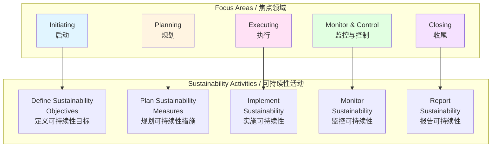
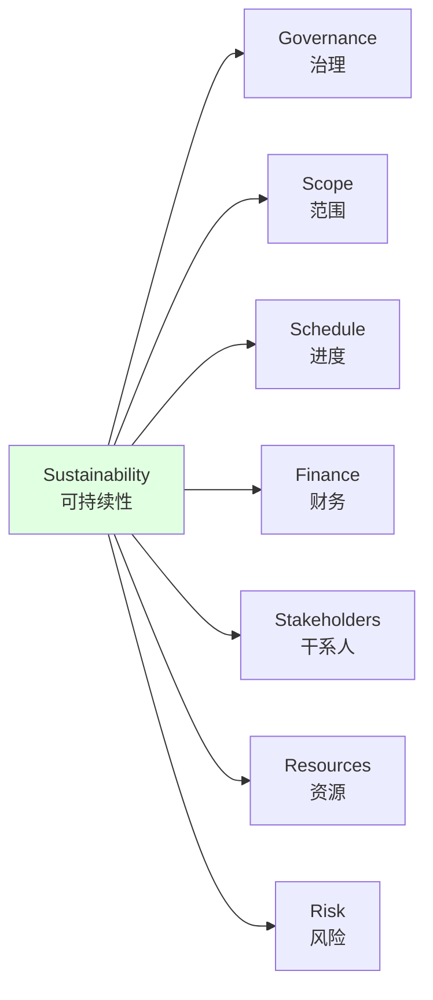

# 可持续性项目管理 / Sustainability Project Management

## 📋 Table of Contents / 目录

- [可持续性项目管理 / Sustainability Project Management](#可持续性项目管理--sustainability-project-management)
  - [📋 Table of Contents / 目录](#-table-of-contents--目录)
  - [0. 所属层与转换关系 / Layer and Transformation](#0-所属层与转换关系--layer-and-transformation)
  - [1. Overview / 概述](#1-overview--概述)
  - [2. Definition / 定义](#2-definition--定义)
    - [2.1 PMBOK 8th Edition Definition / PMBOK 第8版定义](#21-pmbok-8th-edition-definition--pmbok-第8版定义)
    - [2.2 可持续性定义](#22-可持续性定义)
    - [2.3 环境可持续性](#23-环境可持续性)
    - [2.4 社会可持续性](#24-社会可持续性)
    - [2.5 经济可持续性](#25-经济可持续性)
    - [2.6 可持续性项目管理框架](#26-可持续性项目管理框架)
  - [3. Category Theory Perspective / 范畴论视角](#3-category-theory-perspective--范畴论视角)
    - [3.1 可持续性项目作为对象](#31-可持续性项目作为对象)
    - [3.2 可持续性过程作为态射](#32-可持续性过程作为态射)
    - [3.3 可持续性函子](#33-可持续性函子)
  - [4. Properties / 性质](#4-properties--性质)
    - [4.1 可持续性的三重底线](#41-可持续性的三重底线)
    - [4.2 可持续性的长期性](#42-可持续性的长期性)
    - [4.3 可持续性的可测量性](#43-可持续性的可测量性)
  - [5. Relations / 关系](#5-relations--关系)
    - [5.1 与PMBOK 8th核心原则的关系](#51-与pmbok-8th核心原则的关系)
    - [5.2 与绩效域的关系](#52-与绩效域的关系)
    - [5.3 与其他行业应用的关系](#53-与其他行业应用的关系)
  - [6. Examples / 例子](#6-examples--例子)
    - [6.1 绿色建筑项目](#61-绿色建筑项目)
    - [6.2 可再生能源项目](#62-可再生能源项目)
    - [6.3 可持续软件开发项目](#63-可持续软件开发项目)
  - [7. Explanations / 解释](#7-explanations--解释)
    - [7.1 数学解释 / Mathematical Explanation](#71-数学解释--mathematical-explanation)
    - [7.2 直观解释 / Intuitive Explanation](#72-直观解释--intuitive-explanation)
    - [7.3 应用解释 / Application Explanation](#73-应用解释--application-explanation)
    - [7.4 认知解释 / Cognitive Explanation](#74-认知解释--cognitive-explanation)
    - [7.5 历史解释 / Historical Explanation](#75-历史解释--historical-explanation)
    - [7.6 哲学解释 / Philosophical Explanation](#76-哲学解释--philosophical-explanation)
    - [7.7 技术解释 / Technical Explanation](#77-技术解释--technical-explanation)
    - [7.8 实践解释 / Practical Explanation](#78-实践解释--practical-explanation)
    - [7.9 对比解释 / Comparative Explanation](#79-对比解释--comparative-explanation)
    - [7.10 系统解释 / System Explanation](#710-系统解释--system-explanation)
  - [8. Argumentation / 论证](#8-argumentation--论证)
    - [8.1 为什么需要可持续性项目管理](#81-为什么需要可持续性项目管理)
    - [8.2 可持续性项目管理的有效性证明](#82-可持续性项目管理的有效性证明)
  - [9. Applications / 应用](#9-applications--应用)
    - [9.1 在建筑项目中的应用](#91-在建筑项目中的应用)
    - [9.2 在IT项目中的应用](#92-在it项目中的应用)
    - [9.3 在制造项目中的应用](#93-在制造项目中的应用)
  - [10. References / 参考文献](#10-references--参考文献)
    - [10.1 Standards / 标准](#101-standards--标准)
    - [10.2 Category Theory / 范畴论](#102-category-theory--范畴论)
    - [10.3 Related Files / 相关文件](#103-related-files--相关-files)

---

## 0. 所属层与转换关系 / Layer and Transformation

- **所属层**：**应用模型层**（对应 docs/04-industry-applications）
- **转换关系**：可持续性项目管理应用**生命周期转换**、**资源转换**（考虑环境资源）、**风险转换**（环境和社会风险）；与 **01-项目管理基础/06-PMBOK8核心原则**（原则5：整合可持续性）对应。

---

## 1. Overview / 概述

**English / 英文**:

Sustainability project management integrates environmental, social, and economic sustainability considerations throughout the project lifecycle. It is a core principle in PMBOK 8th Edition (2025) and represents a fundamental shift toward responsible project management that considers long-term impacts on people, planet, and profit.

**中文**:

可持续性项目管理在整个项目生命周期中整合环境、社会和经济可持续性考虑。它是PMBOK 第8版（2025）的核心原则，代表了向负责任的项目管理的根本转变，考虑对人员、地球和利润的长期影响。

**Key Insights / 关键洞察**:

- **Triple Bottom Line / 三重底线**: People, Planet, Profit / 人员、地球、利润
- **Environmental Sustainability / 环境可持续性**: Minimize environmental impact / 最小化环境影响
- **Social Sustainability / 社会可持续性**: Positive social impact / 积极的社会影响
- **Economic Sustainability / 经济可持续性**: Long-term economic viability / 长期经济可行性
- **Lifecycle Integration / 生命周期整合**: Sustainability throughout project lifecycle / 整个项目生命周期的可持续性

---

## 2. Definition / 定义

### 2.1 PMBOK 8th Edition Definition / PMBOK 第8版定义

**Definition 2.1** (Sustainability Project Management - PMBOK 8th Edition)

Sustainability project management is the integration of environmental, social, and economic sustainability considerations into project management practices, aligned with PMBOK 8th Edition Core Principle 5: "Integrate Sustainability".

**Formal Definition / 形式化定义**:

$$\text{SustainabilityPM}(P) = \text{Integrate}(\text{Environmental}(P), \text{Social}(P), \text{Economic}(P))$$

where sustainability is integrated throughout the project lifecycle.

**Key Activities / 关键活动**:

- **Sustainability Planning / 可持续性规划**: Plan sustainability objectives and measures
- **Sustainability Assessment / 可持续性评估**: Assess environmental, social, economic impacts
- **Sustainability Implementation / 可持续性实施**: Implement sustainability measures
- **Sustainability Monitoring / 可持续性监控**: Monitor sustainability performance
- **Sustainability Reporting / 可持续性报告**: Report on sustainability outcomes

### 2.2 可持续性定义

**Definition 2.2** (Sustainability)

Sustainability is the ability to meet present needs without compromising the ability of future generations to meet their own needs (Brundtland Commission, 1987).

**Formal Definition / 形式化定义**:

$$\text{Sustainability}(t) = \forall t' > t: \text{Needs}(t') \text{ can be met}$$

where $t$ is the current time and $t'$ is future time.

**Triple Bottom Line / 三重底线**:

Sustainability encompasses three dimensions:

$$\text{Sustainability} = (\text{Environmental}, \text{Social}, \text{Economic})$$

### 2.3 环境可持续性

**Definition 2.3** (Environmental Sustainability)

Environmental sustainability minimizes negative environmental impacts and promotes environmental protection.

**Formal Definition / 形式化定义**:

$$\text{Environmental}(P) = \min(\text{CarbonFootprint}(P), \text{Waste}(P), \text{ResourceConsumption}(P))$$

**Key Indicators / 关键指标**:

- **Carbon Footprint / 碳足迹**: CO₂ emissions
- **Energy Consumption / 能源消耗**: Energy use
- **Water Usage / 用水量**: Water consumption
- **Waste Generation / 废物产生**: Waste produced
- **Resource Efficiency / 资源效率**: Resource utilization

**Category Theory Mapping / 范畴论映射**:

Environmental sustainability corresponds to a functor:

$$E: \mathbf{Project} \to \mathbf{EnvironmentalImpact}$$

### 2.4 社会可持续性

**Definition 2.4** (Social Sustainability)

Social sustainability promotes positive social impacts and considers stakeholder well-being.

**Formal Definition / 形式化定义**:

$$\text{Social}(P) = \max(\text{StakeholderWellbeing}(P), \text{CommunityBenefit}(P), \text{Equity}(P))$$

**Key Indicators / 关键指标**:

- **Stakeholder Engagement / 干系人参与**: Level of stakeholder involvement
- **Community Impact / 社区影响**: Positive community contributions
- **Health and Safety / 健康与安全**: Worker and community safety
- **Diversity and Inclusion / 多样性与包容性**: Diversity in teams and stakeholders
- **Social Equity / 社会公平**: Fair distribution of benefits

**Category Theory Mapping / 范畴论映射**:

Social sustainability corresponds to a functor:

$$S: \mathbf{Project} \to \mathbf{SocialImpact}$$

### 2.5 经济可持续性

**Definition 2.5** (Economic Sustainability)

Economic sustainability ensures long-term economic viability and value creation.

**Formal Definition / 形式化定义**:

$$\text{Economic}(P) = \text{LongTermValue}(P) \land \text{FinancialViability}(P) \land \text{EconomicGrowth}(P)$$

**Key Indicators / 关键指标**:

- **Long-term Value / 长期价值**: Value creation over time
- **Financial Viability / 财务可行性**: Financial sustainability
- **Economic Growth / 经济增长**: Contribution to economic development
- **Cost Efficiency / 成本效率**: Efficient resource use
- **Return on Investment / 投资回报**: ROI considering sustainability

**Category Theory Mapping / 范畴论映射**:

Economic sustainability corresponds to a functor:

$$Ec: \mathbf{Project} \to \mathbf{EconomicImpact}$$

### 2.6 可持续性项目管理框架

**Definition 2.6** (Sustainability Project Management Framework)

The sustainability project management framework integrates sustainability into all project management processes:

$$\text{SustainabilityFramework} = (\text{Plan}, \text{Assess}, \text{Implement}, \text{Monitor}, \text{Report})$$

**Framework Components / 框架组件**:

1. **Sustainability Planning / 可持续性规划**
   - Define sustainability objectives
   - Identify sustainability measures
   - Plan sustainability activities

2. **Sustainability Assessment / 可持续性评估**
   - Assess environmental impacts
   - Assess social impacts
   - Assess economic impacts

3. **Sustainability Implementation / 可持续性实施**
   - Implement environmental measures
   - Implement social measures
   - Implement economic measures

4. **Sustainability Monitoring / 可持续性监控**
   - Monitor environmental performance
   - Monitor social performance
   - Monitor economic performance

5. **Sustainability Reporting / 可持续性报告**
   - Report sustainability outcomes
   - Communicate sustainability achievements
   - Document lessons learned

**Integration with PMBOK 8th Focus Areas / 与PMBOK 8th焦点领域的整合**:

---

## 3. Category Theory Perspective / 范畴论视角

### 3.1 可持续性项目作为对象

**Definition 3.1** (Sustainability Project Object)

A sustainability project $P_{sust} \in \mathbf{SustainabilityProject}$ is an object:

$$P_{sust} = (\text{Environmental}(P), \text{Social}(P), \text{Economic}(P), \text{SustainabilityMetrics}(P))$$

where:

- $\text{Environmental}(P)$: Environmental sustainability measures
- $\text{Social}(P)$: Social sustainability measures
- $\text{Economic}(P)$: Economic sustainability measures
- $\text{SustainabilityMetrics}(P)$: Sustainability performance metrics

**Example 3.1** (Green Building Project)

A green building project:

$$P_{green} = (\text{LEEDCertification}, \text{EnergyEfficiency}, \text{CommunityBenefit}, \text{LongTermValue})$$

where:

- $\text{LEEDCertification}$: LEED certification level
- $\text{EnergyEfficiency}$: Energy efficiency measures
- $\text{CommunityBenefit}$: Community benefits provided
- $\text{LongTermValue}$: Long-term economic value

### 3.2 可持续性过程作为态射

**Definition 3.2** (Sustainability Process Morphism)

A sustainability process is a morphism:

$$p_{sust}: P \to P'$$

that transforms a project $P$ into a more sustainable project $P'$:

$$\text{Sustainability}(P') \geq \text{Sustainability}(P)$$

**Example 3.2** (Sustainability Improvement Process)

The process of improving energy efficiency:

$$p_{energy}: P \to P'$$

where:

- $P$: Project with baseline energy consumption
- $P'$: Project with reduced energy consumption
- $\text{EnergyConsumption}(P') < \text{EnergyConsumption}(P)$

### 3.3 可持续性函子

**Definition 3.3** (Sustainability Functor)

Sustainability corresponds to a functor:

$$Sust: \mathbf{Project} \to \mathbf{Sustainability}$$

that preserves project structure while adding sustainability dimensions.

**Theorem 3.1** (Sustainability Functor Composition)

Sustainability functors can be composed:

$$(Sust_{social} \circ Sust_{environmental})(P) = Sust_{social}(Sust_{environmental}(P))$$

**Natural Transformation / 自然变换**:

There exists a natural transformation:

$$\alpha: \text{Project} \Rightarrow \text{SustainableProject}$$

that transforms any project into a sustainable project.

---

## 4. Properties / 性质

### 4.1 可持续性的三重底线

**Property 4.1** (Triple Bottom Line)

Sustainability requires balance across three dimensions:

$$\text{Sustainability}(P) = \alpha \cdot \text{Environmental}(P) + \beta \cdot \text{Social}(P) + \gamma \cdot \text{Economic}(P)$$

where $\alpha + \beta + \gamma = 1$ and all components $\geq 0$.

**Balance Requirement / 平衡要求**:

True sustainability requires all three dimensions:

$$\text{Environmental}(P) > 0 \land \text{Social}(P) > 0 \land \text{Economic}(P) > 0$$

### 4.2 可持续性的长期性

**Property 4.2** (Long-term Perspective)

Sustainability considers long-term impacts:

$$\text{Sustainability}(P, t) = \int_{t}^{\infty} \text{Impact}(P, t') dt'$$

where $t$ is the current time and $t'$ is future time.

**Intergenerational Equity / 代际公平**:

Sustainability ensures intergenerational equity:

$$\forall t, t': \text{Needs}(t') \text{ can be met given } \text{Resources}(t)$$

### 4.3 可持续性的可测量性

**Property 4.3** (Sustainability Measurability)

Sustainability can be measured through indicators:

$$\text{SustainabilityScore}(P) = f(\text{EnvironmentalIndicators}(P), \text{SocialIndicators}(P), \text{EconomicIndicators}(P))$$

**Key Metrics / 关键指标**:

- **Environmental**: Carbon footprint, energy consumption, waste
- **Social**: Stakeholder satisfaction, community impact, diversity
- **Economic**: Long-term value, ROI, cost efficiency

---

## 5. Relations / 关系

### 5.1 与PMBOK 8th核心原则的关系

**Relation 5.1** (Core Principle 5: Integrate Sustainability)

Sustainability project management directly implements PMBOK 8th Edition Core Principle 5: "Integrate Sustainability".

**Integration / 整合**:

Sustainability is integrated throughout:

- **Holistic View**: Consider environmental, social, economic aspects
- **Value Focus**: Long-term value creation
- **Quality Embedded**: Sustainability as quality dimension
- **Accountable Leadership**: Leadership for sustainability
- **Empowered Teams**: Teams empowered for sustainability

### 5.2 与绩效域的关系

**Relation 5.2** (Performance Domains Relationship)

Sustainability relates to all seven performance domains:

- **Governance** ($D_1$): Sustainability governance
- **Scope** ($D_2$): Sustainability scope considerations
- **Schedule** ($D_3$): Sustainability timeline considerations
- **Finance** ($D_4$): Sustainability financial considerations
- **Stakeholders** ($D_5$): Social sustainability
- **Resources** ($D_6$): Environmental resource management
- **Risk** ($D_7$): Sustainability risks

**Mapping / 映射**:

### 5.3 与其他行业应用的关系

**Relation 5.3** (Industry Application Relationships)

Sustainability applies across all industry applications:

- **Construction Projects / 建筑项目**: Green building, LEED certification
- **IT Projects / IT项目**: Green computing, energy-efficient data centers
- **Manufacturing Projects / 制造项目**: Sustainable manufacturing, circular economy
- **Energy Projects / 能源项目**: Renewable energy, energy efficiency

---

## 6. Examples / 例子

### 6.1 绿色建筑项目

**Example 6.1** (Green Building Project)

**Project / 项目**: LEED-certified office building

**Environmental Sustainability / 环境可持续性**:

- Energy-efficient design (30% reduction in energy consumption)
- Renewable energy (solar panels)
- Water conservation (rainwater harvesting)
- Sustainable materials (recycled content)

**Social Sustainability / 社会可持续性**:

- Community engagement (local hiring)
- Health and wellness (indoor air quality)
- Accessibility (ADA compliance)
- Public spaces (community areas)

**Economic Sustainability / 经济可持续性**:

- Long-term cost savings (reduced energy costs)
- Increased property value (LEED certification premium)
- Tenant satisfaction (lower turnover)
- Market competitiveness (sustainability as differentiator)

**Sustainability Metrics / 可持续性指标**:

- LEED Gold certification
- 30% energy reduction
- 40% water reduction
- 50% waste diversion

### 6.2 可再生能源项目

**Example 6.2** (Renewable Energy Project)

**Project / 项目**: Solar farm development

**Environmental Sustainability / 环境可持续性**:

- Clean energy generation (zero emissions)
- Land use optimization (dual-use agriculture)
- Biodiversity protection (habitat preservation)
- Carbon offset (replacing fossil fuels)

**Social Sustainability / 社会可持续性**:

- Local employment (construction and operations)
- Community benefits (reduced energy costs)
- Education (renewable energy awareness)
- Energy access (rural electrification)

**Economic Sustainability / 经济可持续性**:

- Long-term revenue (power purchase agreements)
- Cost competitiveness (declining solar costs)
- Economic development (local investment)
- Energy security (reduced dependence on imports)

**Sustainability Metrics / 可持续性指标**:

- 100 MW capacity
- 150,000 tons CO₂ offset annually
- 200 local jobs created
- 20-year PPA (power purchase agreement)

### 6.3 可持续软件开发项目

**Example 6.3** (Sustainable Software Development Project)

**Project / 项目**: Energy-efficient cloud application

**Environmental Sustainability / 环境可持续性**:

- Green computing (energy-efficient algorithms)
- Cloud optimization (reduced server usage)
- Code efficiency (reduced computational requirements)
- Sustainable hosting (renewable energy data centers)

**Social Sustainability / 社会可持续性**:

- Accessibility (WCAG compliance)
- Digital inclusion (low-bandwidth optimization)
- Privacy protection (data minimization)
- Open source (community benefit)

**Economic Sustainability / 经济可持续性**:

- Cost efficiency (reduced infrastructure costs)
- Scalability (efficient resource use)
- Long-term maintenance (sustainable architecture)
- Market value (sustainability as feature)

**Sustainability Metrics / 可持续性指标**:

- 40% reduction in server usage
- 50% reduction in energy consumption
- WCAG AA compliance
- Open source license

---

## 7. Explanations / 解释

### 7.1 数学解释 / Mathematical Explanation

**Mathematical Structure / 数学结构**:

Sustainability is a weighted combination:

$$\text{Sustainability}(P) = \alpha \cdot E(P) + \beta \cdot S(P) + \gamma \cdot Ec(P)$$

where:

- $E(P)$: Environmental sustainability score
- $S(P)$: Social sustainability score
- $Ec(P)$: Economic sustainability score
- $\alpha, \beta, \gamma$: Weights ($\alpha + \beta + \gamma = 1$)

**Optimization / 优化**:

Sustainability project management optimizes:

$$\max_{P} \text{Sustainability}(P) \text{ subject to } \text{Constraints}(P)$$

### 7.2 直观解释 / Intuitive Explanation

**Intuitive Understanding / 直观理解**:

Think of sustainability as a **three-legged stool**:

- **Environmental leg / 环境腿**: Minimize harm to the planet
- **Social leg / 社会腿**: Benefit people and communities
- **Economic leg / 经济腿**: Ensure financial viability

All three legs must be strong for the stool (sustainability) to stand.

### 7.3 应用解释 / Application Explanation

**Practical Application / 实际应用**:

In practice, sustainability project management:

- **Plans**: Include sustainability objectives in project planning
- **Implements**: Execute sustainability measures throughout project
- **Monitors**: Track sustainability performance
- **Reports**: Communicate sustainability outcomes

**Example / 例子**:

A construction project might plan for LEED certification, implement energy-efficient design, monitor energy consumption, and report LEED points achieved.

### 7.4 认知解释 / Cognitive Explanation

**Cognitive Understanding / 认知理解**:

From a cognitive perspective, sustainability requires:

- **Systems thinking / 系统思维**: Consider interconnected impacts
- **Long-term thinking / 长期思维**: Consider future consequences
- **Stakeholder thinking / 干系人思维**: Consider all affected parties
- **Value thinking / 价值思维**: Consider multiple forms of value

### 7.5 历史解释 / Historical Explanation

**Historical Development / 历史发展**:

- **1987**: Brundtland Commission defines sustainability
- **1992**: Rio Earth Summit establishes sustainability principles
- **2015**: UN Sustainable Development Goals (SDGs) adopted
- **2025**: PMBOK 8th Edition makes sustainability a core principle

Sustainability has evolved from environmental concern to integrated triple bottom line approach.

### 7.6 哲学解释 / Philosophical Explanation

**Philosophical Perspective / 哲学视角**:

Sustainability represents:

- **Ethics / 伦理**: Responsibility to future generations
- **Stewardship / 管理**: Care for resources
- **Equity / 公平**: Fair distribution of benefits and costs
- **Interdependence / 相互依存**: Recognition of interconnectedness

### 7.7 技术解释 / Technical Explanation

**Technical Details / 技术细节**:

From a technical perspective:

- **Lifecycle Assessment / 生命周期评估**: Evaluate impacts across lifecycle
- **Carbon Accounting / 碳核算**: Measure carbon footprint
- **Sustainability Metrics / 可持续性指标**: Quantify sustainability performance
- **Sustainability Standards / 可持续性标准**: Apply standards (LEED, ISO 14001, etc.)

### 7.8 实践解释 / Practical Explanation

**Practical Perspective / 实践视角**:

In practice, sustainability:

- **Adds value**: Long-term value creation
- **Reduces risk**: Environmental and social risk mitigation
- **Enhances reputation**: Positive brand image
- **Meets regulations**: Compliance with sustainability requirements

### 7.9 对比解释 / Comparative Explanation

**Comparison / 对比**:

| Aspect / 方面 | Traditional PM | Sustainability PM |
|--------------|----------------|-------------------|
| Focus / 焦点 | Short-term success | Long-term sustainability |
| Scope / 范围 | Project boundaries | Extended impacts |
| Stakeholders / 干系人 | Direct stakeholders | All affected parties |
| Metrics / 指标 | Cost, schedule, scope | Triple bottom line |
| Timeframe / 时间框架 | Project duration | Long-term impacts |

### 7.10 系统解释 / System Explanation

**System Perspective / 系统视角**:

From a systems perspective, sustainability:

- **System boundaries / 系统边界**: Extended to include environmental and social systems
- **System interactions / 系统交互**: Considers interactions between systems
- **System feedback / 系统反馈**: Incorporates feedback loops
- **System adaptation / 系统适应**: Enables system adaptation and resilience

---

## 8. Argumentation / 论证

### 8.1 为什么需要可持续性项目管理

**Argument 8.1** (Need for Sustainability Project Management)

**Why Sustainability PM Is Needed / 为什么需要可持续性项目管理**:

1. **Environmental Crisis / 环境危机**: Climate change, resource depletion require sustainable practices
2. **Social Responsibility / 社会责任**: Projects impact communities; responsibility to consider social impacts
3. **Economic Viability / 经济可行性**: Long-term economic success requires sustainability
4. **Regulatory Requirements / 监管要求**: Increasing regulations require sustainability considerations
5. **Stakeholder Expectations / 干系人期望**: Stakeholders expect sustainable practices
6. **Business Value / 商业价值**: Sustainability creates long-term value

**Evidence / 证据**:

- PMBOK 8th Edition makes sustainability a core principle
- UN SDGs provide global framework
- Increasing regulations (EU Green Deal, etc.)
- Market demand for sustainable products and services

### 8.2 可持续性项目管理的有效性证明

**Argument 8.2** (Effectiveness of Sustainability PM)

**Effectiveness Criteria / 有效性标准**:

1. **Environmental Impact Reduction / 环境影响减少**: Reduced carbon footprint, waste ✅
2. **Social Benefit Creation / 社会效益创造**: Positive community impacts ✅
3. **Economic Value Creation / 经济价值创造**: Long-term financial viability ✅
4. **Stakeholder Satisfaction / 干系人满意度**: Improved stakeholder relationships ✅
5. **Regulatory Compliance / 监管合规**: Meet sustainability regulations ✅

**Proof / 证明**:

- **Environmental**: LEED-certified buildings reduce energy by 30-50% ✅
- **Social**: Community engagement improves project acceptance ✅
- **Economic**: Sustainable projects show long-term value ✅
- **Stakeholder**: Sustainability enhances reputation ✅
- **Regulatory**: Compliance with sustainability standards ✅

---

## 9. Applications / 应用

### 9.1 在建筑项目中的应用

**Application 9.1** (Construction Projects)

**Sustainability Measures / 可持续性措施**:

- **LEED Certification / LEED认证**: Green building certification
- **Energy Efficiency / 能源效率**: Energy-efficient design and systems
- **Sustainable Materials / 可持续材料**: Recycled and sustainable materials
- **Water Conservation / 节水**: Water-efficient fixtures and systems
- **Waste Reduction / 废物减少**: Construction waste minimization

**Benefits / 效益**:

- Reduced operating costs
- Increased property value
- Improved occupant health
- Environmental protection

### 9.2 在IT项目中的应用

**Application 9.2** (IT Projects)

**Sustainability Measures / 可持续性措施**:

- **Green Computing / 绿色计算**: Energy-efficient algorithms and hardware
- **Cloud Optimization / 云优化**: Efficient cloud resource usage
- **Sustainable Hosting / 可持续托管**: Renewable energy data centers
- **E-waste Management / 电子废物管理**: Responsible disposal and recycling
- **Remote Work / 远程工作**: Reduced commuting and office space

**Benefits / 效益**:

- Reduced energy consumption
- Lower infrastructure costs
- Improved scalability
- Environmental protection

### 9.3 在制造项目中的应用

**Application 9.3** (Manufacturing Projects)

**Sustainability Measures / 可持续性措施**:

- **Sustainable Manufacturing / 可持续制造**: Efficient production processes
- **Circular Economy / 循环经济**: Waste reduction and recycling
- **Renewable Energy / 可再生能源**: Use of renewable energy sources
- **Water Management / 水资源管理**: Water conservation and treatment
- **Supply Chain Sustainability / 供应链可持续性**: Sustainable sourcing

**Benefits / 效益**:

- Reduced resource consumption
- Lower production costs
- Improved brand reputation
- Regulatory compliance

---

## 10. References / 参考文献

### 10.1 Standards / 标准

- **PMBOK Guide 8th Edition** (2025): Core Principle 5 - Integrate Sustainability
- **ISO 14001:2015**: Environmental management systems
- **ISO 26000:2010**: Social responsibility
- **LEED**: Leadership in Energy and Environmental Design
- **UN SDGs**: United Nations Sustainable Development Goals

### 10.2 Category Theory / 范畴论

- Category theory foundations for sustainability modeling
- Functorial relationships between projects and sustainability
- Natural transformations in sustainability

### 10.3 Related Files / 相关文件

- [06-PMBOK8核心原则.md](../01-项目管理基础/06-PMBOK8核心原则.md) - Core Principle 5: Integrate Sustainability
- [05-建筑项目管理.md](05-建筑项目管理.md) - Construction Project Management
- [04-AI项目管理.md](04-AI项目管理.md) - AI Project Management

---

**Last Updated / 最后更新**: 2026-01-27
**Version / 版本**: 1.0
**Status / 状态**: ✅ Complete / 完成

---

## 📊 Summary / 总结

Sustainability project management integrates environmental, social, and economic sustainability throughout the project lifecycle, implementing PMBOK 8th Edition Core Principle 5. It provides a framework for responsible project management that considers long-term impacts on people, planet, and profit, creating value while protecting resources for future generations.

可持续性项目管理在整个项目生命周期中整合环境、社会和经济可持续性，实施PMBOK 第8版核心原则5。它提供了一个负责任的项目管理框架，考虑对人员、地球和利润的长期影响，在创造价值的同时保护未来世代的资源。
