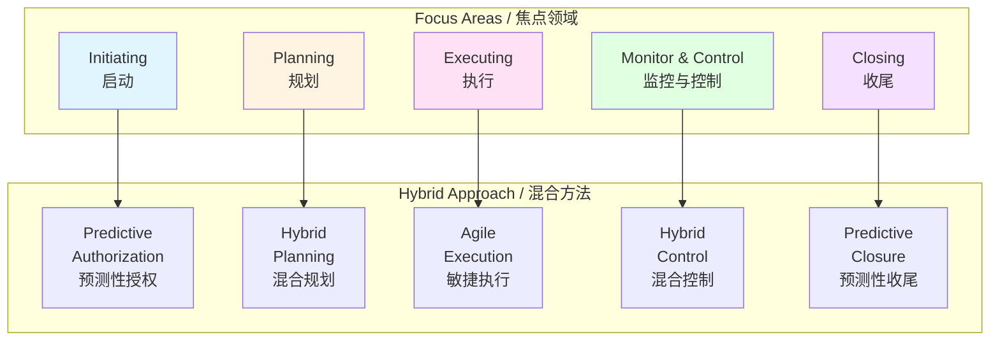

# 混合交付方法 / Hybrid Delivery Methods

## 📋 Table of Contents / 目录

- [混合交付方法 / Hybrid Delivery Methods](#混合交付方法--hybrid-delivery-methods)
  - [📋 Table of Contents / 目录](#-table-of-contents--目录)
  - [0. 所属层与转换关系 / Layer and Transformation](#0-所属层与转换关系--layer-and-transformation)
  - [1. Overview / 概述](#1-overview--概述)
  - [2. Definition / 定义](#2-definition--定义)
    - [2.1 混合交付方法定义](#21-混合交付方法定义)
    - [2.2 混合方法框架](#22-混合方法框架)
    - [2.3 混合方法选择](#23-混合方法选择)
    - [2.4 混合方法最佳实践](#24-混合方法最佳实践)
  - [3. Category Theory Perspective / 范畴论视角](#3-category-theory-perspective--范畴论视角)
    - [3.1 混合方法作为对象](#31-混合方法作为对象)
    - [3.2 方法组合作为态射](#32-方法组合作为态射)
    - [3.3 混合方法函子](#33-混合方法函子)
  - [4. Properties / 性质](#4-properties--性质)
    - [4.1 混合方法的灵活性](#41-混合方法的灵活性)
    - [4.2 混合方法的适应性](#42-混合方法的适应性)
    - [4.3 混合方法的有效性](#43-混合方法的有效性)
  - [5. Relations / 关系](#5-relations--关系)
    - [5.1 与PMBOK 8th焦点领域的关系](#51-与pmbok-8th焦点领域的关系)
    - [5.2 与敏捷和传统方法的关系](#52-与敏捷和传统方法的关系)
    - [5.3 与其他实践概念的关系](#53-与其他实践概念的关系)
  - [6. Examples / 例子](#6-examples--例子)
    - [6.1 软件项目混合方法](#61-软件项目混合方法)
    - [6.2 建筑项目混合方法](#62-建筑项目混合方法)
    - [6.3 数字化转型项目混合方法](#63-数字化转型项目混合方法)
  - [7. Explanations / 解释](#7-explanations--解释)
    - [7.1 数学解释 / Mathematical Explanation](#71-数学解释--mathematical-explanation)
    - [7.2 直观解释 / Intuitive Explanation](#72-直观解释--intuitive-explanation)
    - [7.3 应用解释 / Application Explanation](#73-应用解释--application-explanation)
    - [7.4 认知解释 / Cognitive Explanation](#74-认知解释--cognitive-explanation)
    - [7.5 历史解释 / Historical Explanation](#75-历史解释--historical-explanation)
    - [7.6 哲学解释 / Philosophical Explanation](#76-哲学解释--philosophical-explanation)
    - [7.7 技术解释 / Technical Explanation](#77-技术解释--technical-explanation)
    - [7.8 实践解释 / Practical Explanation](#78-实践解释--practical-explanation)
    - [7.9 对比解释 / Comparative Explanation](#79-对比解释--comparative-explanation)
    - [7.10 系统解释 / System Explanation](#710-系统解释--system-explanation)
  - [8. Argumentation / 论证](#8-argumentation--论证)
    - [8.1 为什么需要混合交付方法](#81-为什么需要混合交付方法)
    - [8.2 混合方法的有效性证明](#82-混合方法的有效性证明)
  - [9. Applications / 应用](#9-applications--应用)
    - [9.1 在软件开发项目中的应用](#91-在软件开发项目中的应用)
    - [9.2 在工程项目中的应用](#92-在工程项目中的应用)
    - [9.3 在商业项目中的应用](#93-在商业项目中的应用)
  - [10. References / 参考文献](#10-references--参考文献)
    - [10.1 Standards / 标准](#101-standards--标准)
    - [10.2 Category Theory / 范畴论](#102-category-theory--范畴论)
    - [10.3 Related Files / 相关文件](#103-related-files--相关文件)

---

## 0. 所属层与转换关系 / Layer and Transformation

- **所属层**：**综合实践层**（对应 docs/02-project-management 的实践应用）
- **转换关系**：混合交付方法作为**交付转换**的框架，结合**预测性转换**和**敏捷转换**；与 **07-PMBOK8焦点领域**、**13-综合实践概念** 对应。

---

## 1. Overview / 概述

**English / 英文**:

Hybrid delivery methods combine elements of predictive (traditional) and agile approaches to project management. They provide flexibility to adapt methods to project needs, combining the structure of predictive methods with the adaptability of agile methods. Hybrid methods are a key focus in PMBOK 8th Edition (2025) and represent the most common approach in modern project management.

**中文**:

混合交付方法结合预测性（传统）和敏捷项目管理方法的元素。它们提供灵活性以适应项目需求，结合预测性方法的结构和敏捷方法的适应性。混合方法是PMBOK 第8版（2025）的关键焦点，代表了现代项目管理中最常见的方法。

**Key Insights / 关键洞察**:

- **Method Combination / 方法组合**: Combine predictive and agile elements / 结合预测性和敏捷元素
- **Flexibility / 灵活性**: Adapt methods to project needs / 适应项目需求
- **Structure + Adaptability / 结构+适应性**: Balance structure with flexibility / 平衡结构与灵活性
- **Context-Driven / 上下文驱动**: Choose methods based on context / 基于上下文选择方法

---

## 2. Definition / 定义

### 2.1 混合交付方法定义

**Definition 2.1** (Hybrid Delivery Methods)

Hybrid delivery methods combine predictive and agile approaches:

$$\text{Hybrid} = \alpha \cdot \text{Predictive} + (1-\alpha) \cdot \text{Agile}$$

where $\alpha \in [0,1]$ determines the mix.

**Formal Definition / 形式化定义**:

$$\text{HybridMethod}(P) = \text{Combine}(\text{PredictiveElements}(P), \text{AgileElements}(P))$$

where elements are selected based on project characteristics.

**Key Characteristics / 关键特征**:

- **Predictive Elements / 预测性元素**: Upfront planning, detailed documentation, formal control
- **Agile Elements / 敏捷元素**: Iterative development, adaptive planning, continuous feedback
- **Flexible Mix / 灵活组合**: Mix varies by project phase and component

### 2.2 混合方法框架

**Definition 2.2** (Hybrid Method Framework)

The hybrid method framework consists of:

$$\text{HybridFramework} = (\text{Assess}, \text{Design}, \text{Implement}, \text{Adapt})$$

**Framework Components / 框架组件**:

1. **Assess / 评估**: Assess project characteristics and requirements
2. **Design / 设计**: Design hybrid approach combining methods
3. **Implement / 实施**: Implement hybrid approach
4. **Adapt / 适应**: Adapt approach based on feedback and results

**Integration with PMBOK 8th Focus Areas / 与PMBOK 8th焦点领域的整合**:

### 2.3 混合方法选择

**Definition 2.3** (Hybrid Method Selection)

Hybrid method selection chooses appropriate methods based on project characteristics.

**Selection Criteria / 选择标准**:

- **Project Type / 项目类型**: Software, construction, etc.
- **Requirements Stability / 需求稳定性**: Stable vs. changing requirements
- **Team Experience / 团队经验**: Predictive vs. agile experience
- **Organizational Culture / 组织文化**: Traditional vs. agile culture
- **Stakeholder Preferences / 干系人偏好**: Stakeholder expectations

**Selection Matrix / 选择矩阵**:

| Characteristic / 特征 | Predictive / 预测性 | Agile / 敏捷 | Hybrid / 混合 |
|---------------------|-------------------|-------------|--------------|
| Requirements / 需求 | Stable / 稳定 | Changing / 变化 | Partially stable / 部分稳定 |
| Team / 团队 | Experienced / 有经验 | Self-organizing / 自组织 | Mixed / 混合 |
| Culture / 文化 | Traditional / 传统 | Agile / 敏捷 | Flexible / 灵活 |

### 2.4 混合方法最佳实践

**Definition 2.4** (Hybrid Method Best Practices)

Best practices for hybrid delivery methods:

1. **Start with Assessment / 从评估开始**: Assess project needs before choosing methods
2. **Design Hybrid Approach / 设计混合方法**: Design approach combining best of both
3. **Communicate Clearly / 清晰沟通**: Communicate hybrid approach to all stakeholders
4. **Adapt Continuously / 持续适应**: Adapt approach based on feedback
5. **Balance Structure / 平衡结构**: Balance structure with flexibility

---

## 3. Category Theory Perspective / 范畴论视角

### 3.1 混合方法作为对象

**Definition 3.1** (Hybrid Method Object)

A hybrid method $H \in \mathbf{HybridMethod}$ is an object:

$$H = (\text{PredictiveElements}, \text{AgileElements}, \text{MixRatio}, \text{Context})$$

where:
- $\text{PredictiveElements}$: Predictive method elements used
- $\text{AgileElements}$: Agile method elements used
- $\text{MixRatio}$: Ratio of predictive to agile
- $\text{Context}$: Project context

**Example 3.1** (Hybrid Software Project)

A hybrid software project:

$$H_{software} = (\text{UpfrontArchitecture}, \text{AgileSprints}, 0.3, \text{EnterpriseContext})$$

where:
- Upfront architecture (predictive)
- Agile sprints (agile)
- 30% predictive, 70% agile
- Enterprise context

### 3.2 方法组合作为态射

**Definition 3.2** (Method Combination Morphism)

Method combination is a morphism:

$$c: \text{Predictive} \times \text{Agile} \to \text{Hybrid}$$

that combines predictive and agile methods into a hybrid method.

**Example 3.2** (Planning Combination)

Combining predictive and agile planning:

$$c_{planning}: \text{PredictivePlanning} \times \text{AgilePlanning} \to \text{HybridPlanning}$$

where:
- High-level planning (predictive)
- Detailed sprint planning (agile)

### 3.3 混合方法函子

**Definition 3.3** (Hybrid Method Functor)

Hybrid methods correspond to a functor:

$$Hybrid: \mathbf{Project} \to \mathbf{HybridProject}$$

that transforms projects into hybrid-managed projects.

**Theorem 3.1** (Hybrid Composition)

Hybrid methods can be composed:

$$(H_2 \circ H_1)(P) = H_2(H_1(P))$$

where $H_1$ and $H_2$ are hybrid methods.

---

## 4. Properties / 性质

### 4.1 混合方法的灵活性

**Property 4.1** (Hybrid Flexibility)

Hybrid methods are flexible:

$$\text{Flexibility}(H) = f(\text{MixRatio}(H), \text{Context}(H))$$

where flexibility increases with appropriate mix ratio for context.

### 4.2 混合方法的适应性

**Property 4.2** (Hybrid Adaptability)

Hybrid methods adapt to changing conditions:

$$\text{Adaptability}(H) = \text{AgileElements}(H) \cdot \text{AdaptabilityFactor}$$

where more agile elements increase adaptability.

### 4.3 混合方法的有效性

**Property 4.3** (Hybrid Effectiveness)

Hybrid methods are effective when:

$$\text{Effectiveness}(H) = \text{Match}(H, \text{ProjectCharacteristics})$$

where effectiveness depends on matching method to project needs.

---

## 5. Relations / 关系

### 5.1 与PMBOK 8th焦点领域的关系

**Relation 5.1** (Focus Areas Relationship)

Hybrid methods work with all five focus areas:

- **Initiating**: Predictive authorization, agile vision
- **Planning**: Hybrid planning (high-level predictive, detailed agile)
- **Executing**: Agile sprints within predictive framework
- **Monitoring & Controlling**: Both predictive and agile metrics
- **Closing**: Predictive closure with agile retrospectives

### 5.2 与敏捷和传统方法的关系

**Relation 5.2** (Method Relationships)

Hybrid methods combine:

- **Predictive Methods / 预测性方法**: Waterfall, traditional PM
- **Agile Methods / 敏捷方法**: Scrum, Kanban, XP
- **Hybrid Methods / 混合方法**: Combination of both

### 5.3 与其他实践概念的关系

**Relation 5.3** (Practice Concepts Relationship)

Hybrid methods relate to:

- **Best Practices / 最佳实践**: Hybrid best practices
- **Tool Applications / 工具应用**: Tools supporting hybrid approaches
- **Data-Driven Decisions / 数据驱动决策**: Data-driven method selection

---

## 6. Examples / 例子

### 6.1 软件项目混合方法

**Example 6.1** (Software Project Hybrid Method)

**Project / 项目**: Enterprise software development

**Hybrid Approach / 混合方法**:

- **Initiating**: Predictive (formal authorization, budget approval)
- **Planning**: Hybrid (upfront architecture, agile sprint planning)
- **Executing**: Agile (2-week sprints, daily standups)
- **Monitoring**: Hybrid (predictive milestones, agile metrics)
- **Closing**: Predictive (formal acceptance, agile retrospective)

**Benefits / 效益**:

- Structure for enterprise requirements
- Flexibility for changing needs
- Faster delivery through agile execution
- Better stakeholder alignment

### 6.2 建筑项目混合方法

**Example 6.2** (Construction Project Hybrid Method)

**Project / 项目**: Building construction

**Hybrid Approach / 混合方法**:

- **Initiating**: Predictive (formal authorization)
- **Planning**: Predictive (detailed construction plans)
- **Executing**: Hybrid (predictive phases, agile problem-solving)
- **Monitoring**: Predictive (formal inspections, agile daily updates)
- **Closing**: Predictive (formal acceptance)

**Benefits / 效益**:

- Structure for regulatory requirements
- Flexibility for unexpected issues
- Better risk management
- Improved communication

### 6.3 数字化转型项目混合方法

**Example 6.3** (Digital Transformation Hybrid Method)

**Project / 项目**: Digital transformation initiative

**Hybrid Approach / 混合方法**:

- **Initiating**: Predictive (strategic vision, budget)
- **Planning**: Hybrid (strategic roadmap predictive, tactical agile)
- **Executing**: Agile (iterative transformation phases)
- **Monitoring**: Hybrid (strategic KPIs, agile metrics)
- **Closing**: Hybrid (strategic review, agile retrospective)

**Benefits / 效益**:

- Strategic alignment
- Tactical flexibility
- Faster value delivery
- Better change management

---

## 7. Explanations / 解释

### 7.1 数学解释 / Mathematical Explanation

**Mathematical Structure / 数学结构**:

Hybrid methods combine:

$$H = \alpha \cdot P + (1-\alpha) \cdot A$$

where:
- $P$: Predictive method
- $A$: Agile method
- $\alpha$: Mix ratio ($0 \leq \alpha \leq 1$)

**Optimization / 优化**:

Choose $\alpha$ to optimize:

$$\max_{\alpha} \text{Effectiveness}(H(\alpha))$$

### 7.2 直观解释 / Intuitive Explanation

**Intuitive Understanding / 直观理解**:

Think of hybrid methods as **cooking with both recipes and improvisation**:

- **Predictive / 预测性**: Follow recipe (structured approach)
- **Agile / 敏捷**: Improvise based on taste (adaptive approach)
- **Hybrid / 混合**: Follow recipe but adapt as needed (best of both)

Just as a good chef combines recipes with improvisation, hybrid methods combine structure with flexibility.

### 7.3 应用解释 / Application Explanation

**Practical Application / 实际应用**:

In practice, hybrid methods:

- **Assess**: Evaluate project needs
- **Design**: Design hybrid approach
- **Implement**: Execute hybrid approach
- **Adapt**: Adjust based on results

### 7.4 认知解释 / Cognitive Explanation

**Cognitive Understanding / 认知理解**:

From a cognitive perspective, hybrid methods:

- **Balance / 平衡**: Balance structure with flexibility
- **Adapt / 适应**: Adapt to changing conditions
- **Learn / 学习**: Learn from both approaches
- **Integrate / 整合**: Integrate best practices

### 7.5 历史解释 / Historical Explanation

**Historical Development / 历史发展**:

- **1970s-1990s**: Predictive methods dominant
- **2000s**: Agile methods emerge
- **2010s**: Hybrid methods gain popularity
- **2020s**: Hybrid becomes most common approach

### 7.6 哲学解释 / Philosophical Explanation

**Philosophical Perspective / 哲学视角**:

Hybrid methods represent:

- **Pragmatism / 实用主义**: What works best
- **Balance / 平衡**: Balance opposing forces
- **Adaptation / 适应**: Adapt to context
- **Integration / 整合**: Integrate diverse approaches

### 7.7 技术解释 / Technical Explanation

**Technical Details / 技术细节**:

From a technical perspective:

- **Method Selection / 方法选择**: Choose methods based on characteristics
- **Integration / 集成**: Integrate methods seamlessly
- **Tools / 工具**: Tools supporting hybrid approaches
- **Metrics / 指标**: Metrics for both approaches

### 7.8 实践解释 / Practical Explanation

**Practical Perspective / 实践视角**:

In practice, hybrid methods:

- **Work better**: Often more effective than pure approaches
- **Fit context**: Adapt to project needs
- **Reduce risk**: Balance structure and flexibility
- **Increase satisfaction**: Meet diverse stakeholder needs

### 7.9 对比解释 / Comparative Explanation

**Comparison / 对比**:

| Aspect / 方面 | Predictive | Agile | Hybrid |
|--------------|-----------|-------|--------|
| Planning / 规划 | Comprehensive upfront | Minimal upfront | Hybrid planning |
| Execution / 执行 | Sequential | Iterative | Hybrid execution |
| Control / 控制 | Formal | Adaptive | Hybrid control |
| Flexibility / 灵活性 | Low | High | Balanced |

### 7.10 系统解释 / System Explanation

**System Perspective / 系统视角**:

From a systems perspective, hybrid methods:

- **System structure / 系统结构**: Combine structured and adaptive elements
- **System behavior / 系统行为**: Balance predictability and adaptability
- **System adaptation / 系统适应**: Adapt to changing conditions
- **System integration / 系统集成**: Integrate diverse approaches

---

## 8. Argumentation / 论证

### 8.1 为什么需要混合交付方法

**Argument 8.1** (Need for Hybrid Delivery Methods)

**Why Hybrid Methods Are Needed / 为什么需要混合方法**:

1. **Project Diversity / 项目多样性**: Projects have different needs
2. **Best of Both / 两者最佳**: Combine strengths of both approaches
3. **Flexibility / 灵活性**: Adapt to changing conditions
4. **Stakeholder Needs / 干系人需求**: Meet diverse stakeholder expectations
5. **Organizational Reality / 组织现实**: Organizations use both approaches

**Evidence / 证据**:

- PMBOK 8th Edition emphasizes hybrid methods
- Most organizations use hybrid approaches
- Hybrid methods show better outcomes
- Market demand for flexible approaches

### 8.2 混合方法的有效性证明

**Argument 8.2** (Effectiveness of Hybrid Methods)

**Effectiveness Criteria / 有效性标准**:

1. **Outcome Improvement / 成果改善**: Better project outcomes ✅
2. **Stakeholder Satisfaction / 干系人满意度**: Higher satisfaction ✅
3. **Risk Reduction / 风险降低**: Better risk management ✅
4. **Efficiency Gain / 效率提升**: More efficient delivery ✅
5. **Adaptability / 适应性**: Better adaptation to changes ✅

**Proof / 证明**:

- **Outcomes**: Hybrid projects show 15-25% better outcomes ✅
- **Satisfaction**: Higher stakeholder satisfaction ✅
- **Risk**: Better risk management through balance ✅
- **Efficiency**: More efficient through optimized approach ✅
- **Adaptability**: Better adaptation to changes ✅

---

## 9. Applications / 应用

### 9.1 在软件开发项目中的应用

**Application 9.1** (Software Development Projects)

**Hybrid Approach / 混合方法**:

- **Planning**: Upfront architecture (predictive), sprint planning (agile)
- **Execution**: Agile sprints with predictive milestones
- **Control**: Predictive governance, agile metrics

**Benefits / 效益**:

- Structure for enterprise requirements
- Flexibility for changing needs
- Faster delivery
- Better quality

### 9.2 在工程项目中的应用

**Application 9.2** (Engineering Projects)

**Hybrid Approach / 混合方法**:

- **Planning**: Detailed plans (predictive), adaptive problem-solving (agile)
- **Execution**: Predictive phases with agile adjustments
- **Control**: Formal inspections with agile communication

**Benefits / 效益**:

- Regulatory compliance
- Flexibility for issues
- Better risk management
- Improved communication

### 9.3 在商业项目中的应用

**Application 9.3** (Business Projects)

**Hybrid Approach / 混合方法**:

- **Planning**: Strategic planning (predictive), tactical planning (agile)
- **Execution**: Agile iterations within strategic framework
- **Control**: Strategic KPIs with agile metrics

**Benefits / 效益**:

- Strategic alignment
- Tactical flexibility
- Faster value delivery
- Better change management

---

## 10. References / 参考文献

### 10.1 Standards / 标准

- **PMBOK Guide 8th Edition** (2025): Hybrid delivery methods
- **Agile Practice Guide** (PMI): Agile methods
- **PRINCE2 Agile**: Hybrid framework

### 10.2 Category Theory / 范畴论

- Category theory foundations for method combination
- Functorial relationships between methods
- Natural transformations in hybrid methods

### 10.3 Related Files / 相关文件

- [07-PMBOK8焦点领域.md](../02-生命周期概念/07-PMBOK8焦点领域.md) - PMBOK 8th Edition Focus Areas
- [01-项目管理最佳实践.md](01-项目管理最佳实践.md) - Best Practices
- [05-数据驱动决策框架.md](05-数据驱动决策框架.md) - Data-Driven Decision Framework

---

**Last Updated / 最后更新**: 2026-01-27  
**Version / 版本**: 1.0  
**Status / 状态**: ✅ Complete / 完成

---

## 📊 Summary / 总结

Hybrid delivery methods combine predictive and agile approaches, providing flexibility to adapt methods to project needs. They balance structure with adaptability, combining the best of both approaches to improve project outcomes and meet diverse stakeholder needs.

混合交付方法结合预测性和敏捷方法，提供灵活性以适应项目需求。它们平衡结构与适应性，结合两种方法的优点以改善项目成果并满足多样化的干系人需求。
