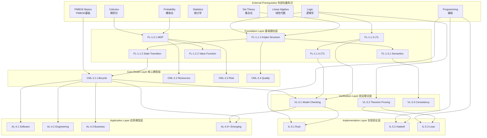
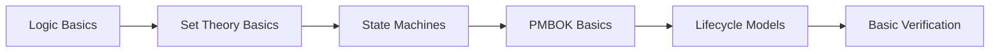
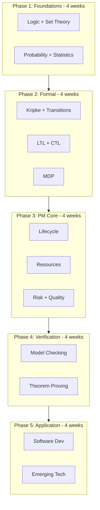

# Prerequisite Dependency Graph / 先备知识依赖图

## 1. Overview / 概述

This document provides a visual and structured representation of prerequisite dependencies between all concepts in the Formal-ProgramManage knowledge system.

本文档提供Formal-ProgramManage知识体系中所有概念之间先备知识依赖关系的可视化和结构化表示。

---

## 2. Complete Dependency Graph / 完整依赖图



---

## 3. Layer-by-Layer Dependencies / 逐层依赖关系

### 3.1 Foundation Layer Prerequisites / 基础理论层先备知识

| Concept | Required Prerequisites | Optional Prerequisites |
|---------|----------------------|----------------------|
| FL-1.1.1 Kripke Structure | Set theory, Logic | Automata theory |
| FL-1.1.2 State Transition | FL-1.1.1, Set theory | Graph theory |
| FL-1.1.3 LTL | Propositional logic, Path semantics | Modal logic |
| FL-1.1.4 CTL | FL-1.1.3, Tree semantics | Fixed-point theory |
| FL-1.2.1 MDP | Probability, State machines, Optimization | Calculus |
| FL-1.2.2 Value Function | FL-1.2.1, Bellman equation | Dynamic programming |
| FL-1.3.1 Semantics | Logic, Set theory | Programming languages |

### 3.2 Core Model Layer Prerequisites / 核心模型层先备知识

| Concept | Required Prerequisites | Optional Prerequisites |
|---------|----------------------|----------------------|
| CML-2.1 Lifecycle | FL-1.1.2, PMBOK basics | Process modeling |
| CML-2.2 Resources | FL-1.2.1, Optimization | Operations research |
| CML-2.3 Risk | FL-1.2.1, Probability, Statistics | Decision theory |
| CML-2.4 Quality | FL-1.1.x, Statistics | Six Sigma |

### 3.3 Verification Layer Prerequisites / 验证理论层先备知识

| Concept | Required Prerequisites | Optional Prerequisites |
|---------|----------------------|----------------------|
| VL-3.1 Model Checking | FL-1.1.1, FL-1.1.3, FL-1.1.4 | Automata theory |
| VL-3.2 Theorem Proving | Logic, Proof theory | Type theory |
| VL-3.3 Consistency | FL-1.3.1, Model theory | Category theory |

### 3.4 Application Layer Prerequisites / 应用模型层先备知识

| Concept | Required Prerequisites | Optional Prerequisites |
|---------|----------------------|----------------------|
| AL-4.1 Software | CML-2.x, Software development | Agile certification |
| AL-4.2 Engineering | CML-2.x, Systems engineering | Domain expertise |
| AL-4.3 Business | CML-2.x, Business fundamentals | MBA knowledge |
| AL-4.4+ Emerging | CML-2.x, VL-3.x, Domain tech | Research papers |

---

## 4. Prerequisite Chains / 先备知识链

### 4.1 Chain to Model Checking / 模型检验先备知识链

```
Set Theory → Kripke Structure → State Transition → Project State
    ↓
Logic → LTL → CTL → Model Checking → Workflow Verification
```

### 4.2 Chain to Theorem Proving / 定理证明先备知识链

```
Logic → Propositional Logic → Predicate Logic → Proof Theory → Theorem Proving
                                                      ↓
                                            Type Theory → Coq/Lean
```

### 4.3 Chain to Risk Management / 风险管理先备知识链

```
Probability → Statistics → Quantitative Analysis → Risk Modeling
      ↓
   MDP → Value Function → Decision Analysis → Risk Response
```

### 4.4 Chain to Industry Applications / 行业应用先备知识链

```
PMBOK → Lifecycle Models → Resource/Risk/Quality → Industry Application
           ↓
     State Models → Verification → Certified Processes
```

---

## 5. Learning Path Recommendations / 学习路径推荐

### 5.1 Minimum Viable Path / 最小可行路径

For quick understanding of core concepts:



**Duration**: 4-6 weeks

### 5.2 Comprehensive Path / 综合路径

For deep understanding:



**Duration**: 16-20 weeks

---

## 6. Dependency Validation Checklist / 依赖验证清单

Before studying a concept, verify prerequisites:

### 6.1 For Foundation Layer / 基础理论层

- [ ] Can define and manipulate sets
- [ ] Understand propositional logic operators
- [ ] Can compute basic probabilities
- [ ] Understand functions and relations

### 6.2 For Core Model Layer / 核心模型层

- [ ] Completed FL-1.1 or equivalent
- [ ] Familiar with project lifecycle phases
- [ ] Understand optimization basics
- [ ] Know probability and statistics fundamentals

### 6.3 For Verification Layer / 验证理论层

- [ ] Can construct Kripke structures
- [ ] Can write LTL/CTL formulas
- [ ] Understand proof techniques
- [ ] Have programming experience

### 6.4 For Application Layer / 应用模型层

- [ ] Completed CML modules
- [ ] Have domain knowledge (software/engineering/business)
- [ ] Understand verification basics
- [ ] Familiar with industry practices

---

## 7. Status / 状态

**Document Version / 文档版本**: 1.0
**Last Updated / 最后更新**: 2026-02-02
**Status / 状态**: ✅ Complete
**Next Review / 下次审查**: 2026-05-02

**Related Documents / 相关文档**:

- [Concept Linking Index](./CONCEPT_LINKING_INDEX.md)
- [Learning Prerequisites](../docs/12-learning-support/01-learning-prerequisites.md)
- [Theme Hierarchy Master](../templates_and_standards/THEME_HIERARCHY_MASTER.md)
