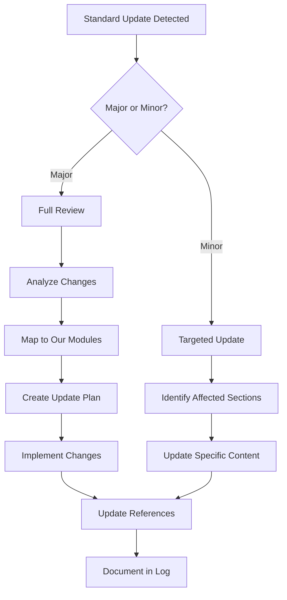

# International Standards Tracking Mechanism / 国际标准跟踪机制

## 1. Overview / 概述

This document establishes a systematic mechanism for tracking updates to international project management and formal methods standards, ensuring the Formal-ProgramManage knowledge system remains current and authoritative.

本文档建立了一个系统性机制，用于跟踪国际项目管理和形式化方法标准的更新，确保Formal-ProgramManage知识体系保持最新和权威。

---

## 2. Standards Tracked / 跟踪的标准

### 2.1 Project Management Standards / 项目管理标准

| Standard | Organization | Current Version | Next Review | Our Reference |
|----------|--------------|-----------------|-------------|---------------|
| **PMBOK Guide** | PMI | 7th Edition (2021) | 2025+ | CML-2.x |
| **ISO 21500** | ISO | 2021 | 2026 | CML-2.x |
| **ISO 21502** | ISO | 2020 | 2025 | CML-2.x |
| **ISO 31000** | ISO | 2018 | 2025 (Ed.3 in dev) | CML-2.3 |
| **PRINCE2** | Axelos | 2017 | Ongoing | CML-2.x |
| **CMMI** | CMMI Institute | V3.0 (2023) | Ongoing | CML-2.4 |
| **ICB4** | IPMA | 4.0 (2015) | Ongoing | CML-2.x |

### 2.2 Formal Methods Standards / 形式化方法标准

| Standard | Organization | Current Version | Our Reference |
|----------|--------------|-----------------|---------------|
| **ISO/IEC 15909** (Petri Nets) | ISO | 2019 | FL-1.2 |
| **ISO/IEC 26702** (Systems Engineering) | ISO | 2007 | VL-3.x |
| **DO-178C** (Airborne Systems) | RTCA | 2012 | VL-3.x |
| **IEC 61508** (Functional Safety) | IEC | 2010 | VL-3.x |

### 2.3 Quality Standards / 质量标准

| Standard | Organization | Current Version | Our Reference |
|----------|--------------|-----------------|---------------|
| **ISO 9001** | ISO | 2015 | CML-2.4 |
| **ISO/IEC 25010** | ISO | 2011 | CML-2.4 |
| **ISO/IEC 33000** | ISO | 2015 | CML-2.4 |

---

## 3. Tracking Schedule / 跟踪计划

### 3.1 Quarterly Review Schedule / 季度审查计划

| Quarter | Focus Areas | Actions |
|---------|-------------|---------|
| Q1 (Jan-Mar) | PMI, ISO updates | Check PMI announcements, ISO catalog |
| Q2 (Apr-Jun) | CMMI, PRINCE2 | Check institute websites |
| Q3 (Jul-Sep) | Formal methods | Check academic publications |
| Q4 (Oct-Dec) | Annual summary | Compile changes, plan updates |

### 3.2 Review Checklist / 审查清单

**Quarterly Checklist**:

- [ ] Check PMI website for PMBOK updates
- [ ] Check ISO catalog for standard revisions
- [ ] Check Axelos for PRINCE2 updates
- [ ] Check CMMI Institute for model updates
- [ ] Review major conferences (ICSE, FSE, CAV) for formal methods
- [ ] Search academic databases for new research
- [ ] Update tracking log

---

## 4. Update Procedures / 更新程序

### 4.1 When Standard Updates / 标准更新时



### 4.2 Update Priority Matrix / 更新优先级矩阵

| Impact | Urgency | Priority | Action |
|--------|---------|----------|--------|
| High | High | Critical | Immediate update (< 1 week) |
| High | Low | High | Plan update (< 1 month) |
| Low | High | Medium | Schedule update (< 3 months) |
| Low | Low | Low | Next quarterly review |

---

## 5. Tracking Log / 跟踪日志

### 5.1 Log Template / 日志模板

```markdown
## Standards Tracking Log

### Entry [Date]

**Standard**: [Name and Organization]
**Change Type**: [New Edition / Amendment / Errata / Withdrawal]
**Summary**: [Brief description of changes]
**Impact on Our Content**: [High/Medium/Low]
**Affected Modules**: [List of modules]
**Action Taken**: [Description of updates made]
**Completed Date**: [Date completed]
**Verified By**: [Name/Role]
```

### 5.2 Current Log Entries / 当前日志条目

#### Entry 2026-02-02

**Standard**: ISO 21500:2021
**Change Type**: Confirmed current version
**Summary**: ISO 21500:2021 "Project, programme and portfolio management — Context and concepts" is the latest version
**Impact on Our Content**: Low (already aligned)
**Affected Modules**: CML-2.x
**Action Taken**: Verified alignment, no changes needed
**Completed Date**: 2026-02-02
**Verified By**: System review

#### Entry 2026-02-02

**Standard**: ISO 31000
**Change Type**: Edition 3 in development
**Summary**: ISO/CD 31000 (Edition 3) is under development
**Impact on Our Content**: Medium (when released)
**Affected Modules**: CML-2.3
**Action Taken**: Added to watch list for Q3-Q4 2026
**Completed Date**: 2026-02-02
**Verified By**: System review

#### Entry 2026-02-02

**Standard**: CMMI V3.0
**Change Type**: Current version confirmed
**Summary**: CMMI V3.0 released April 2023
**Impact on Our Content**: Low (already aligned)
**Affected Modules**: CML-2.4
**Action Taken**: Verified alignment
**Completed Date**: 2026-02-02
**Verified By**: System review

---

## 6. Watch List / 关注列表

### 6.1 Upcoming Changes / 即将到来的变化

| Standard | Expected Change | Expected Date | Priority |
|----------|-----------------|---------------|----------|
| ISO 31000 Ed.3 | Major revision | 2026-2027 | High |
| PMBOK 8th | Potential new edition | 2027+ | High |
| ISO 21502 revision | Minor updates | 2025-2026 | Medium |

### 6.2 Emerging Standards / 新兴标准

| Standard | Area | Relevance |
|----------|------|-----------|
| ISO/AWI 81001 | AI in Healthcare | AL-4.4 (AI Management) |
| ISO/AWI 24029 | AI Systems | AL-4.4 (AI Management) |
| IEEE P3123 | AI Risk | AL-4.4, CML-2.3 |

---

## 7. Source Monitoring / 来源监控

### 7.1 Official Sources / 官方来源

| Source | URL | Check Frequency |
|--------|-----|-----------------|
| PMI | <https://www.pmi.org/pmbok-guide-standards> | Quarterly |
| ISO | <https://www.iso.org/> | Quarterly |
| Axelos | <https://www.axelos.com/> | Quarterly |
| CMMI Institute | <https://cmmiinstitute.com/> | Quarterly |
| IPMA | <https://www.ipma.world/> | Annually |

### 7.2 Secondary Sources / 次要来源

| Source | URL | Purpose |
|--------|-----|---------|
| Project Management Journal | PMI | Research trends |
| IEEE Software | IEEE | Formal methods |
| ACM SIGSOFT | ACM | Software engineering |
| arXiv cs.SE | arXiv | Preprints |

---

## 8. Automation Opportunities / 自动化机会

### 8.1 Current Manual Processes / 当前手动流程

- Quarterly website checks
- Manual log updates
- Email notifications setup

### 8.2 Future Automation / 未来自动化

| Process | Automation Method | Priority |
|---------|-------------------|----------|
| RSS feed monitoring | Script-based alerts | Medium |
| ISO catalog API | Automated queries | Medium |
| Reference link checking | CI/CD integration | High |
| Version comparison | Diff tools | Medium |

### 8.3 Sample Monitoring Script / 监控脚本示例

```python
"""
Standards Monitoring Script
Run quarterly to check for updates
"""

import requests
from datetime import datetime

STANDARDS_URLS = {
    'PMI': 'https://www.pmi.org/pmbok-guide-standards',
    'ISO_21500': 'https://www.iso.org/standard/75704.html',
    'ISO_31000': 'https://www.iso.org/standard/65694.html',
}

def check_standards():
    """Check standard sources for updates"""
    results = []

    for name, url in STANDARDS_URLS.items():
        try:
            response = requests.head(url, timeout=10)
            last_modified = response.headers.get('Last-Modified', 'Unknown')
            results.append({
                'standard': name,
                'url': url,
                'status': response.status_code,
                'last_modified': last_modified,
                'check_date': datetime.now().isoformat()
            })
        except Exception as e:
            results.append({
                'standard': name,
                'error': str(e),
                'check_date': datetime.now().isoformat()
            })

    return results

def generate_report(results):
    """Generate quarterly report"""
    report = f"# Standards Check Report - {datetime.now().strftime('%Y-%m-%d')}\n\n"

    for r in results:
        report += f"## {r['standard']}\n"
        if 'error' in r:
            report += f"- Error: {r['error']}\n"
        else:
            report += f"- Status: {r['status']}\n"
            report += f"- Last Modified: {r['last_modified']}\n"
        report += "\n"

    return report

if __name__ == "__main__":
    results = check_standards()
    report = generate_report(results)
    print(report)
```

---

## 9. Responsibility Matrix / 责任矩阵

| Task | Frequency | Responsibility |
|------|-----------|----------------|
| Quarterly checks | Quarterly | Knowledge maintainer |
| Update implementation | As needed | Content authors |
| Log maintenance | Ongoing | Knowledge maintainer |
| Annual summary | Annually | Project lead |

---

## 10. Status / 状态

**Document Version / 文档版本**: 1.0
**Last Updated / 最后更新**: 2026-02-02
**Status / 状态**: ✅ Active
**Next Quarterly Review / 下次季度审查**: 2026-04-01

**Related Documents / 相关文档**:

- [Theme Hierarchy Master](../templates_and_standards/THEME_HIERARCHY_MASTER.md)
- [2025-2026 Ultimate Standard](../templates_and_standards/2025_2026_ULTIMATE_STANDARD.md)
- [University Course Alignment](./UNIVERSITY_COURSE_ALIGNMENT.md)
