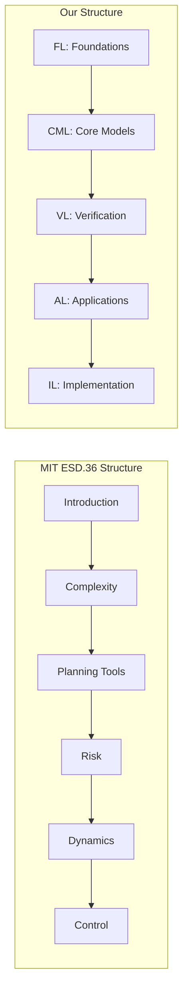

# University Course Alignment / 大学课程对齐

## 1. Overview / 概述

This document aligns the Formal-ProgramManage knowledge system with curricula from leading international universities in project management and related fields.

本文档将Formal-ProgramManage知识体系与国际顶尖大学的项目管理及相关领域课程对齐。

---

## 2. MIT Course Alignment / MIT课程对齐

### 2.1 MIT ESD.36 System Project Management

**Course URL**: <https://ocw.mit.edu/courses/esd-36-system-project-management-fall-2012/>

**Course Topics and Alignment**:

| MIT ESD.36 Topic | Our Module | Coverage |
|------------------|------------|----------|
| Project dynamics and complexity | CML-2.1, 13-complexity-systems | ✅ Full |
| Critical Path Method (CPM) | CML-2.1, CML-2.2 | ✅ Full |
| Design Structure Matrices (DSM) | FL-1.2, CML-2.2 | 🟡 Partial |
| Risk and uncertainty | CML-2.3, FL-1.2 (MDP) | ✅ Full |
| System dynamics modeling | 13-02-systems-dynamics | ✅ Full |
| Real options in projects | CML-2.3, FL-1.2 | 🟡 Partial |
| Project monitoring | CML-2.1.4 | ✅ Full |

**Recommended Additions**:

- Design Structure Matrix (DSM) detailed content
- Real options analysis expansion

### 2.2 MIT 1.040 Project Management

**Course URL**: <https://ocw.mit.edu/courses/1-040-project-management-spring-2004/>

**Course Topics and Alignment**:

| MIT 1.040 Topic | Our Module | Coverage |
|-----------------|------------|----------|
| Project organization | CML-2.2 | ✅ Full |
| Planning and scheduling | CML-2.1, CML-2.2 | ✅ Full |
| Resource management | CML-2.2 | ✅ Full |
| Cost estimation | CML-2.2.4 | ✅ Full |
| Risk management | CML-2.3 | ✅ Full |
| Project control | CML-2.1.4 | ✅ Full |
| Construction focus | AL-4.2.2 | ✅ Full |

### 2.3 MIT 18.404J Theory of Computation

**Relevance**: Formal methods foundations

| Topic | Our Module | Coverage |
|-------|------------|----------|
| Finite automata | FL-1.1 | ✅ Full |
| Regular languages | FL-1.3 | ✅ Full |
| Computability | VL-3.2 | 🟡 Partial |
| Complexity theory | VL-3.1 | 🟡 Partial |

---

## 3. Stanford Course Alignment / Stanford课程对齐

### 3.1 Stanford MS&E 252 Decision Analysis

**Course Topics and Alignment**:

| Stanford Topic | Our Module | Coverage |
|----------------|------------|----------|
| Decision trees | CML-2.3, FL-1.2 | ✅ Full |
| Probability assessment | FL-1.2 | ✅ Full |
| Value of information | CML-2.3 | 🟡 Partial |
| Risk preferences | CML-2.3 | ✅ Full |
| Multi-attribute decisions | CML-2.3, CML-2.4 | ✅ Full |

### 3.2 Stanford CS221 Artificial Intelligence

**Relevance**: AI for project management

| Topic | Our Module | Coverage |
|-------|------------|----------|
| Search algorithms | VL-3.1 | ✅ Full |
| MDPs and reinfortic learning | FL-1.2.1 | ✅ Full |
| Constraint satisfaction | VL-3.3, 11-04-tools (Z3) | ✅ Full |
| Logic and reasoning | FL-1.1, VL-3.2 | ✅ Full |

### 3.3 Stanford EE103 Introduction to Matrix Methods

**Relevance**: Mathematical foundations

| Topic | Our Module | Coverage |
|-------|------------|----------|
| Linear algebra | FL-1.2 | ✅ Full |
| Optimization | FL-1.2, CML-2.2 | ✅ Full |
| Least squares | FL-1.2 | 🟡 Partial |

---

## 4. CMU Course Alignment / CMU课程对齐

### 4.1 CMU 17-654 Analysis of Software Artifacts

**Course Topics and Alignment**:

| CMU Topic | Our Module | Coverage |
|-----------|------------|----------|
| Formal methods | FL-1.1, VL-3.x | ✅ Full |
| Model checking | VL-3.1, 11-02 | ✅ Full |
| Static analysis | VL-3.1 | ✅ Full |
| Theorem proving | VL-3.2, 11-03 | ✅ Full |
| Software verification | VL-3.x, IL-5.x | ✅ Full |

### 4.2 CMU 17-803 Empirical Methods

**Relevance**: Research methods for PM

| Topic | Our Module | Coverage |
|-------|------------|----------|
| Experimental design | CML-2.4 | 🟡 Partial |
| Statistical analysis | FL-1.2, CML-2.3 | ✅ Full |
| Case studies | AL-4.x examples | ✅ Full |

---

## 5. Comparison Matrix / 对比矩阵

### 5.1 Coverage by University / 大学覆盖度

| Topic Area | MIT | Stanford | CMU | Our Coverage |
|------------|-----|----------|-----|--------------|
| PM Fundamentals | ✅ | ✅ | 🟡 | ✅ |
| Formal Methods | 🟡 | 🟡 | ✅ | ✅ |
| Risk Management | ✅ | ✅ | 🟡 | ✅ |
| Systems Thinking | ✅ | 🟡 | 🟡 | ✅ |
| Decision Analysis | 🟡 | ✅ | 🟡 | ✅ |
| Software Engineering | 🟡 | 🟡 | ✅ | ✅ |
| AI/ML | 🟡 | ✅ | ✅ | ✅ |
| Verification | 🟡 | 🟡 | ✅ | ✅ |

### 5.2 Unique Contributions / 独特贡献

Our knowledge system provides unique integration of:

| Our Unique Aspect | University Coverage |
|-------------------|---------------------|
| Category theory for PM | Not typically covered |
| Formal verification of PM processes | Rarely integrated |
| Multi-layer knowledge architecture | Novel structure |
| Bilingual content | Not standard |
| Cognitive learning support | Rarely integrated |

---

## 6. Course Structure Comparison / 课程结构对比

### 6.1 MIT ESD.36 vs Our Structure

### 6.2 Learning Sequence Alignment / 学习顺序对齐

| Week | MIT ESD.36 | Our Equivalent |
|------|------------|----------------|
| 1 | Introduction | FL-1.1, CML-2.1 overview |
| 2 | Project dynamics | 13-complexity-systems |
| 3-4 | CPM, PERT | CML-2.1, CML-2.2 |
| 5 | DSM | FL-1.2 (graph models) |
| 6-7 | Risk analysis | CML-2.3, FL-1.2.1 (MDP) |
| 8-9 | System dynamics | 13-02-systems-dynamics |
| 10 | Real options | CML-2.3 advanced |
| 11-12 | Control | CML-2.1.4, VL-3.x |

---

## 7. Recommended Reading List / 推荐阅读清单

### 7.1 Textbooks Aligned with Universities / 大学教材对齐

| Textbook | University | Our Modules |
|----------|------------|-------------|
| Sterman, "Business Dynamics" | MIT | 13-02-systems-dynamics |
| Shtub et al., "Project Management" | MIT | CML-2.x |
| Kerzner, "Project Management" | General | CML-2.x, AL-4.x |
| Clarke et al., "Model Checking" | CMU | VL-3.1, 11-02 |
| Holzmann, "SPIN Model Checker" | CMU | 11-02, 11-04 |

### 7.2 Research Papers / 研究论文

| Paper | Topic | Our Module |
|-------|-------|------------|
| Brooks, "Mythical Man-Month" | Software PM | AL-4.1 |
| Snowden, "Cynefin" | Complexity | 13-01 |
| Lamport, TLA+ papers | Formal methods | 11-01 |

---

## 8. Gap Analysis / 差距分析

### 8.1 Topics to Add / 需增加主题

| Topic | Source | Priority |
|-------|--------|----------|
| Design Structure Matrix (DSM) | MIT ESD.36 | Medium |
| Real Options Analysis | MIT ESD.36 | Medium |
| Earned Value Management (detailed) | PMI, MIT | Low |
| Simulation methods | Stanford | Medium |

### 8.2 Topics Well Covered / 已充分覆盖

- Formal methods (exceeds typical coverage)
- Risk management (comprehensive)
- Systems thinking (comprehensive)
- Verification methods (exceeds typical coverage)
- Industry applications (comprehensive)

---

## 9. Implementation Recommendations / 实施建议

### 9.1 For Learners / 对学习者

1. Follow MIT ESD.36 sequence for practical PM focus
2. Add our FL/VL content for formal foundations
3. Use our AL content for industry specialization
4. Supplement with our cognitive learning tools

### 9.2 For Instructors / 对教师

1. Our content can supplement university courses
2. Use our formal methods for advanced topics
3. Our bilingual content serves international students
4. Our visual guides support diverse learners

---

## 10. Status / 状态

**Document Version / 文档版本**: 1.0
**Last Updated / 最后更新**: 2026-02-02
**Status / 状态**: ✅ Complete
**Next Review / 下次审查**: 2026-08-02 (align with academic year)

**Related Documents / 相关文档**:

- [Theme Hierarchy Master](../templates_and_standards/THEME_HIERARCHY_MASTER.md)
- [Learning Prerequisites](../docs/12-learning-support/01-learning-prerequisites.md)
- [Concept Linking Index](./CONCEPT_LINKING_INDEX.md)
