# Visual Concept Guide / 概念可视化指南

## 1. Overview / 概述

This document provides intuitive visual explanations and diagrams for abstract formal concepts in the Formal-ProgramManage knowledge system.

本文档为Formal-ProgramManage知识体系中的抽象形式化概念提供直观的可视化解释和图表。

---

## 2. Kripke Structure Visualization / Kripke结构可视化

### 2.1 Abstract Definition / 抽象定义

$$M = (S, S_0, R, L)$$

### 2.2 Visual Representation / 可视化表示

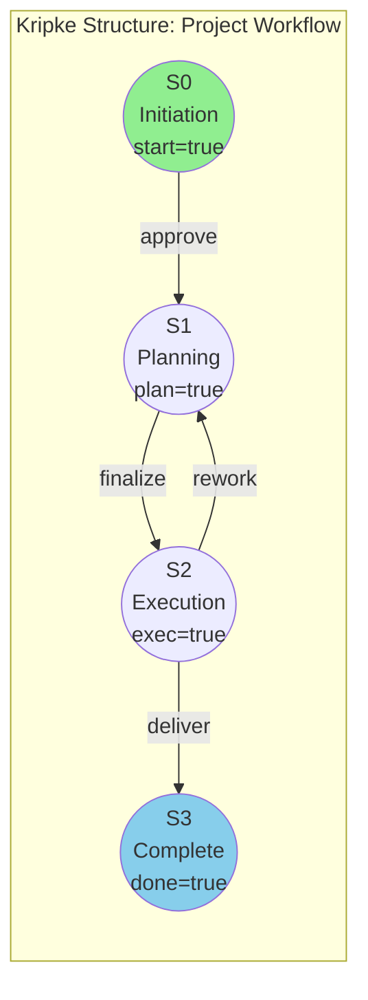

### 2.3 Intuitive Analogy / 直观类比

**Think of it as**: A map of cities (states) and roads (transitions)

- Each city has a sign showing what's true there (labels)
- You start at a specific city (initial state)
- You can only travel on existing roads (transition relation)

---

## 3. Temporal Logic (LTL) Visualization / 时序逻辑可视化

### 3.1 LTL Operators / LTL算子

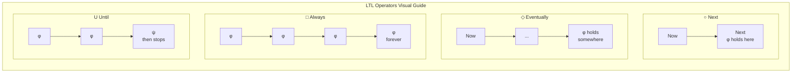

### 3.2 Project Examples / 项目示例

| LTL Formula | Visual | Meaning |
|-------------|--------|---------|
| ○ planning | `[init] → [planning]` | Next state is planning |
| ◇ complete | `[...] → [...] → [complete]` | Eventually reaches complete |
| □ (budget ≥ 0) | `[✓] → [✓] → [✓] → ...` | Budget always non-negative |
| planning U execution | `[plan] → [plan] → [exec]` | Planning until execution starts |

### 3.3 Intuitive Analogy / 直观类比

**Think of it as**: Describing a movie plot

- ○ (Next): "In the next scene..."
- ◇ (Eventually): "At some point..."
- □ (Always): "Throughout the entire movie..."
- U (Until): "This continues until..."

---

## 4. Markov Decision Process (MDP) Visualization / MDP可视化

### 4.1 MDP Structure / MDP结构

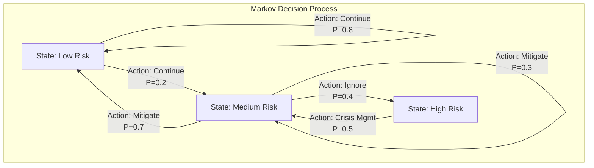

### 4.2 Decision Tree View / 决策树视图

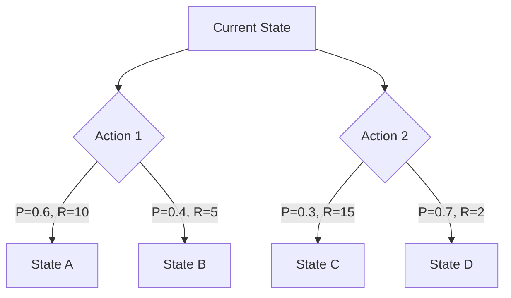

### 4.3 Intuitive Analogy / 直观类比

**Think of it as**: A board game with dice

- States = squares on the board
- Actions = moves you can make
- Probabilities = dice outcomes
- Rewards = points you earn
- Goal = maximize total points

---

## 5. Category Theory Concepts / 范畴论概念

### 5.1 Morphism (Arrow) / 态射

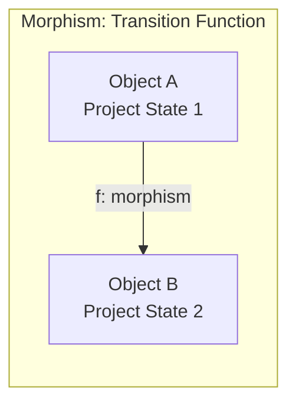

**Intuitive**: A morphism is just a "transformation" or "process" that takes you from one thing to another.

### 5.2 Functor / 函子

```mermaid
graph TD
    subgraph Functor[Functor: Structure-Preserving Map]
        subgraph Cat1[Category 1: Abstract]
            A1[A] -->|f| B1[B]
        end

        subgraph Cat2[Category 2: Concrete]
            A2[F(A)] -->|F(f)| B2[F(B)]
        end

        A1 -.->|F| A2
        B1 -.->|F| B2
    end
```

**Intuitive**: A functor is like a "translation" that preserves structure—like translating a story to another language while keeping the plot.

### 5.3 Natural Transformation / 自然变换

```mermaid
graph TD
    subgraph NatTrans[Natural Transformation]
        subgraph FunctorF[Functor F]
            FA[F(A)] -->|F(f)| FB[F(B)]
        end

        subgraph FunctorG[Functor G]
            GA[G(A)] -->|G(f)| GB[G(B)]
        end

        FA -->|η_A| GA
        FB -->|η_B| GB
    end
```

**Intuitive**: A natural transformation is a "consistent way" to convert between two translations.

---

## 6. Model Checking Visualization / 模型检验可视化

### 6.1 State Space Exploration / 状态空间探索

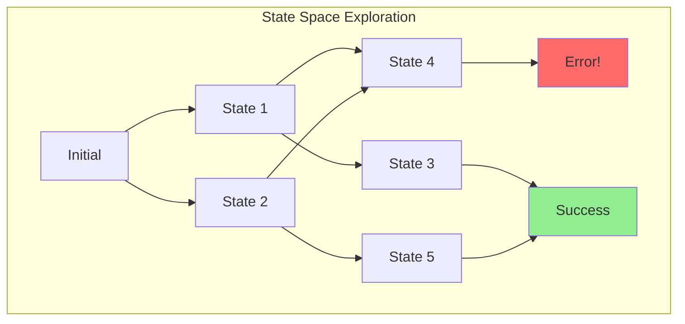

### 6.2 Counterexample Path / 反例路径

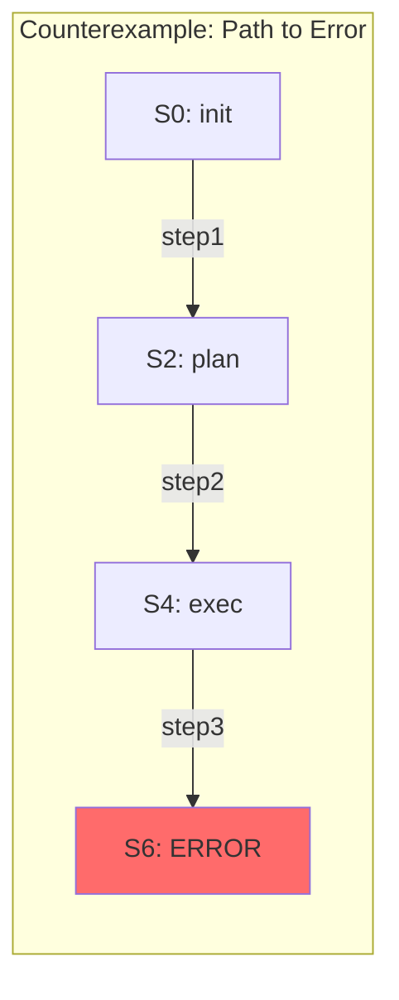

**Intuitive**: Model checking is like exploring a maze to check if any path leads to a trap.

---

## 7. Project Lifecycle State Machine / 项目生命周期状态机

### 7.1 Visual State Machine / 可视状态机

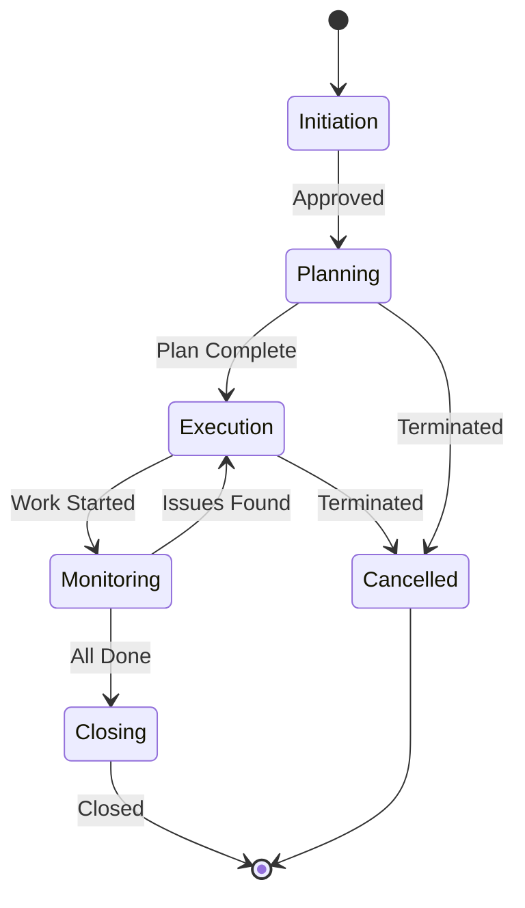

### 7.2 Phase Transition Conditions / 阶段转换条件

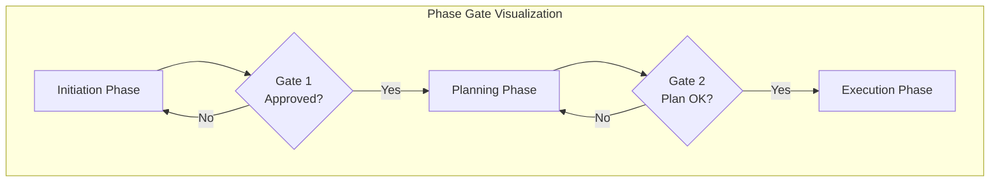

---

## 8. Risk Management Visualization / 风险管理可视化

### 8.1 Risk Matrix / 风险矩阵

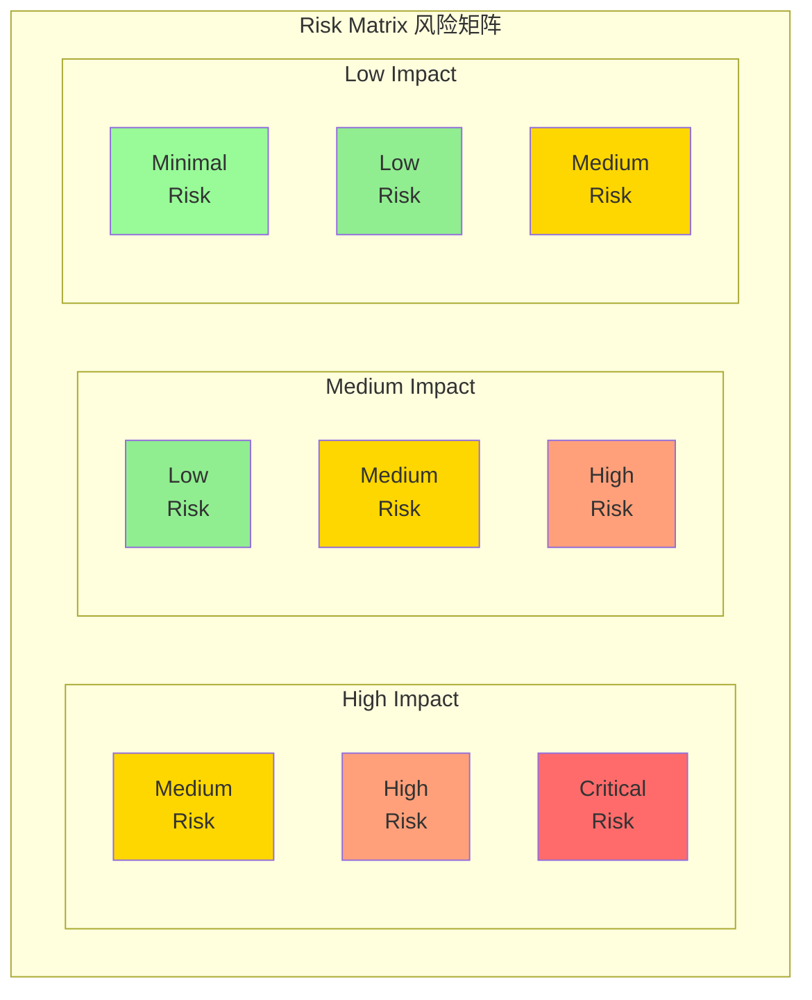

### 8.2 Risk Flow / 风险流程

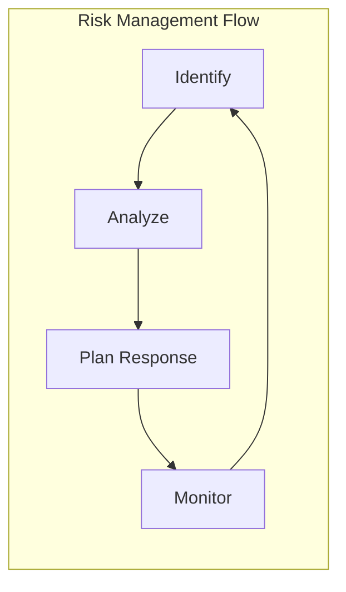

---

## 9. Resource Allocation Visualization / 资源分配可视化

### 9.1 Gantt-Style View / 甘特图视图

```
Resource 1: |████ Task A ████|     |██ Task D ██|
Resource 2:      |██████ Task B ██████|
Resource 3: |██ Task C ██|    |████ Task E ████|
            ─────────────────────────────────────→ Time
            Day 1    Day 5    Day 10   Day 15
```

### 9.2 Resource Constraint Graph / 资源约束图

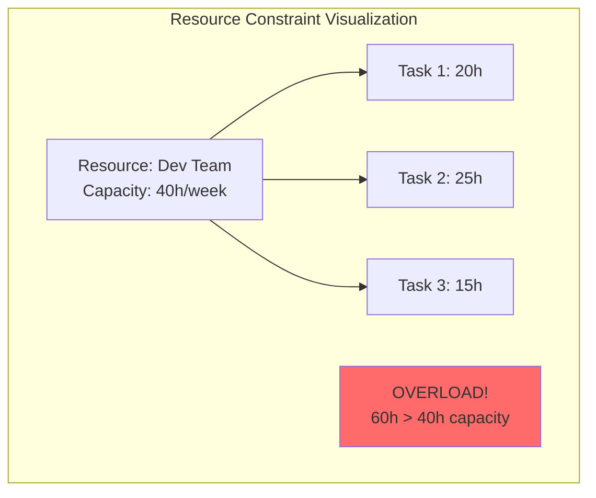

---

## 10. Quick Reference Cards / 快速参考卡片

### 10.1 Formal Concept Quick Reference / 形式化概念快速参考

| Concept | Symbol | Visual | Intuition |
|---------|--------|--------|-----------|
| Kripke Structure | M=(S,S₀,R,L) | Graph with labeled nodes | City map |
| LTL Next | ○φ | → [φ] | Next scene |
| LTL Eventually | ◇φ | →...→ [φ] | At some point |
| LTL Always | □φ | [φ]→[φ]→[φ]→... | Forever |
| MDP | (S,A,P,R,γ) | Graph with probabilities | Board game |
| Model Checking | M ⊨ φ | Maze exploration | Find all paths |
| Counterexample | Path to violation | Highlighted path | Found the trap |

---

## 11. Status / 状态

**Document Version / 文档版本**: 1.0
**Last Updated / 最后更新**: 2026-02-02
**Status / 状态**: ✅ Complete
**Next Review / 下次审查**: 2026-05-02

**Related Documents / 相关文档**:

- [Concept Linking Index](./CONCEPT_LINKING_INDEX.md)
- [Learning Prerequisites](../docs/12-learning-support/01-learning-prerequisites.md)
- [Formal Methods Practice](../docs/11-formal-methods-practice/README.md)
