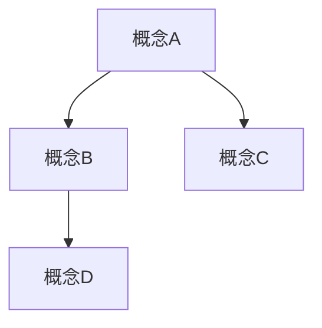

# 文档更新计划

# Document Update Plan

## 📋 文档说明 / Document Description

本文档制定详细的文档更新计划，根据验证结果系统化更新不符合标准的文档。

This document outlines a detailed document update plan to systematically update documents that do not meet standards based on validation results.

**创建时间**: 2026-01-27
**最后更新**: 2026-01-27
**版本**: 1.0
**状态**: ✅ 持续更新中

---

## 📊 更新优先级 / Update Priority

### 高优先级（核心模型层）- 立即更新

1. **docs/02-project-management/lifecycle-models.md**
   - 当前状态: 6/12章节，3/5内容
   - 缺失项: 双语标题、目录、实例、解释、论证、应用、Mermaid图表、最新研究前沿
   - 预计工作量: 8小时
   - 开始时间: 2026-01-27

2. **docs/02-project-management/resource-models.md**
   - 当前状态: 5/12章节，3/5内容
   - 缺失项: 双语标题、目录、属性、实例、解释、论证、应用、Mermaid图表、最新研究前沿
   - 预计工作量: 8小时
   - 开始时间: 2026-01-28

3. **docs/02-project-management/risk-models.md**
   - 当前状态: 5/12章节，3/5内容
   - 缺失项: 双语标题、目录、属性、实例、解释、论证、状态、Mermaid图表、最新研究前沿
   - 预计工作量: 8小时
   - 开始时间: 2026-01-29

4. **docs/02-project-management/quality-models.md**
   - 当前状态: 5/12章节，3/5内容
   - 缺失项: 双语标题、目录、实例、解释、论证、应用、状态、Mermaid图表、最新研究前沿
   - 预计工作量: 8小时
   - 开始时间: 2026-01-30

---

## 🔄 更新步骤 / Update Steps

### 步骤1：添加双语标题和目录

**操作**:

1. 在文档开头添加双语标题（格式：`# 中文标题 / English Title`）
2. 添加目录部分（`## 📋 Table of Contents / 目录`）
3. 使用Markdown自动生成或手动维护目录

**示例**:

```markdown
# 项目生命周期模型 / Project Life Cycle Model

## 📋 Table of Contents / 目录

- [1. Overview / 概述](#1-overview--概述)
- [2. Definition / 定义](#2-definition--定义)
...
```

### 步骤2：重组现有内容到标准章节

**操作**:

1. 将"概述"部分移到"1. Overview / 概述"
2. 将"定义"部分移到"2. Definition / 定义"
3. 将"属性"相关内容移到"3. Properties / 属性"
4. 将"关系"相关内容移到"4. Relations / 关系"
5. 保留现有内容，只调整章节结构

### 步骤3：补充缺失章节

**操作**:

1. **5. Examples / 实例**: 添加至少5个实例
   - 软件开发项目生命周期实例
   - 建筑工程项目生命周期实例
   - 敏捷项目生命周期实例
   - 传统项目生命周期实例
   - 混合项目生命周期实例

2. **6. Explanations / 解释**: 添加至少10种解释
   - 数学解释
   - 直观解释
   - 应用解释
   - 认知解释
   - 历史解释
   - 哲学解释
   - 技术解释
   - 实践解释
   - 对比解释
   - 系统解释

3. **7. Argumentation / 论证**: 添加形式化证明
   - 生命周期可达性定理
   - 生命周期完整性定理
   - 生命周期优化定理

4. **8. Applications / 应用**: 添加实际应用案例
   - 软件开发应用
   - 建筑工程应用
   - 制造业应用
   - 服务行业应用
   - 跨行业应用

### 步骤4：添加Mermaid图表

**操作**:

1. 在"4. Relations / 关系"部分添加概念关系图
2. 在"1. Overview / 概述"部分添加层次结构图
3. 在"2. Definition / 定义"部分添加状态转换图
4. 在"8. Applications / 应用"部分添加应用流程图

### 步骤5：补充最新研究前沿

**操作**:

1. 在"9. References / 参考文献"部分添加"9.1 Latest Research Frontiers (2020-2025)"
2. 搜索并引用2020-2025年的最新研究论文
3. 确保引用格式规范

### 步骤6：添加状态信息

**操作**:

1. 在文档末尾添加"10. Status / 状态"部分
2. 包含版本号、最后更新日期、状态标记

---

## 📝 更新模板 / Update Template

### 双语标题模板

```markdown
# [中文标题] / [English Title]
```

### 目录模板

```markdown
## 📋 Table of Contents / 目录

- [1. Overview / 概述](#1-overview--概述)
- [2. Definition / 定义](#2-definition--定义)
- [3. Properties / 属性](#3-properties--属性)
- [4. Relations / 关系](#4-relations--关系)
- [5. Examples / 实例](#5-examples--实例)
- [6. Explanations / 解释](#6-explanations--解释)
- [7. Argumentation / 论证](#7-argumentation--论证)
- [8. Applications / 应用](#8-applications--应用)
- [9. References / 参考文献](#9-references--参考文献)
- [10. Status / 状态](#10-status--状态)
```

### 实例模板

```markdown
## 5. Examples / 实例

### 5.1 [实例名称] / [Example Name]

**实例 X.X.X** ([实例描述])

[实例详细描述，包含形式化描述和实际应用场景]
```

### 解释模板

```markdown
## 6. Explanations / 解释

### 6.1 [解释类型] / [Explanation Type]

**解释 X.X.X** ([解释类型])

[解释内容]
```

### Mermaid图表模板

```markdown


```

---

## 📅 更新时间表 / Update Schedule

### 第一周（2026-01-27 至 2026-02-02）

- [ ] 更新`lifecycle-models.md`（步骤1-3）
- [ ] 更新`resource-models.md`（步骤1-2）

### 第二周（2026-02-03 至 2026-02-09）

- [ ] 完成`lifecycle-models.md`（步骤4-6）
- [ ] 更新`risk-models.md`（步骤1-3）
- [ ] 更新`quality-models.md`（步骤1-2）

### 第三周（2026-02-10 至 2026-02-16）

- [ ] 完成`resource-models.md`（步骤4-6）
- [ ] 完成`risk-models.md`（步骤4-6）
- [ ] 完成`quality-models.md`（步骤4-6）

### 第四周（2026-02-17 至 2026-02-23）

- [ ] 验证所有更新后的文档
- [ ] 运行验证脚本检查更新结果
- [ ] 修复发现的问题

---

## ✅ 质量检查清单 / Quality Checklist

每个文档更新后必须检查：

- [ ] 双语标题已添加
- [ ] 目录已添加且链接正确
- [ ] 10个必需章节都存在
- [ ] 至少5个实例
- [ ] 至少10种解释
- [ ] 至少2-3个论证
- [ ] 至少3-5个应用场景
- [ ] 至少3-5个Mermaid图表
- [ ] 最新研究前沿部分已添加
- [ ] 状态信息已添加
- [ ] 所有链接正常工作
- [ ] 格式符合标准

---

## 📚 相关文档 / Related Documents

- `DOCUMENT_STRUCTURE_CHECKLIST.md`: 文档结构标准化检查清单
- `DOCUMENT_STRUCTURE_ANALYSIS.md`: 文档结构分析报告
- `DOCUMENT_VALIDATION_REPORT.md`: 文档验证报告
- `CONTENT_ORGANIZATION_GUIDE.md`: 内容组织指南

---

**Last Updated / 最后更新**: 2026-01-27
**Version / 版本**: 1.0
**Status / 状态**: ✅ 持续更新中
